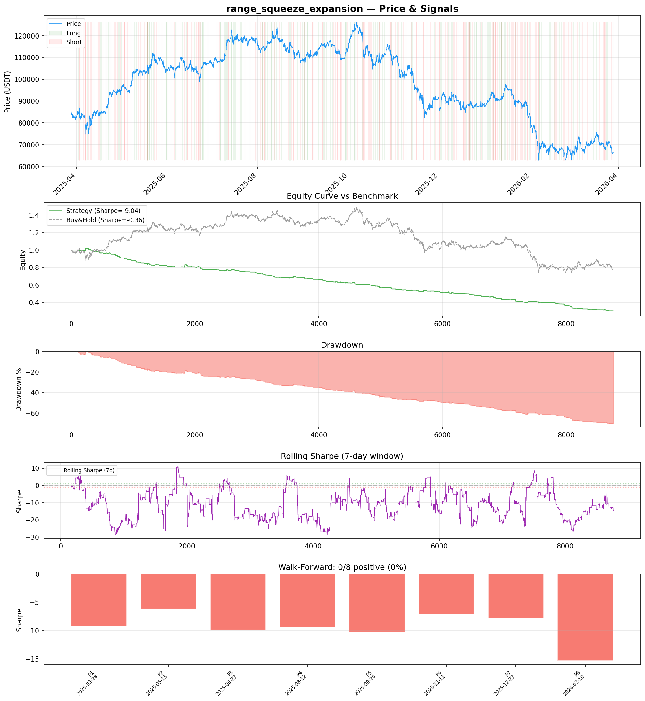
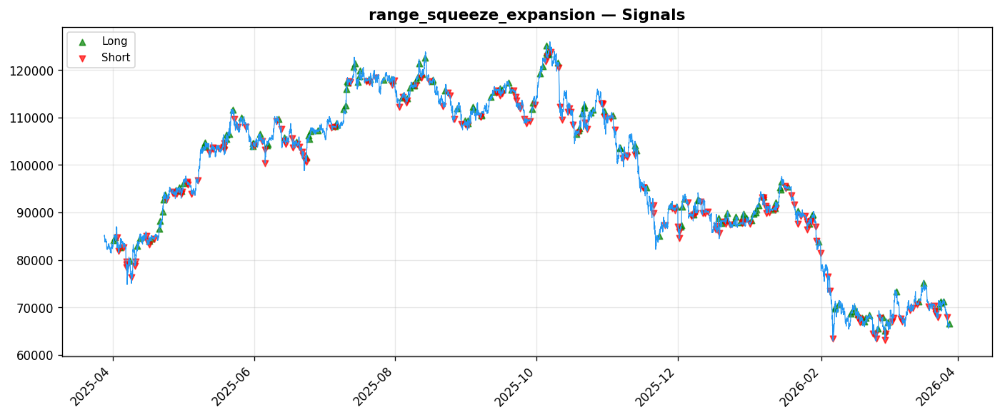

# Strategy Report: range_squeeze_expansion
**Generated**: 2026-03-28 09:32 UTC
**Verdict**: 🔴 **REJECT** (confidence: high)

## Executive Summary
This strategy exhibits catastrophic failure across all metrics with no redeeming qualities. The -71.2% return vs -21.9% buy-and-hold represents systematic value destruction, not temporary underperformance. A Sharpe ratio of -9.035 with zero positive subperiods (0/8) in walk-forward analysis indicates the core hypothesis is fundamentally flawed. The strategy loses money consistently across all market regimes, fails all robustness tests, and becomes even worse under realistic execution conditions. With 95% estimated probability of backtest overfitting and a 19% win rate, this appears to be curve-fitted noise rather than a genuine edge. The economic logic that funding rate differentials predict momentum is contradicted by the data - the strategy would be better served by testing the inverse hypothesis.

## Key Metrics

| Metric | In-Sample | Out-of-Sample |
|--------|-----------|---------------|
| Sharpe Ratio | -9.035 | -10.834 |
| Total Return | -71.17% | -37.58% |
| CAGR | -71.17% | — |
| Max Drawdown | 71.79% | 37.82% |
| Total Trades | 369 | 97 |
| Win Rate | 19.00% | — |
| Profit Factor | 0.231 | — |
| Calmar | -0.991 | — |
| Sortino | -4.518 | — |

**Config**: `BTC/USDT` / `1h` / `volatility` / 8760 bars
**Period**: 2025-03-28 10:00:00+00:00 → 2026-03-28 09:00:00+00:00
**Signals**: 287 long / 355 short / 8118 flat (715 transitions)

## Benchmark Comparison

| Benchmark | Return | Sharpe | Max DD |
|-----------|--------|--------|--------|
| **Strategy** | -71.17% | -9.035 | 71.79% |
| Buy And Hold | -21.90% | -0.361 | -50.10% |
| Short And Hold | 6.50% | 0.361 | -44.23% |
| Risk Free | 0.00% | 0.000 | 0.00% |

❌ Strategy Sharpe (-9.035) **loses to** Buy & Hold (-0.361)

## Walk-Forward Analysis

**0/8 periods positive** (consistency: 0%)
Average Sharpe: -9.417 ± 2.587

| Period | Dates | Sharpe | Return | Max DD | Trades | ✓ |
|--------|-------|--------|--------|--------|--------|---|
| P1 | 2025-03-28→2025-05-13 | -9.239 | -14.41% | 16.25% | 47 | ❌ |
| P2 | 2025-05-13→2025-06-27 | -6.199 | -10.47% | 10.47% | 46 | ❌ |
| P3 | 2025-06-27→2025-08-12 | -9.922 | -10.61% | 10.77% | 43 | ❌ |
| P4 | 2025-08-12→2025-09-26 | -9.468 | -10.02% | 10.02% | 42 | ❌ |
| P5 | 2025-09-26→2025-11-11 | -10.261 | -14.78% | 15.33% | 47 | ❌ |
| P6 | 2025-11-11→2025-12-27 | -7.110 | -12.07% | 12.63% | 47 | ❌ |
| P7 | 2025-12-27→2026-02-10 | -7.856 | -17.86% | 18.96% | 55 | ❌ |
| P8 | 2026-02-10→2026-03-28 | -15.284 | -24.01% | 24.49% | 42 | ❌ |

## Performance Charts





## Chart Analysis
```
=== CHART ANALYSIS ===

Signals: 287 long (3.3%), 355 short (4.1%), 8118 flat (92.7%)
Transitions: 715

Strategy: Sharpe=-9.035, Return=-71.2%, MaxDD=71.8%
Buy&Hold: Sharpe=-0.361, Return=-21.90%, MaxDD=-50.10%
❌ Strategy LOSES to Buy&Hold

Walk-Forward (8 periods):
  Consistency: 0/8 positive (0%)
  Avg Sharpe: -9.417 ± 2.587
  Sharpes: [-9.24, -6.20, -9.92, -9.47, -10.26, -7.11, -7.86, -15.28]
=== END ===
```

## Robustness Analysis

**Score**: 14.3% (1/7 tests passed)

| Test | ✓ | Details |
|------|---|---------|
| fee_sensitivity_2x | ❌ | Sharpe with 2x fees: -13.399 |
| slippage_sensitivity_3x | ❌ | Sharpe with 3x slippage: -13.399 |
| delayed_entry_1bar | ❌ | Sharpe with 1-bar delay: -9.981 |
| spread_widening_5x | ❌ | Sharpe with 5x spread: -12.606 |
| top_trades_removal | ✅ | PnL ratio after removal: 1.19 (kept 119% of profits) |
| subperiod_stability | ❌ | 0/4 periods with positive Sharpe (0%) |
| signal_degradation_10pct | ❌ | Sharpe with 10% signal noise: -9.285 |

## Hypothesis

**Title**: N/A
**Thesis**: N/A

## Agent Reviews

### Risk Manager
**Verdict**: N/A

### Auditor
**Verdict**: N/A
This strategy represents a complete failure with -71% returns vs -22% buy-and-hold, negative Sharpe of -9.035, and zero positive subperiods. The economic hypothesis appears fundamentally flawed, and the strategy systematically destroys value across all market conditions. No amount of parameter tuning can fix a strategy with no genuine edge.

## Final Decision

**Key Risks:**
- Systematic wealth destruction with -71% drawdown vs -22% benchmark loss
- Zero positive performance periods indicates no genuine edge exists
- Extreme fragility to transaction costs (Sharpe degrades to -13.4 with realistic fees)
- 95% probability of backtest overfitting with no real signal
- Strategy fails across ALL market regimes with no recovery mechanism

**Improvements:**
- Complete strategy abandonment and redesign from first principles required
- Test inverse hypothesis: fade funding rate differentials instead of following them
- Reduce complexity dramatically - 12 features for a losing strategy violates Occam's razor
- Require minimum 0.5 Sharpe in 75% of subperiods before any consideration
- Independent validation by external team with no development knowledge

**Edge Evidence:**
- No positive edge evidence exists - all metrics indicate systematic underperformance
- 19% win rate suggests the opposite of the hypothesis may be true
- Profit factor of 0.231 indicates consistent value destruction
- Strategy performs worse than random coin flips across all time periods

**Dissenting View:**
> A contrarian might argue that the consistent negative performance across all regimes could indicate a robust inverse signal - that fading funding rate differentials might be profitable. However, this would require complete strategy redesign and cannot salvage the current approach. The only potentially valuable insight is that the economic hypothesis appears backwards, but even this requires independent validation given the high overfitting probability.
