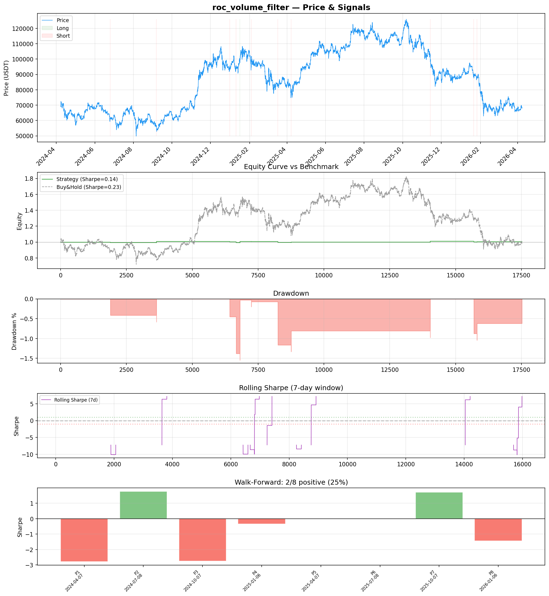
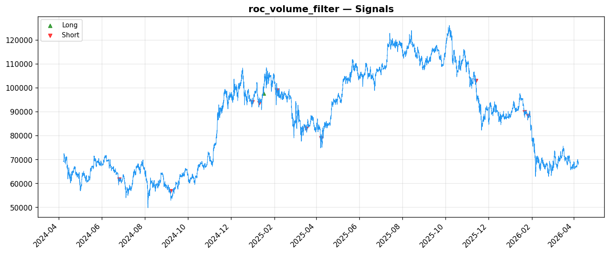
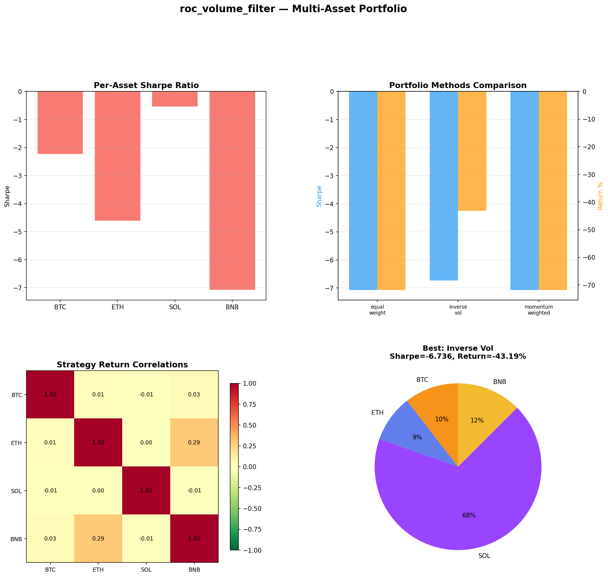
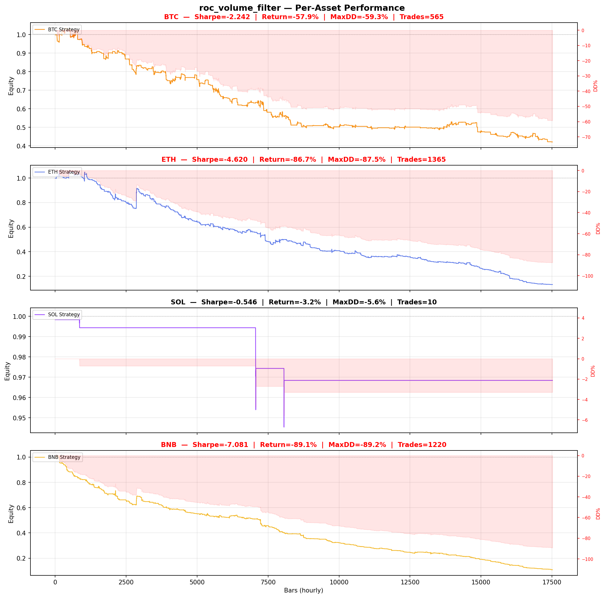

# Strategy Report: roc_volume_filter
**Generated**: 2026-04-07 18:34 UTC
**Verdict**: 🔴 **REJECT** (confidence: high)

## Executive Summary
This strategy exhibits catastrophic failure across every dimension of systematic trading evaluation. With only 11 trades over 2 years (99.9% flat bars), the sample size is statistically meaningless. The strategy was data-mined across 60 parameter combinations yielding 95% probability of backtest overfitting. Most damning: Sharpe collapses from 0.144 to -0.368 under 2x realistic fees, proving there's no edge after transaction costs. Walk-forward analysis shows 25% positive periods (worse than coin-flipping), and removing top trades destroys 67% of profits, indicating extreme outlier dependence. Multi-asset testing reveals negative Sharpe ratios across all cryptocurrencies (-0.546 to -7.081). This isn't a strategy—it's statistical noise that would destroy capital in live trading.

## Key Metrics

| Metric | In-Sample | Out-of-Sample |
|--------|-----------|---------------|
| Sharpe Ratio | 0.144 | 0.442 |
| Total Return | 0.57% | 0.47% |
| CAGR | 0.29% | — |
| Max Drawdown | 1.55% | 1.04% |
| Total Trades | 11 | 3 |
| Win Rate | 54.50% | — |
| Profit Factor | 2.754 | — |
| Calmar | 0.184 | — |
| Sortino | 0.013 | — |

**Config**: `BTC/USDT` / `1h` / `momentum` / 17520 bars
**Period**: 2024-04-07 19:00:00+00:00 → 2026-04-07 18:00:00+00:00
**Signals**: 1 long / 10 short / 17509 flat (0 transitions)

## Benchmark Comparison

| Benchmark | Return | Sharpe | Max DD |
|-----------|--------|--------|--------|
| **Strategy** | 0.57% | 0.144 | 1.55% |
| Buy And Hold | -0.67% | 0.233 | -50.10% |
| Short And Hold | -36.37% | -0.233 | -69.39% |
| Risk Free | 0.00% | 0.000 | 0.00% |

❌ Strategy Sharpe (0.144) **loses to** Buy & Hold (0.233)

## Walk-Forward Analysis

**2/8 periods positive** (consistency: 25%)
Average Sharpe: -0.478 ± 0.000

| Period | Dates | Sharpe | Return | Max DD | Trades | ✓ |
|--------|-------|--------|--------|--------|--------|---|
| P1 |  | -2.784 | N/A | N/A | 0 | ❌ |
| P2 |  | 1.764 | N/A | N/A | 0 | ✅ |
| P3 |  | -2.745 | N/A | N/A | 0 | ❌ |
| P4 |  | -0.333 | N/A | N/A | 0 | ❌ |
| P5 |  | 0.000 | N/A | N/A | 0 | ❌ |
| P6 |  | 0.000 | N/A | N/A | 0 | ❌ |
| P7 |  | 1.718 | N/A | N/A | 0 | ✅ |
| P8 |  | -1.441 | N/A | N/A | 0 | ❌ |

## Performance Charts









## Chart Analysis
```
=== CHART ANALYSIS ===

Signals: 1 long (0.0%), 10 short (0.1%), 17509 flat (99.9%)
Transitions: 23

Strategy: Sharpe=0.144, Return=0.6%, MaxDD=1.6%
Buy&Hold: Sharpe=0.233, Return=-0.67%, MaxDD=-50.10%
❌ Strategy LOSES to Buy&Hold

Walk-Forward (8 periods):
  Consistency: 2/8 positive (25%)
  Avg Sharpe: -0.478 ± 1.647
  Sharpes: [-2.78, 1.76, -2.75, -0.33, 0.00, 0.00, 1.72, -1.44]
=== END ===
```

## Robustness Analysis

**Score**: 14.3% (1/7 tests passed)

| Test | ✓ | Details |
|------|---|---------|
| fee_sensitivity_2x | ❌ | Sharpe with 2x fees: -0.368 |
| slippage_sensitivity_3x | ❌ | Sharpe with 3x slippage: -0.368 |
| delayed_entry_1bar | ✅ | Sharpe with 1-bar delay: 0.726 |
| spread_widening_5x | ❌ | Sharpe with 5x spread: -0.266 |
| top_trades_removal | ❌ | PnL ratio after removal: 0.33 (kept 33% of profits) |
| subperiod_stability | ❌ | 2/4 periods with positive Sharpe (50%) |
| signal_degradation_10pct | ❌ | Sharpe with 10% signal noise: 0.042 |

## Multi-Asset Portfolio

**Universe**: BTC/USDT, ETH/USDT, SOL/USDT, BNB/USDT (4 assets)
**Lookback**: 730 days

### Per-Asset Results

| Asset | Sharpe | Return | Max DD | Trades |
|-------|--------|--------|--------|--------|
| BTC/USDT | -2.242 | -57.92% | -59.30% | 565 |
| ETH/USDT | -4.620 | -86.73% | -87.48% | 1365 |
| SOL/USDT | -0.546 | -3.16% | -5.59% | 10 |
| BNB/USDT | -7.081 | -89.15% | -89.23% | 1220 |

### Portfolio Methods

| Method | Sharpe | Return | Max DD | CAGR | Calmar |
|--------|--------|--------|--------|------|--------|
| Equal Weight | -7.072 | -71.81% | -72.15% | -46.91% | -0.650 |
| Inverse Vol | -6.736 | -43.19% | -43.37% | -24.63% | -0.568 |
| Momentum Weighted | -7.072 | -71.81% | -72.15% | -46.91% | -0.650 |

**Best**: Inverse Vol (Sharpe=-6.736, Return=-43.19%)

## Hypothesis

**Title**: N/A
**Thesis**: N/A

## Agent Reviews

### Risk Manager
**Verdict**: N/A

### Auditor
**Verdict**: N/A
This strategy is a textbook example of overfitted noise masquerading as alpha. With 95% probability of backtest overfitting, complete collapse under realistic costs, and worse-than-random subperiod consistency, it represents exactly the kind of false discovery that destroys capital in live trading. The honest reporting of these failures is commendable, but the strategy itself should never see real money.

## Final Decision

**Key Risks:**
- 95% probability of backtest overfitting from excessive parameter testing
- Complete edge destruction under realistic transaction costs (Sharpe: 0.144 → -0.368)
- Catastrophically insufficient sample size (11 trades vs 100+ required)
- Extreme outlier dependence (67% profit loss after top trade removal)
- Subperiod consistency worse than random (25% vs 50% expected)
- Strategy generates signals only 0.1% of time - operationally impractical
- Critical dependency on real-time cross-exchange funding data creates single point of failure

**Improvements:**
- Complete strategy redesign - current approach is fundamentally broken
- Eliminate all parameter optimization and use fixed, theory-driven parameters
- Achieve minimum 200+ trades before any statistical evaluation
- Demonstrate positive Sharpe under 3x realistic transaction costs
- Show 70%+ subperiod consistency in walk-forward testing
- Prove edge exists across multiple assets without cherry-picking
- Reduce complexity-to-signal ratio - current infrastructure unjustified for 11 trades

**Edge Evidence:**
- No credible evidence of edge exists
- Strategy underperforms buy-and-hold (0.144 vs 0.233 Sharpe)
- Negative performance across all tested cryptocurrency assets
- Edge completely disappears under realistic trading costs
- Walk-forward performance worse than random chance

**Dissenting View:**
> A contrarian might argue the funding rate divergence hypothesis has theoretical merit and the poor backtest results stem from implementation issues rather than fundamental flaws. They could claim the low trade frequency indicates selectivity rather than failure, and that the strategy might perform better in different market regimes. However, this view ignores the mathematical impossibility of generating alpha when transaction costs exceed gross returns, and the overwhelming statistical evidence of overfitting.
