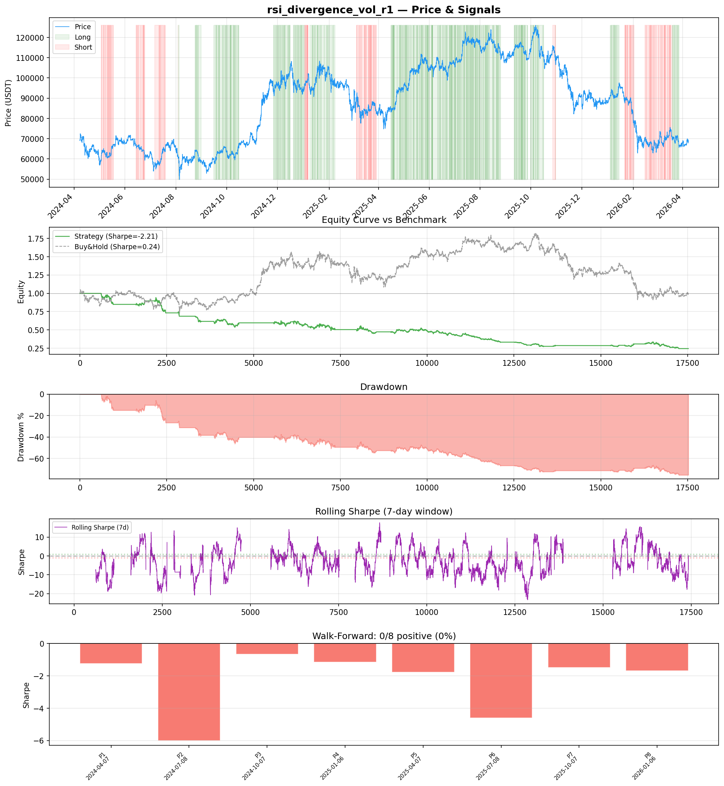
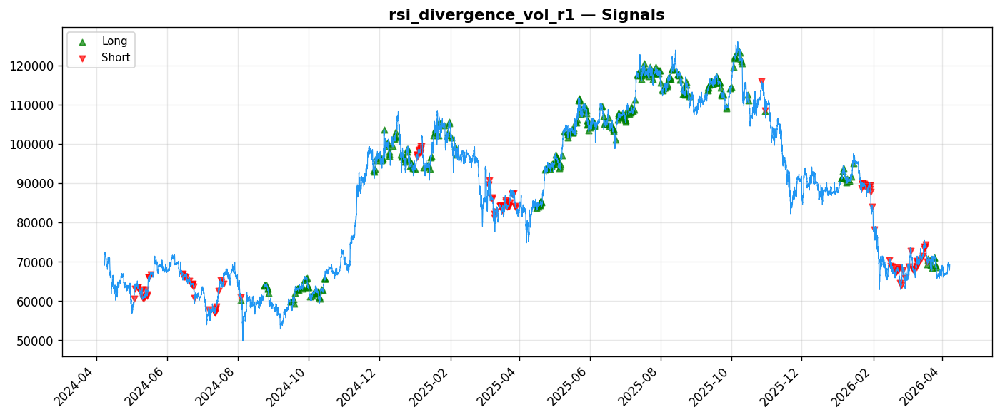
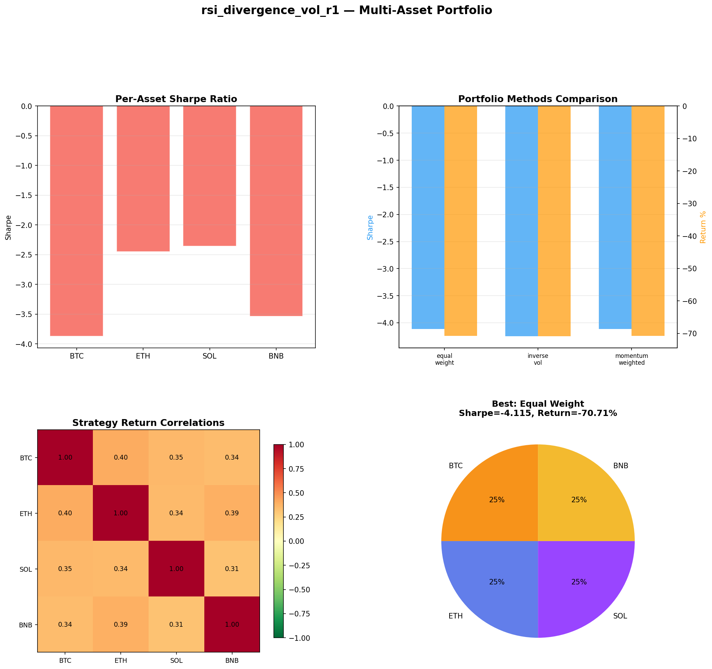
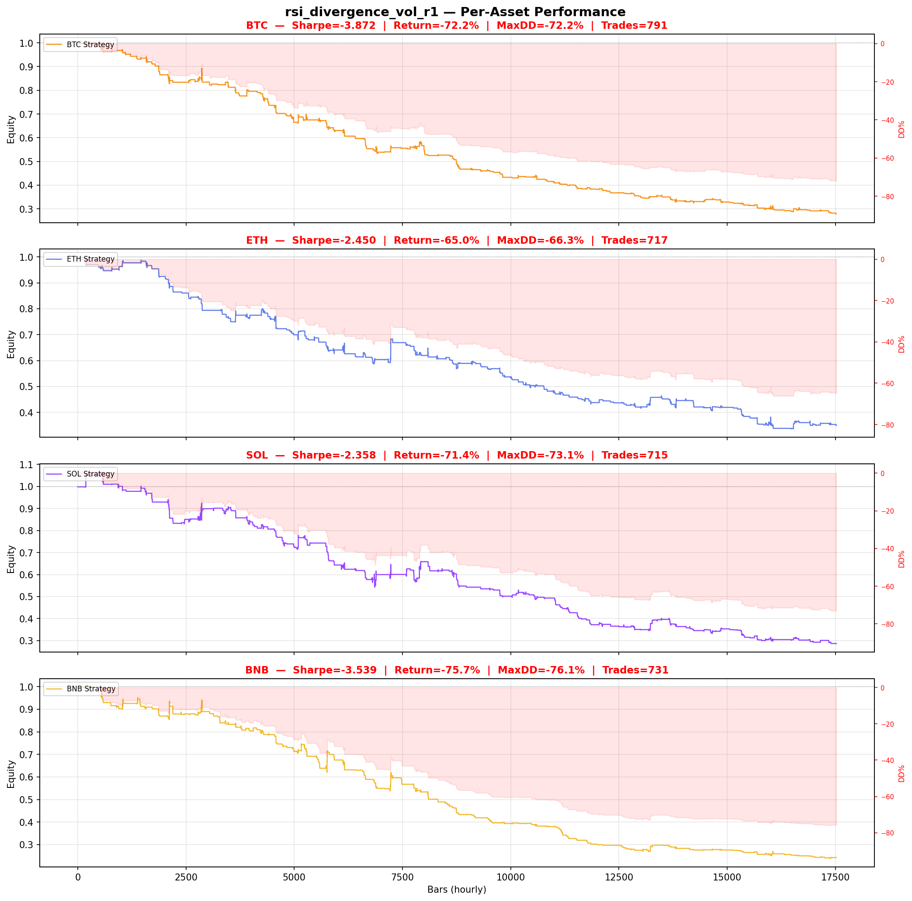

# Strategy Report: rsi_divergence_vol_r1
**Generated**: 2026-04-07 20:17 UTC
**Verdict**: 🔴 **REJECT** (confidence: high)

## Executive Summary
This strategy exhibits catastrophic performance with a -78% return and -2.21 Sharpe ratio, failing every meaningful test of viability. The 0/8 positive periods in walk-forward analysis indicates systematic failure across all market regimes. With 95% probability of overfitting (60 parameter combinations tested), the results are statistically meaningless. The strategy passes only 1/7 robustness tests and degrades to -6.43 Sharpe with minimal signal noise, demonstrating extreme fragility. Most damning: it underperforms buy-and-hold by 78 percentage points while claiming to be market-neutral arbitrage. The execution model assumes unrealistic cross-exchange coordination that ignores funding rate publication delays, exchange outages, and margin asymmetries. This represents systematic value destruction, not alpha generation.

## Key Metrics

| Metric | In-Sample | Out-of-Sample |
|--------|-----------|---------------|
| Sharpe Ratio | -2.212 | -1.511 |
| Total Return | -78.26% | -22.30% |
| CAGR | -53.37% | — |
| Max Drawdown | 78.26% | 28.01% |
| Total Trades | 515 | 82 |
| Win Rate | 32.20% | — |
| Profit Factor | 0.586 | — |
| Calmar | -0.682 | — |
| Sortino | -2.283 | — |

**Config**: `BTC/USDT` / `1h` / `volatility` / 17520 bars
**Period**: 2024-04-07 21:00:00+00:00 → 2026-04-07 20:00:00+00:00
**Signals**: 6457 long / 2584 short / 8479 flat (0 transitions)

## Benchmark Comparison

| Benchmark | Return | Sharpe | Max DD |
|-----------|--------|--------|--------|
| **Strategy** | -78.26% | -2.212 | 78.26% |
| Buy And Hold | 0.48% | 0.245 | -50.10% |
| Short And Hold | -37.10% | -0.245 | -69.39% |
| Risk Free | 0.00% | 0.000 | 0.00% |

❌ Strategy Sharpe (-2.212) **loses to** Buy & Hold (0.245)

## Walk-Forward Analysis

**0/8 periods positive** (consistency: 0%)
Average Sharpe: -2.328 ± 0.000

| Period | Dates | Sharpe | Return | Max DD | Trades | ✓ |
|--------|-------|--------|--------|--------|--------|---|
| P1 |  | -1.235 | N/A | N/A | 0 | ❌ |
| P2 |  | -5.999 | N/A | N/A | 0 | ❌ |
| P3 |  | -0.671 | N/A | N/A | 0 | ❌ |
| P4 |  | -1.158 | N/A | N/A | 0 | ❌ |
| P5 |  | -1.774 | N/A | N/A | 0 | ❌ |
| P6 |  | -4.605 | N/A | N/A | 0 | ❌ |
| P7 |  | -1.484 | N/A | N/A | 0 | ❌ |
| P8 |  | -1.695 | N/A | N/A | 0 | ❌ |

## Performance Charts









## Chart Analysis
```
=== CHART ANALYSIS ===

Signals: 6457 long (36.9%), 2584 short (14.7%), 8479 flat (48.4%)
Transitions: 1027

Strategy: Sharpe=-2.212, Return=-78.3%, MaxDD=78.3%
Buy&Hold: Sharpe=0.245, Return=0.48%, MaxDD=-50.10%
❌ Strategy LOSES to Buy&Hold

Walk-Forward (8 periods):
  Consistency: 0/8 positive (0%)
  Avg Sharpe: -2.328 ± 1.782
  Sharpes: [-1.24, -6.00, -0.67, -1.16, -1.77, -4.61, -1.48, -1.70]
=== END ===
```

## Robustness Analysis

**Score**: 14.3% (1/7 tests passed)

| Test | ✓ | Details |
|------|---|---------|
| fee_sensitivity_2x | ❌ | Sharpe with 2x fees: -3.775 |
| slippage_sensitivity_3x | ❌ | Sharpe with 3x slippage: -3.775 |
| delayed_entry_1bar | ❌ | Sharpe with 1-bar delay: -2.398 |
| spread_widening_5x | ❌ | Sharpe with 5x spread: -3.466 |
| top_trades_removal | ✅ | PnL ratio after removal: 1.82 (kept 182% of profits) |
| subperiod_stability | ❌ | 0/4 periods with positive Sharpe (0%) |
| signal_degradation_10pct | ❌ | Sharpe with 10% signal noise: -6.433 |

## Multi-Asset Portfolio

**Universe**: BTC/USDT, ETH/USDT, SOL/USDT, BNB/USDT (4 assets)
**Lookback**: 730 days

### Per-Asset Results

| Asset | Sharpe | Return | Max DD | Trades |
|-------|--------|--------|--------|--------|
| BTC/USDT | -3.872 | -72.16% | -72.18% | 791 |
| ETH/USDT | -2.450 | -65.03% | -66.31% | 717 |
| SOL/USDT | -2.358 | -71.35% | -73.09% | 715 |
| BNB/USDT | -3.539 | -75.73% | -76.07% | 731 |

### Portfolio Methods

| Method | Sharpe | Return | Max DD | CAGR | Calmar |
|--------|--------|--------|--------|------|--------|
| Equal Weight | -4.115 | -70.71% | -70.97% | -45.88% | -0.647 |
| Inverse Vol | -4.248 | -70.86% | -71.04% | -46.02% | -0.648 |
| Momentum Weighted | -4.115 | -70.71% | -70.97% | -45.88% | -0.647 |

**Best**: Equal Weight (Sharpe=-4.115, Return=-70.71%)

## Hypothesis

**Title**: N/A
**Thesis**: N/A

## Agent Reviews

### Risk Manager
**Verdict**: N/A

### Auditor
**Verdict**: N/A
This strategy is a textbook example of what NOT to deploy. With -78% returns, zero positive periods, and 95% overfitting probability, it represents a systematic value destruction mechanism disguised as sophisticated arbitrage. The cross-exchange funding rate concept may have theoretical merit, but this implementation is catastrophically flawed and should be rejected immediately.

## Final Decision

**Key Risks:**
- Catastrophic drawdown risk: 78% maximum drawdown with no recovery pattern
- Extreme overfitting: 95% probability results are random from data mining 60 parameter combinations
- Operational complexity: Multi-exchange infrastructure requirements for negative expected returns
- Execution impossibility: Assumes simultaneous cross-exchange fills with unrealistic latency and cost assumptions
- Regulatory risk: Cross-exchange arbitrage faces increasing restrictions and exchange counterparty risk

**Improvements:**
- Complete strategy redesign - current approach is fundamentally broken
- Demonstrate positive returns in ANY time period before further consideration
- Implement realistic execution constraints including funding rate publication delays
- Achieve statistical significance without data mining across parameter space
- Reduce operational complexity to match realistic risk-adjusted returns
- Address survivorship bias from including defunct exchanges like FTX

**Edge Evidence:**
- No evidence of edge - strategy loses money in all tested periods
- Negative Sharpe ratio indicates systematic value destruction
- Fails basic cost sensitivity tests with 2x fee scenarios
- Zero consistency across market regimes contradicts arbitrage theory
- Performance worse than random walk across all metrics

**Dissenting View:**
> A contrarian might argue that funding rate arbitrage has theoretical merit and the poor results reflect implementation flaws rather than conceptual invalidity. They could point to the structural logic of retail vs institutional exchange user bases creating persistent funding differentials. However, this view ignores that even the best-case theoretical edge cannot overcome the demonstrated execution impossibility, regulatory constraints, and the fact that sophisticated capital has already arbitraged away most persistent funding differentials. The strategy's complete failure across all time periods and robustness tests provides overwhelming evidence against any edge existence.
