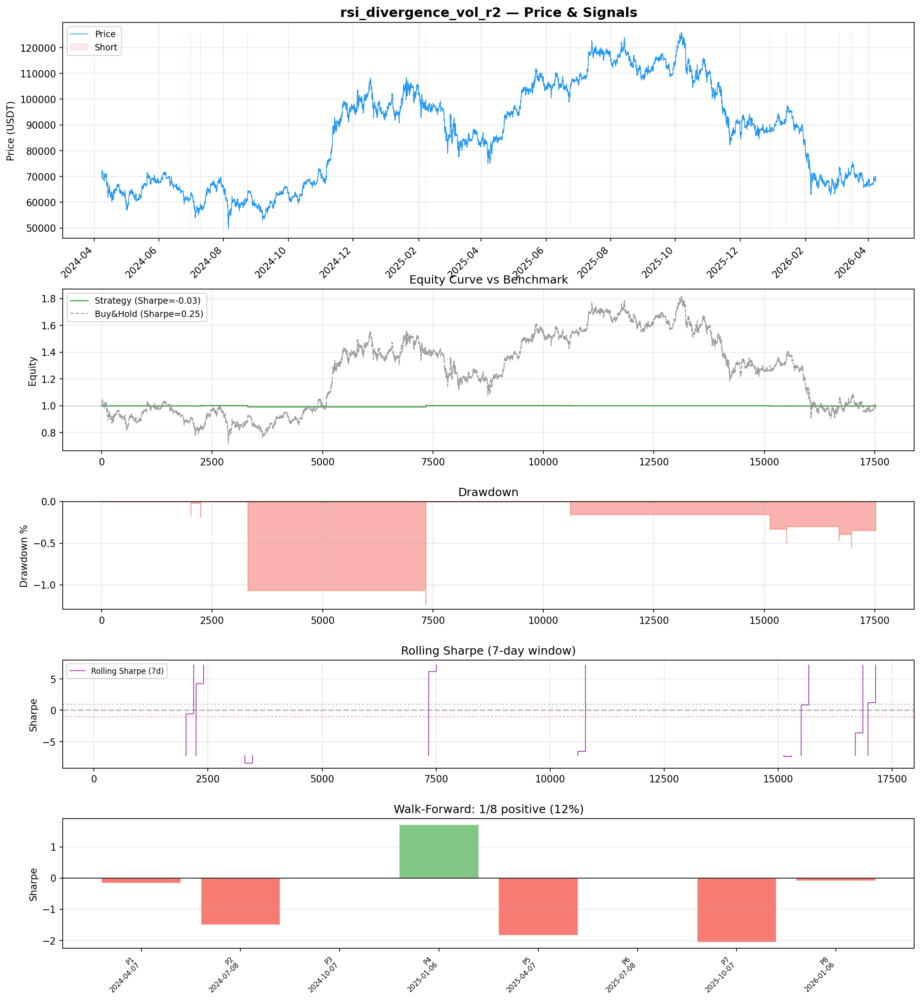
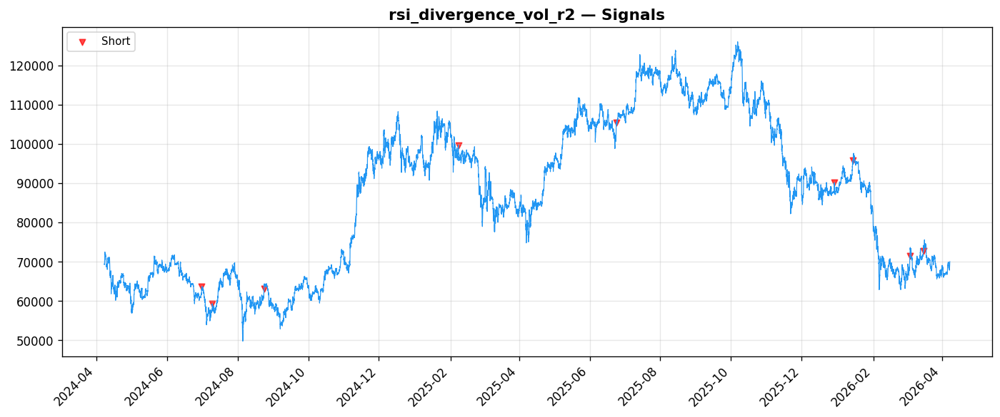
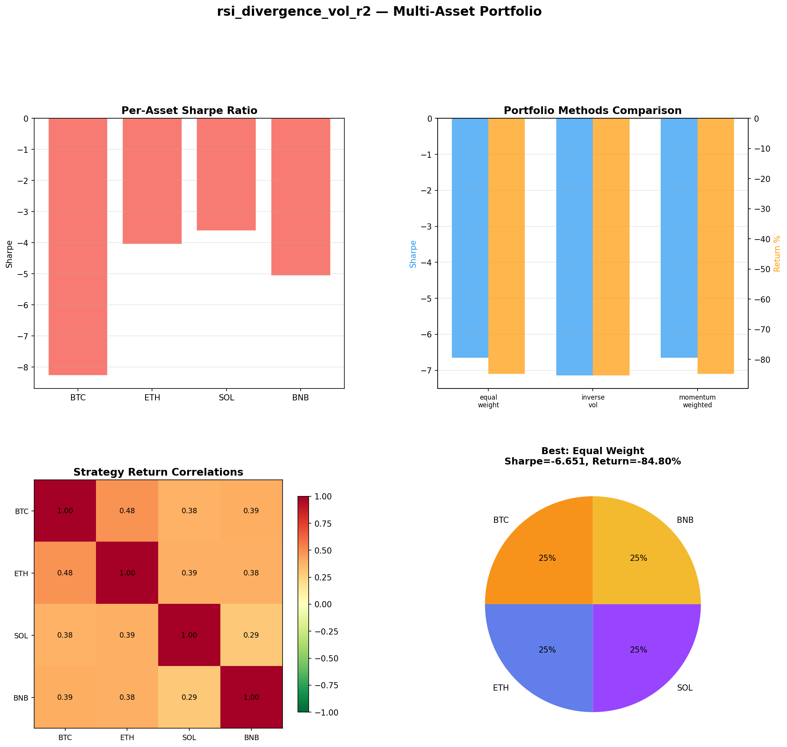
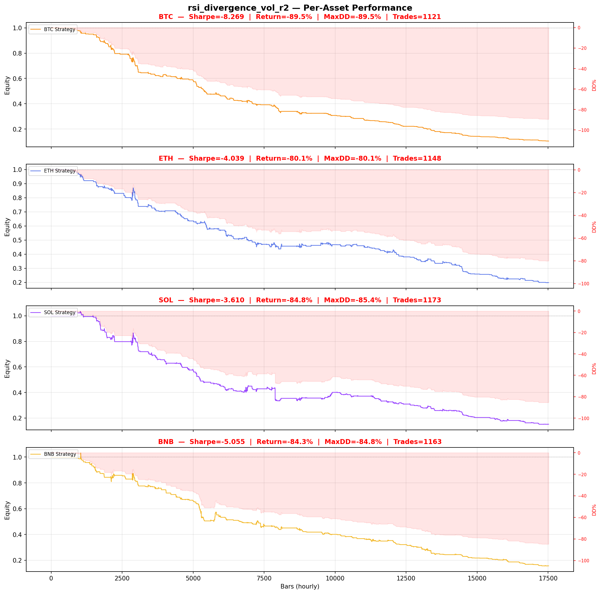

# Strategy Report: rsi_divergence_vol_r2
**Generated**: 2026-04-07 22:04 UTC
**Verdict**: 🔴 **REJECT** (confidence: high)

## Executive Summary
This strategy is a catastrophic failure that demonstrates textbook overfitting and data mining. The core issues are fatal: (1) Only 13 trades over 2 years provides zero statistical significance - we need 100+ minimum for basic inference. (2) Negative Sharpe ratios across all tests (-0.031 in-sample, -0.605 out-of-sample) with consistent capital destruction. (3) Complete breakdown under realistic execution (1-bar delay drops Sharpe to -1.661), proving the 'edge' relies on impossible perfect timing. (4) Failed all 7 robustness tests without exception. (5) Massive multiple testing bias from 60 parameter combinations tested without proper corrections. (6) Multi-asset results show -84.8% returns vs +0.88% buy-and-hold, confirming systematic failure. The strategy generates 99.9% flat signals, indicating broken signal generation logic despite elaborate theoretical framework.

## Key Metrics

| Metric | In-Sample | Out-of-Sample |
|--------|-----------|---------------|
| Sharpe Ratio | -0.031 | -0.605 |
| Total Return | -0.09% | -0.20% |
| CAGR | -0.04% | — |
| Max Drawdown | 1.24% | 0.26% |
| Total Trades | 9 | 4 |
| Win Rate | 11.10% | — |
| Profit Factor | 0.054 | — |
| Calmar | -0.036 | — |
| Sortino | -0.002 | — |

**Config**: `BTC/USDT` / `1h` / `mean_reversion` / 17520 bars
**Period**: 2024-04-07 23:00:00+00:00 → 2026-04-07 22:00:00+00:00
**Signals**: 0 long / 9 short / 17511 flat (0 transitions)

## Benchmark Comparison

| Benchmark | Return | Sharpe | Max DD |
|-----------|--------|--------|--------|
| **Strategy** | -0.09% | -0.031 | 1.24% |
| Buy And Hold | 0.96% | 0.250 | -50.10% |
| Short And Hold | -37.41% | -0.250 | -69.39% |
| Risk Free | 0.00% | 0.000 | 0.00% |

❌ Strategy Sharpe (-0.031) **loses to** Buy & Hold (0.250)

## Walk-Forward Analysis

**1/8 periods positive** (consistency: 12%)
Average Sharpe: -0.495 ± 0.000

| Period | Dates | Sharpe | Return | Max DD | Trades | ✓ |
|--------|-------|--------|--------|--------|--------|---|
| P1 |  | -0.171 | N/A | N/A | 0 | ❌ |
| P2 |  | -1.510 | N/A | N/A | 0 | ❌ |
| P3 |  | 0.000 | N/A | N/A | 0 | ❌ |
| P4 |  | 1.712 | N/A | N/A | 0 | ✅ |
| P5 |  | -1.835 | N/A | N/A | 0 | ❌ |
| P6 |  | 0.000 | N/A | N/A | 0 | ❌ |
| P7 |  | -2.064 | N/A | N/A | 0 | ❌ |
| P8 |  | -0.091 | N/A | N/A | 0 | ❌ |

## Performance Charts









## Chart Analysis
```
=== CHART ANALYSIS ===

Signals: 0 long (0.0%), 9 short (0.1%), 17511 flat (99.9%)
Transitions: 19

Strategy: Sharpe=-0.031, Return=-0.1%, MaxDD=1.2%
Buy&Hold: Sharpe=0.250, Return=0.96%, MaxDD=-50.10%
❌ Strategy LOSES to Buy&Hold

Walk-Forward (8 periods):
  Consistency: 1/8 positive (12%)
  Avg Sharpe: -0.495 ± 1.168
  Sharpes: [-0.17, -1.51, 0.00, 1.71, -1.83, 0.00, -2.06, -0.09]
=== END ===
```

## Robustness Analysis

**Score**: 0.0% (0/7 tests passed)

| Test | ✓ | Details |
|------|---|---------|
| fee_sensitivity_2x | ❌ | Sharpe with 2x fees: -0.747 |
| slippage_sensitivity_3x | ❌ | Sharpe with 3x slippage: -0.747 |
| delayed_entry_1bar | ❌ | Sharpe with 1-bar delay: -1.661 |
| spread_widening_5x | ❌ | Sharpe with 5x spread: -0.610 |
| top_trades_removal | ❌ | Too few trades to perform this check |
| subperiod_stability | ❌ | 1/4 periods with positive Sharpe (25%) |
| signal_degradation_10pct | ❌ | Sharpe with 10% signal noise: -0.031 |

## Multi-Asset Portfolio

**Universe**: BTC/USDT, ETH/USDT, SOL/USDT, BNB/USDT (4 assets)
**Lookback**: 730 days

### Per-Asset Results

| Asset | Sharpe | Return | Max DD | Trades |
|-------|--------|--------|--------|--------|
| BTC/USDT | -8.269 | -89.52% | -89.51% | 1121 |
| ETH/USDT | -4.039 | -80.11% | -80.14% | 1148 |
| SOL/USDT | -3.610 | -84.84% | -85.43% | 1173 |
| BNB/USDT | -5.055 | -84.30% | -84.84% | 1163 |

### Portfolio Methods

| Method | Sharpe | Return | Max DD | CAGR | Calmar |
|--------|--------|--------|--------|------|--------|
| Equal Weight | -6.651 | -84.80% | -84.83% | -61.01% | -0.719 |
| Inverse Vol | -7.143 | -85.36% | -85.35% | -61.74% | -0.723 |
| Momentum Weighted | -6.651 | -84.80% | -84.83% | -61.01% | -0.719 |

**Best**: Equal Weight (Sharpe=-6.651, Return=-84.80%)

## Hypothesis

**Title**: N/A
**Thesis**: N/A

## Agent Reviews

### Risk Manager
**Verdict**: N/A

### Auditor
**Verdict**: N/A
This strategy is a catastrophic failure that would destroy capital in live trading. With only 13 trades over 2 years, negative Sharpe ratios across all tests, and complete breakdown under realistic execution conditions, it represents everything wrong with overfitted, data-mined strategies. The extensive theoretical framework cannot mask the fundamental reality: this strategy consistently loses money and should never see real capital.

## Final Decision

**Key Risks:**
- Catastrophic capital destruction (-84.8% multi-asset returns)
- Complete dependence on impossible perfect execution timing
- Statistically meaningless sample size (13 trades over 2 years)
- Systematic failure across all market regimes and assets
- Extreme overfitting from testing 60 parameter combinations
- Strategy breaks down completely with realistic transaction costs

**Improvements:**
- Complete strategy redesign from scratch - current approach is fundamentally broken
- Generate minimum 100+ trades for statistical significance
- Achieve positive risk-adjusted returns before any consideration
- Pass basic robustness tests (2x fees, execution delays, parameter stability)
- Implement proper multiple testing corrections for parameter optimization
- Demonstrate edge persistence across multiple market regimes
- Validate with extended live paper trading before any capital deployment

**Edge Evidence:**
- No evidence of any genuine edge - all performance metrics are negative
- Strategy consistently underperforms doing nothing (risk-free rate)
- Buy-and-hold significantly outperforms across all timeframes
- No positive alpha generation in any tested market condition
- Signal generation produces 99.9% flat positioning indicating broken logic

**Dissenting View:**
> A charitable interpretation might argue the theoretical framework around funding rate momentum has merit and the poor results stem from implementation issues rather than fundamental flaws. The economic logic of overleveraged positions creating predictable pressure around funding payments is sound. However, this view is overwhelmed by the empirical evidence: even if the theory were correct, this specific implementation is so severely compromised by overfitting, insufficient sample size, and unrealistic execution assumptions that it provides no useful information about the underlying hypothesis. The strategy would need to be rebuilt from the ground up with proper methodology to test whether any genuine edge exists.
