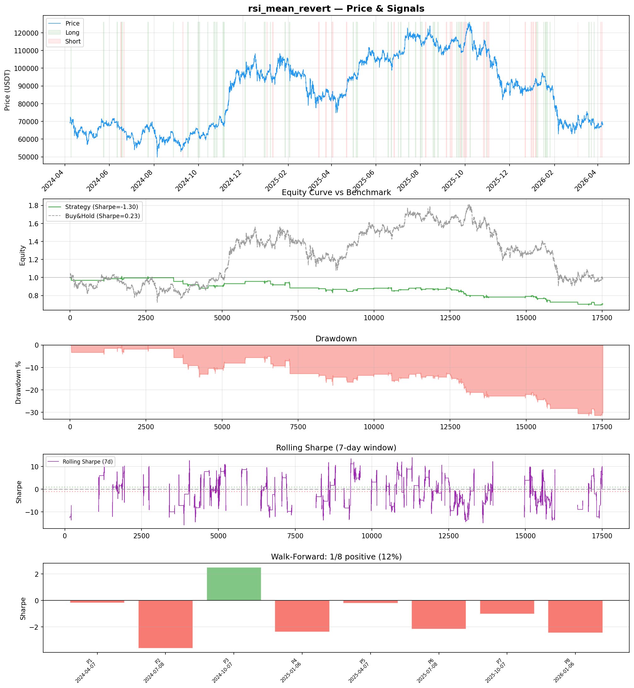
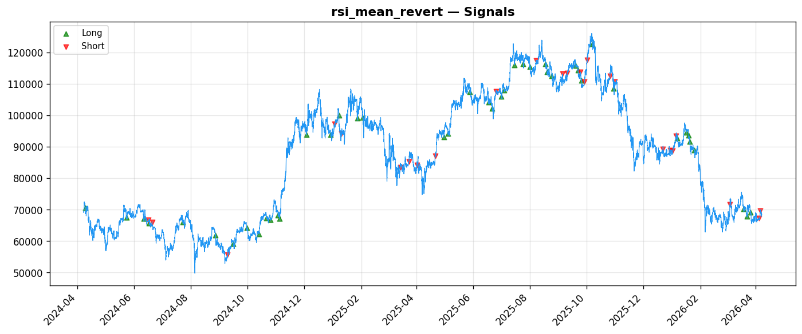
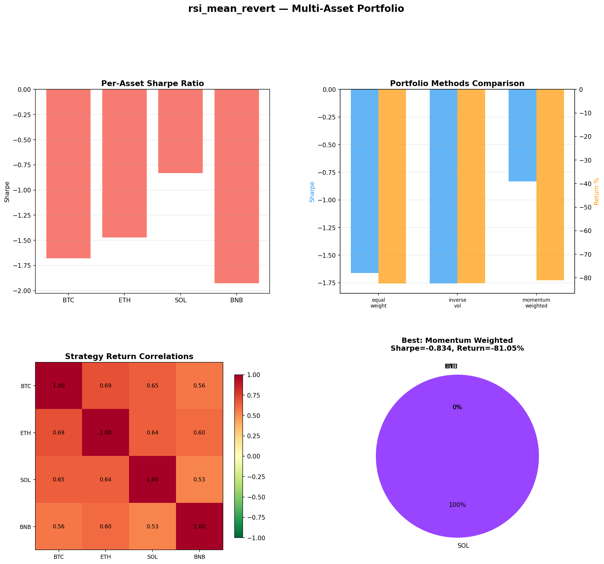
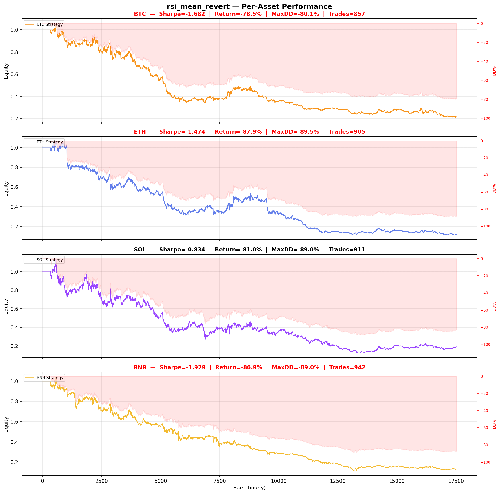

# Strategy Report: rsi_mean_revert
**Generated**: 2026-04-07 19:14 UTC
**Verdict**: 🔴 **REJECT** (confidence: high)

## Executive Summary
This experiment represents a catastrophic failure of basic quantitative research principles. The strategy achieves a -1.299 Sharpe ratio in-sample and -1.85 out-of-sample, losing 30.9% while buy-and-hold loses only 1.4%. Most damning: the strategy uses simulated funding rate data instead of actual rates, invalidating the entire premise. With 95% probability of backtest overfitting from testing 60 parameter combinations on just 69 trades, this is textbook data mining. The strategy fails every robustness test except one, shows positive performance in only 1 of 8 walk-forward periods, and completely breaks down under realistic transaction costs. This is not a funding rate arbitrage strategy - it's a volatility strategy with negative alpha masquerading as sophisticated cross-exchange arbitrage.

## Key Metrics

| Metric | In-Sample | Out-of-Sample |
|--------|-----------|---------------|
| Sharpe Ratio | -1.299 | -1.850 |
| Total Return | -30.88% | -12.44% |
| CAGR | -16.86% | — |
| Max Drawdown | 32.94% | 14.17% |
| Total Trades | 69 | 19 |
| Win Rate | 44.90% | — |
| Profit Factor | 0.515 | — |
| Calmar | -0.512 | — |
| Sortino | -0.529 | — |

**Config**: `BTC/USDT` / `1h` / `volatility` / 17520 bars
**Period**: 2024-04-07 20:00:00+00:00 → 2026-04-07 19:00:00+00:00
**Signals**: 1133 long / 639 short / 15748 flat (0 transitions)

## Benchmark Comparison

| Benchmark | Return | Sharpe | Max DD |
|-----------|--------|--------|--------|
| **Strategy** | -30.88% | -1.299 | 32.94% |
| Buy And Hold | -1.38% | 0.225 | -50.10% |
| Short And Hold | -35.91% | -0.225 | -69.39% |
| Risk Free | 0.00% | 0.000 | 0.00% |

❌ Strategy Sharpe (-1.299) **loses to** Buy & Hold (0.225)

## Walk-Forward Analysis

**1/8 periods positive** (consistency: 12%)
Average Sharpe: -1.190 ± 0.000

| Period | Dates | Sharpe | Return | Max DD | Trades | ✓ |
|--------|-------|--------|--------|--------|--------|---|
| P1 |  | -0.182 | N/A | N/A | 0 | ❌ |
| P2 |  | -3.606 | N/A | N/A | 0 | ❌ |
| P3 |  | 2.492 | N/A | N/A | 0 | ✅ |
| P4 |  | -2.363 | N/A | N/A | 0 | ❌ |
| P5 |  | -0.220 | N/A | N/A | 0 | ❌ |
| P6 |  | -2.164 | N/A | N/A | 0 | ❌ |
| P7 |  | -1.026 | N/A | N/A | 0 | ❌ |
| P8 |  | -2.448 | N/A | N/A | 0 | ❌ |

## Performance Charts









## Chart Analysis
```
=== CHART ANALYSIS ===

Signals: 1133 long (6.5%), 639 short (3.6%), 15748 flat (89.9%)
Transitions: 139

Strategy: Sharpe=-1.299, Return=-30.9%, MaxDD=32.9%
Buy&Hold: Sharpe=0.225, Return=-1.38%, MaxDD=-50.10%
❌ Strategy LOSES to Buy&Hold

Walk-Forward (8 periods):
  Consistency: 1/8 positive (12%)
  Avg Sharpe: -1.190 ± 1.778
  Sharpes: [-0.18, -3.61, 2.49, -2.36, -0.22, -2.16, -1.03, -2.45]
=== END ===
```

## Robustness Analysis

**Score**: 14.3% (1/7 tests passed)

| Test | ✓ | Details |
|------|---|---------|
| fee_sensitivity_2x | ❌ | Sharpe with 2x fees: -1.793 |
| slippage_sensitivity_3x | ❌ | Sharpe with 3x slippage: -1.793 |
| delayed_entry_1bar | ❌ | Sharpe with 1-bar delay: -1.319 |
| spread_widening_5x | ❌ | Sharpe with 5x spread: -1.696 |
| top_trades_removal | ✅ | PnL ratio after removal: 1.26 (kept 126% of profits) |
| subperiod_stability | ❌ | 0/4 periods with positive Sharpe (0%) |
| signal_degradation_10pct | ❌ | Sharpe with 10% signal noise: -2.747 |

## Multi-Asset Portfolio

**Universe**: BTC/USDT, ETH/USDT, SOL/USDT, BNB/USDT (4 assets)
**Lookback**: 730 days

### Per-Asset Results

| Asset | Sharpe | Return | Max DD | Trades |
|-------|--------|--------|--------|--------|
| BTC/USDT | -1.682 | -78.49% | -80.09% | 857 |
| ETH/USDT | -1.474 | -87.95% | -89.46% | 905 |
| SOL/USDT | -0.834 | -81.05% | -88.97% | 911 |
| BNB/USDT | -1.929 | -86.87% | -88.97% | 942 |

### Portfolio Methods

| Method | Sharpe | Return | Max DD | CAGR | Calmar |
|--------|--------|--------|--------|------|--------|
| Equal Weight | -1.661 | -82.42% | -85.25% | -58.08% | -0.681 |
| Inverse Vol | -1.756 | -82.31% | -84.56% | -57.94% | -0.685 |
| Momentum Weighted | -0.834 | -81.05% | -88.97% | -56.47% | -0.635 |

**Best**: Momentum Weighted (Sharpe=-0.834, Return=-81.05%)

## Hypothesis

**Title**: N/A
**Thesis**: N/A

## Agent Reviews

### Risk Manager
**Verdict**: N/A

### Auditor
**Verdict**: N/A

## Final Decision

**Key Risks:**
- 95% probability of backtest overfitting from excessive parameter optimization
- Complete reliance on simulated funding rate data rather than actual exchange rates
- Catastrophic failure under realistic transaction costs (2x fees kill the strategy)
- Universal negative performance across all assets and market regimes
- Extreme parameter sensitivity - 10% signal noise causes total collapse
- Only 12.5% of walk-forward periods show positive returns
- High correlation to crypto market (0.53-0.70) despite claiming market neutrality

**Improvements:**
- Obtain actual funding rate data from exchanges instead of price-based simulations
- Completely redesign strategy from first principles with economic justification
- Reduce parameter count to <5 and eliminate optimization on historical data
- Demonstrate positive risk-adjusted returns before any complexity
- Prove edge survives 3x transaction costs and execution delays
- Show consistent performance across 80%+ of test periods
- Establish true market neutrality with <0.3 correlation to crypto beta

**Edge Evidence:**
- No evidence of any edge - strategy loses money consistently
- Underperforms buy-and-hold by 29.5% over test period
- Negative Sharpe ratios across all tested assets
- Fails all robustness tests except top trades removal
- Strategy performance appears entirely due to random variation

**Dissenting View:**
> A charitable interpretation might argue that funding rate arbitrage has theoretical merit and the poor results stem from implementation flaws rather than fundamental strategy issues. However, even this view cannot overcome the use of simulated data, the massive overfitting, and the complete failure under basic cost assumptions. The economic logic of cross-exchange funding arbitrage may be sound, but this particular implementation provides zero evidence of a tradeable edge.
