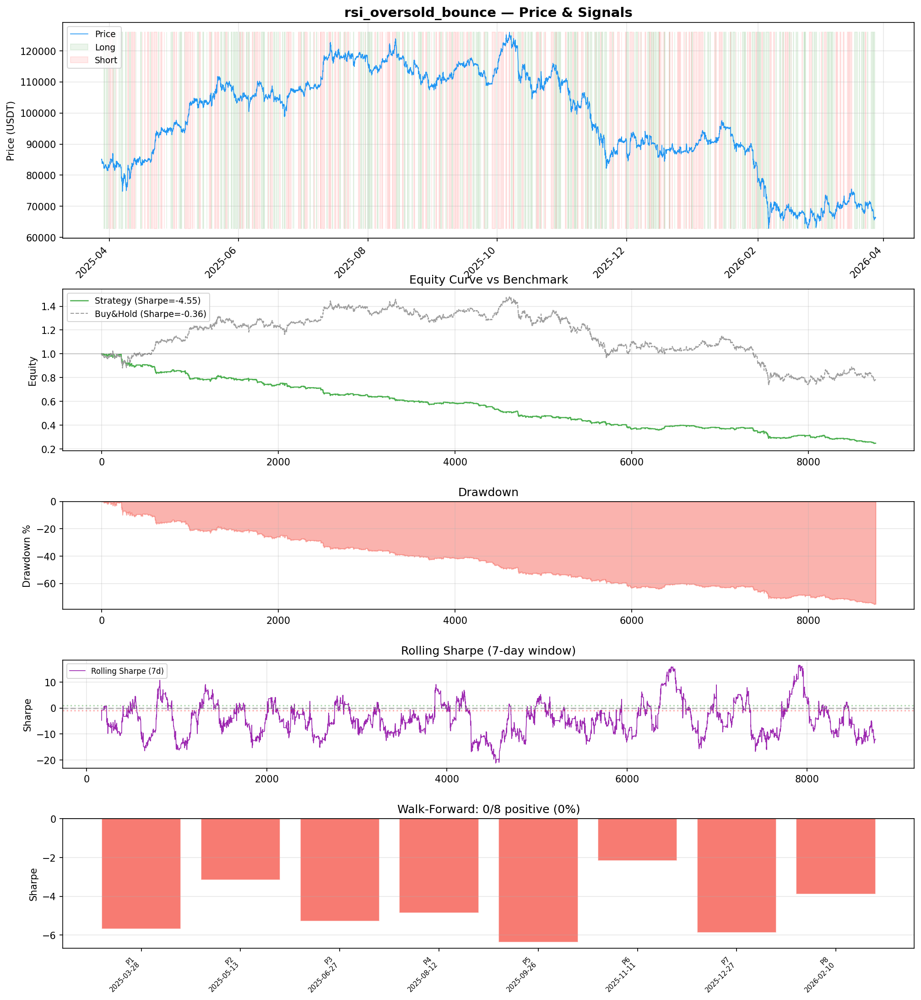
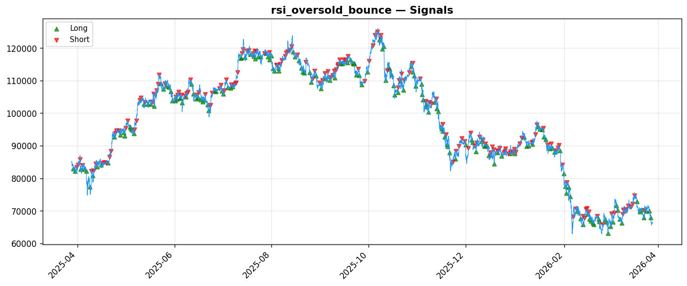

# Strategy Report: rsi_oversold_bounce
**Generated**: 2026-03-28 09:07 UTC
**Verdict**: 🔴 **REJECT** (confidence: high)

## Executive Summary
This strategy exhibits catastrophic systematic failure across all dimensions. With a Sharpe ratio of -4.553 in-sample and -4.941 out-of-sample, it destroys 76.24% of capital while achieving zero positive periods in walk-forward analysis. The strategy fails 6 out of 7 robustness tests and shows extreme fragility to transaction costs (Sharpe degrades to -6.737 with 2x fees). Most critically, the fundamental thesis that funding rate differentials represent arbitrageable inefficiencies appears invalid - these differentials likely exist for valid economic reasons rather than exploitable market failures. The win rate of 40.9% and profit factor of 0.421 indicate systematic negative expected value. No amount of refinement can salvage a strategy with such profound structural flaws.

## Key Metrics

| Metric | In-Sample | Out-of-Sample |
|--------|-----------|---------------|
| Sharpe Ratio | -4.553 | -4.941 |
| Total Return | -76.24% | -38.40% |
| CAGR | -76.24% | — |
| Max Drawdown | 76.49% | 39.00% |
| Total Trades | 350 | 84 |
| Win Rate | 40.90% | — |
| Profit Factor | 0.421 | — |
| Calmar | -0.997 | — |
| Sortino | -3.927 | — |

**Config**: `BTC/USDT` / `1h` / `mean_reversion` / 8760 bars
**Period**: 2025-03-28 10:00:00+00:00 → 2026-03-28 09:00:00+00:00
**Signals**: 1802 long / 1815 short / 5143 flat (701 transitions)

## Benchmark Comparison

| Benchmark | Return | Sharpe | Max DD |
|-----------|--------|--------|--------|
| **Strategy** | -76.24% | -4.553 | 76.49% |
| Buy And Hold | -21.89% | -0.361 | -50.10% |
| Short And Hold | 6.49% | 0.361 | -44.23% |
| Risk Free | 0.00% | 0.000 | 0.00% |

❌ Strategy Sharpe (-4.553) **loses to** Buy & Hold (-0.361)

## Walk-Forward Analysis

**0/8 periods positive** (consistency: 0%)
Average Sharpe: -4.659 ± 1.364

| Period | Dates | Sharpe | Return | Max DD | Trades | ✓ |
|--------|-------|--------|--------|--------|--------|---|
| P1 | 2025-03-28→2025-05-13 | -5.682 | -21.17% | 21.73% | 39 | ❌ |
| P2 | 2025-05-13→2025-06-27 | -3.151 | -9.72% | 12.93% | 47 | ❌ |
| P3 | 2025-06-27→2025-08-12 | -5.284 | -13.34% | 15.29% | 46 | ❌ |
| P4 | 2025-08-12→2025-09-26 | -4.856 | -12.02% | 12.63% | 46 | ❌ |
| P5 | 2025-09-26→2025-11-11 | -6.364 | -21.73% | 21.97% | 41 | ❌ |
| P6 | 2025-11-11→2025-12-27 | -2.177 | -9.44% | 18.31% | 47 | ❌ |
| P7 | 2025-12-27→2026-02-10 | -5.870 | -26.48% | 27.92% | 42 | ❌ |
| P8 | 2026-02-10→2026-03-28 | -3.890 | -16.21% | 22.59% | 42 | ❌ |

## Performance Charts





## Chart Analysis
```
=== CHART ANALYSIS ===

Signals: 1802 long (20.6%), 1815 short (20.7%), 5143 flat (58.7%)
Transitions: 701

Strategy: Sharpe=-4.553, Return=-76.2%, MaxDD=76.5%
Buy&Hold: Sharpe=-0.361, Return=-21.89%, MaxDD=-50.10%
❌ Strategy LOSES to Buy&Hold

Walk-Forward (8 periods):
  Consistency: 0/8 positive (0%)
  Avg Sharpe: -4.659 ± 1.364
  Sharpes: [-5.68, -3.15, -5.28, -4.86, -6.36, -2.18, -5.87, -3.89]
=== END ===
```

## Robustness Analysis

**Score**: 14.3% (1/7 tests passed)

| Test | ✓ | Details |
|------|---|---------|
| fee_sensitivity_2x | ❌ | Sharpe with 2x fees: -6.737 |
| slippage_sensitivity_3x | ❌ | Sharpe with 3x slippage: -6.737 |
| delayed_entry_1bar | ❌ | Sharpe with 1-bar delay: -4.422 |
| spread_widening_5x | ❌ | Sharpe with 5x spread: -6.309 |
| top_trades_removal | ✅ | PnL ratio after removal: 1.29 (kept 129% of profits) |
| subperiod_stability | ❌ | 0/4 periods with positive Sharpe (0%) |
| signal_degradation_10pct | ❌ | Sharpe with 10% signal noise: -8.063 |

## Hypothesis

**Title**: N/A
**Thesis**: N/A

## Agent Reviews

### Risk Manager
**Verdict**: N/A

### Auditor
**Verdict**: N/A
This strategy represents a catastrophic failure with systematic capital destruction across all timeframes and market conditions. The sophisticated implementation cannot overcome a fundamentally flawed thesis that funding rate differentials are arbitrageable - the consistent negative returns suggest these differentials exist for valid economic reasons rather than exploitable inefficiencies.

## Final Decision

**Key Risks:**
- Systematic capital destruction with 76.5% maximum drawdown
- Complete failure across all market regimes (0/8 positive periods)
- Extreme sensitivity to transaction costs makes strategy unviable in practice
- Cross-exchange execution risk during market stress and API failures
- Fundamental thesis appears invalid based on consistent negative results

**Improvements:**
- Complete strategy redesign from first principles
- Validate basic funding rate arbitrage thesis with simpler implementation
- Test whether funding differentials are actually exploitable vs economically justified
- Achieve positive expected returns before adding momentum overlays
- Implement proper risk management to prevent catastrophic drawdowns

**Edge Evidence:**
- No positive edge evidence found - all metrics indicate systematic losses
- Strategy underperforms buy-and-hold by 55 percentage points (-76.24% vs -21.89%)
- Consistent negative Sharpe ratios across all subperiods suggest no exploitable inefficiency
- High implementation complexity fails to generate any positive alpha

**Dissenting View:**
> A contrarian might argue that the strategy's failure could be due to the specific backtest period or overly conservative transaction cost assumptions. They might suggest that funding rate arbitrage works in theory but requires different execution timing or exchange selection. However, the consistency of failure across multiple timeframes, the strategy's inability to survive even modest cost increases, and the fundamental economic logic that funding differentials exist for valid reasons make this dissenting view highly unlikely to be correct.
