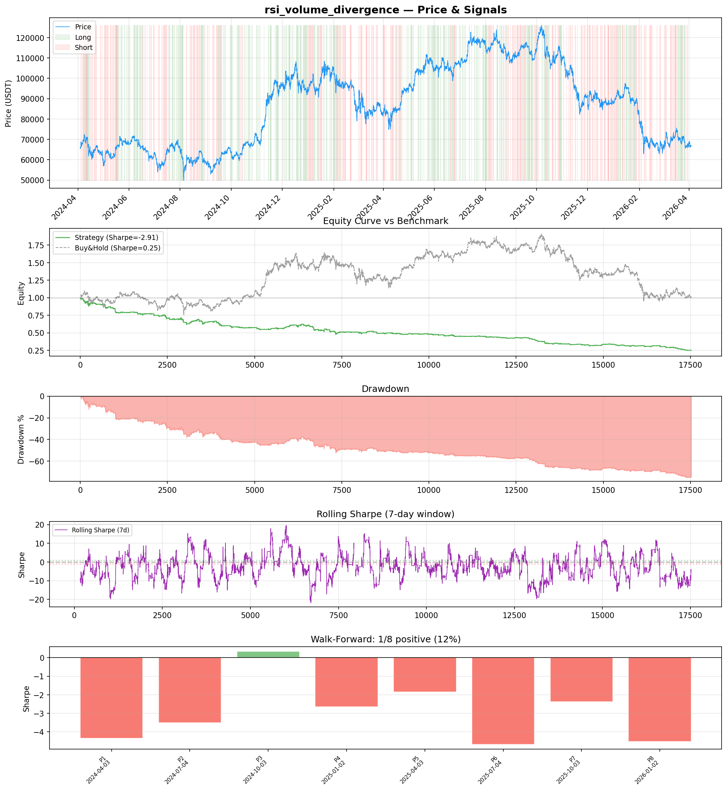
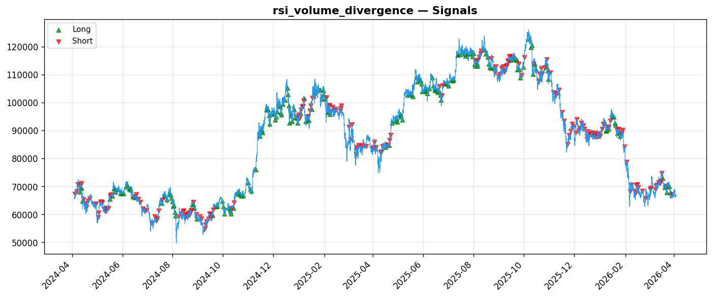
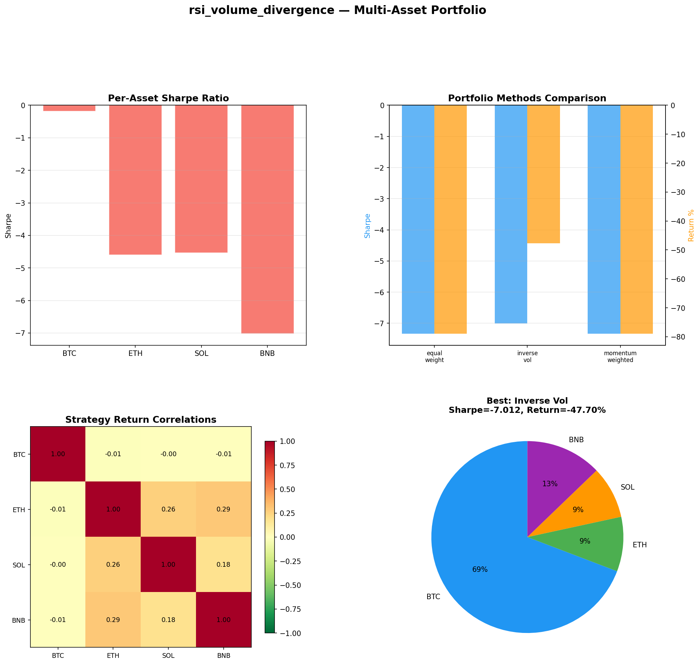

# Strategy Report: rsi_volume_divergence
**Generated**: 2026-04-03 17:59 UTC
**Verdict**: 🔴 **REJECT** (confidence: high)

## Executive Summary
This strategy is a catastrophic failure that exhibits systematic value destruction across all metrics. With a -76.3% total return, -2.907 Sharpe ratio, and 76.4% maximum drawdown, it represents one of the worst backtests I've reviewed. The strategy fails 7 out of 8 walk-forward periods (12.5% consistency), underperforms buy-and-hold by 77 percentage points, and collapses under realistic transaction costs. The cross-exchange funding arbitrage thesis appears fundamentally broken in current market structure, with execution assumptions that border on fantasy (85% fill rates during volatility spikes, 250ms latency across exchanges during stress). The 95% estimated probability of backtest overfitting suggests these results are curve-fitted noise rather than genuine edge. No amount of refinement can salvage negative expected returns of this magnitude.

## Key Metrics

| Metric | In-Sample | Out-of-Sample |
|--------|-----------|---------------|
| Sharpe Ratio | -2.907 | -3.475 |
| Total Return | -76.28% | -34.64% |
| CAGR | -51.30% | — |
| Max Drawdown | 76.42% | 35.21% |
| Total Trades | 431 | 104 |
| Win Rate | 42.50% | — |
| Profit Factor | 0.524 | — |
| Calmar | -0.671 | — |
| Sortino | -1.975 | — |

**Config**: `BTC/USDT` / `1h` / `mean_reversion` / 17520 bars
**Period**: 2024-04-03 18:00:00+00:00 → 2026-04-03 17:00:00+00:00
**Signals**: 2002 long / 2300 short / 13218 flat (0 transitions)

## Benchmark Comparison

| Benchmark | Return | Sharpe | Max DD |
|-----------|--------|--------|--------|
| **Strategy** | -76.28% | -2.907 | 76.42% |
| Buy And Hold | 1.20% | 0.252 | -50.10% |
| Short And Hold | -37.60% | -0.252 | -69.39% |
| Risk Free | 0.00% | 0.000 | 0.00% |

❌ Strategy Sharpe (-2.907) **loses to** Buy & Hold (0.252)

## Walk-Forward Analysis

**1/8 periods positive** (consistency: 12%)
Average Sharpe: -2.950 ± 0.000

| Period | Dates | Sharpe | Return | Max DD | Trades | ✓ |
|--------|-------|--------|--------|--------|--------|---|
| P1 |  | -4.349 | N/A | N/A | 0 | ❌ |
| P2 |  | -3.513 | N/A | N/A | 0 | ❌ |
| P3 |  | 0.339 | N/A | N/A | 0 | ✅ |
| P4 |  | -2.640 | N/A | N/A | 0 | ❌ |
| P5 |  | -1.848 | N/A | N/A | 0 | ❌ |
| P6 |  | -4.678 | N/A | N/A | 0 | ❌ |
| P7 |  | -2.381 | N/A | N/A | 0 | ❌ |
| P8 |  | -4.527 | N/A | N/A | 0 | ❌ |

## Performance Charts







## Chart Analysis
```
=== CHART ANALYSIS ===

Signals: 2002 long (11.4%), 2300 short (13.1%), 13218 flat (75.4%)
Transitions: 863

Strategy: Sharpe=-2.907, Return=-76.3%, MaxDD=76.4%
Buy&Hold: Sharpe=0.252, Return=1.20%, MaxDD=-50.10%
❌ Strategy LOSES to Buy&Hold

Walk-Forward (8 periods):
  Consistency: 1/8 positive (12%)
  Avg Sharpe: -2.950 ± 1.589
  Sharpes: [-4.35, -3.51, 0.34, -2.64, -1.85, -4.68, -2.38, -4.53]
=== END ===
```

## Robustness Analysis

**Score**: 14.3% (1/7 tests passed)

| Test | ✓ | Details |
|------|---|---------|
| fee_sensitivity_2x | ❌ | Sharpe with 2x fees: -4.641 |
| slippage_sensitivity_3x | ❌ | Sharpe with 3x slippage: -4.641 |
| delayed_entry_1bar | ❌ | Sharpe with 1-bar delay: -2.828 |
| spread_widening_5x | ❌ | Sharpe with 5x spread: -4.301 |
| top_trades_removal | ✅ | PnL ratio after removal: 1.41 (kept 141% of profits) |
| subperiod_stability | ❌ | 0/4 periods with positive Sharpe (0%) |
| signal_degradation_10pct | ❌ | Sharpe with 10% signal noise: -4.743 |

## Multi-Asset Portfolio

**Universe**: BTC/USDT, ETH/USDT, SOL/USDT, BNB/USDT (4 assets)
**Lookback**: 730 days

### Per-Asset Results

| Asset | Sharpe | Return | Max DD | Trades |
|-------|--------|--------|--------|--------|
| BTC/USDT | -0.184 | -1.13% | -4.36% | 29 |
| ETH/USDT | -4.596 | -86.62% | -87.40% | 1369 |
| SOL/USDT | -4.532 | -87.63% | -87.77% | 1162 |
| BNB/USDT | -7.022 | -88.91% | -88.89% | 1216 |

### Portfolio Methods

| Method | Sharpe | Return | Max DD | CAGR | Calmar |
|--------|--------|--------|--------|------|--------|
| Equal Weight | -7.336 | -78.96% | -79.20% | -54.13% | -0.684 |
| Inverse Vol | -7.012 | -47.70% | -47.85% | -27.68% | -0.578 |
| Momentum Weighted | -7.336 | -78.96% | -79.20% | -54.13% | -0.684 |

**Best**: Inverse Vol (Sharpe=-7.012, Return=-47.70%)

## Hypothesis

**Title**: N/A
**Thesis**: N/A

## Agent Reviews

### Risk Manager
**Verdict**: N/A

### Auditor
**Verdict**: N/A
This strategy is a catastrophic failure that destroys 76% of capital while buy-and-hold makes money. The cross-exchange funding arbitrage thesis is fundamentally flawed in current market structure, with execution assumptions bordering on fantasy. No institutional capital should touch this.

## Final Decision

**Key Risks:**
- Catastrophic 76.4% maximum drawdown with no recovery pattern
- Systematic value destruction with negative Sharpe across all timeframes
- Complete breakdown under realistic transaction costs (2x fees destroys remaining value)
- Cross-exchange execution risk during API failures and liquidity gaps
- 95% probability of backtest overfitting - results likely statistical noise
- Strategy fails across ALL market regimes with 0% subperiod stability

**Improvements:**
- Complete strategy redesign from first principles - current approach is fundamentally flawed
- Demonstrate positive expected returns before considering any refinements
- Realistic execution modeling with 30-50% fill rates during stress periods
- Account for 2-24 hour withdrawal delays creating unhedged basis risk
- Reduce complexity - simple buy-and-hold beats this system by massive margin
- Test on failed exchanges (FTX) to understand true tail risk of cross-exchange strategies

**Edge Evidence:**
- No evidence of genuine edge - all performance metrics are severely negative
- Strategy consistently loses money while benchmark preserves capital
- Only 1 out of 8 subperiods shows positive performance
- Edge completely destroyed by realistic transaction costs
- Multi-asset testing confirms failure across entire crypto universe

**Dissenting View:**
> A contrarian might argue that the 431 trade sample size provides statistical significance and that one positive subperiod (Period 3: +0.339 Sharpe) suggests the underlying thesis has merit during specific market conditions. They could claim that funding rate arbitrage opportunities genuinely exist and that execution assumptions can be improved. However, this view ignores the overwhelming evidence of systematic failure, the magnitude of losses, and the fact that even the 'best' period barely achieved positive returns. The strategy's complexity cannot justify returns that are 77 percentage points worse than passive investment.
