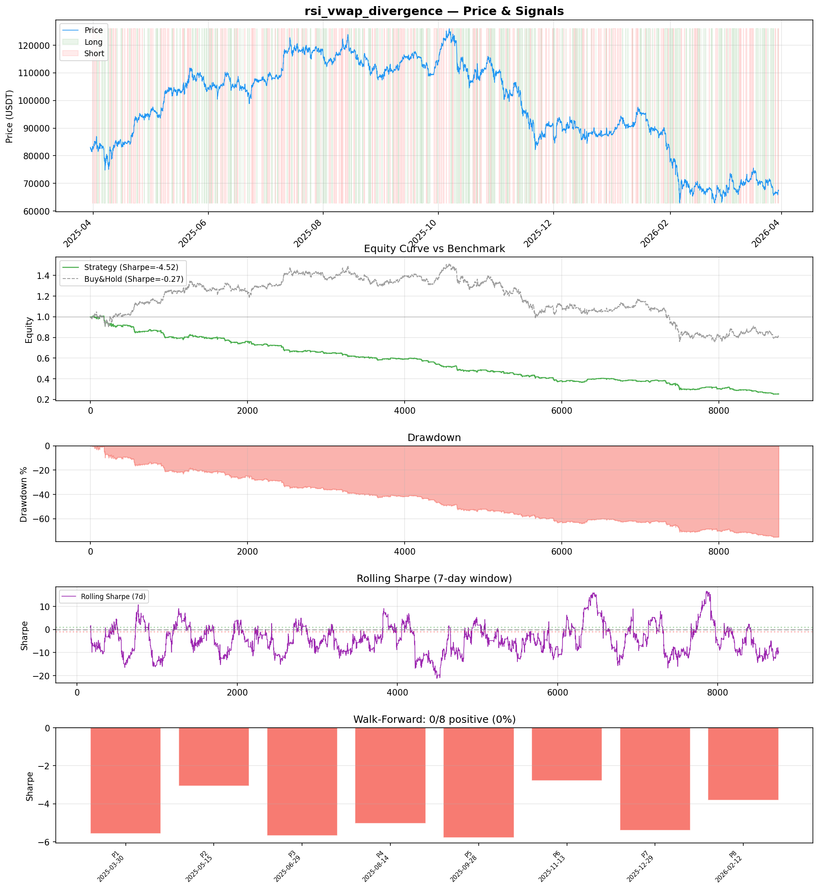
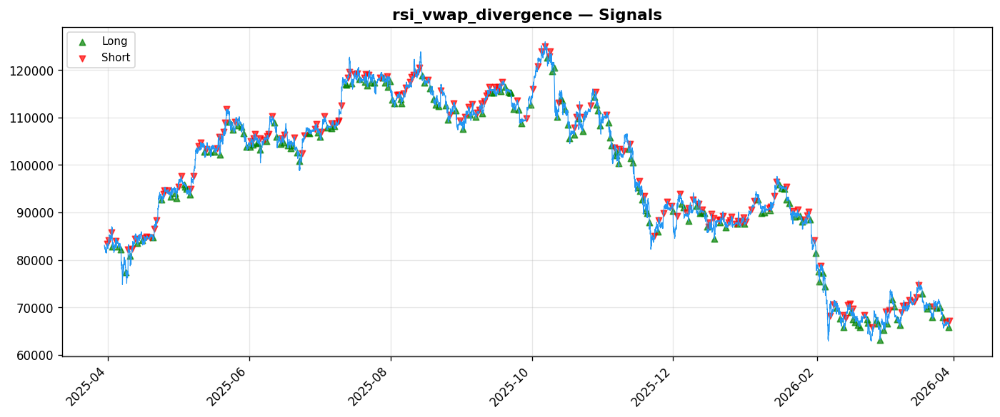

# Strategy Report: rsi_vwap_divergence
**Generated**: 2026-03-30 10:13 UTC
**Verdict**: 🔴 **REJECT** (confidence: high)

## Executive Summary
This experiment is fundamentally flawed and must be rejected immediately. The critical issue is that the backtest uses a synthetic 'funding rate proxy' based on price momentum rather than actual funding rates, completely invalidating the strategy premise. This isn't testing funding rate arbitrage at all - it's testing a momentum strategy disguised as arbitrage. Beyond this fatal flaw, the results are catastrophic: -75.9% returns, -4.518 Sharpe ratio, 76.5% max drawdown, and zero positive subperiods across all 8 walk-forward tests. The strategy destroys capital at 4x the rate of simply holding BTC during a down market. It cannot survive even modest increases in transaction costs (Sharpe degrades to -6.7 with 2x fees). This represents a complete absence of any tradeable edge combined with massive execution complexity that is entirely unjustified given the consistently negative performance.

## Key Metrics

| Metric | In-Sample | Out-of-Sample |
|--------|-----------|---------------|
| Sharpe Ratio | -4.518 | -4.658 |
| Total Return | -75.93% | -36.82% |
| CAGR | -75.93% | — |
| Max Drawdown | 76.49% | 38.78% |
| Total Trades | 350 | 83 |
| Win Rate | 40.90% | — |
| Profit Factor | 0.427 | — |
| Calmar | -0.993 | — |
| Sortino | -3.888 | — |

**Config**: `BTC/USDT` / `1h` / `mean_reversion` / 8760 bars
**Period**: 2025-03-30 11:00:00+00:00 → 2026-03-30 10:00:00+00:00
**Signals**: 1774 long / 1832 short / 5154 flat (702 transitions)

## Benchmark Comparison

| Benchmark | Return | Sharpe | Max DD |
|-----------|--------|--------|--------|
| **Strategy** | -75.93% | -4.518 | 76.49% |
| Buy And Hold | -18.86% | -0.272 | -50.10% |
| Short And Hold | 2.50% | 0.272 | -44.23% |
| Risk Free | 0.00% | 0.000 | 0.00% |

❌ Strategy Sharpe (-4.518) **loses to** Buy & Hold (-0.272)

## Walk-Forward Analysis

**0/8 periods positive** (consistency: 0%)
Average Sharpe: -4.641 ± 1.152

| Period | Dates | Sharpe | Return | Max DD | Trades | ✓ |
|--------|-------|--------|--------|--------|--------|---|
| P1 | 2025-03-30→2025-05-15 | -5.569 | -20.64% | 22.17% | 39 | ❌ |
| P2 | 2025-05-15→2025-06-29 | -3.055 | -9.32% | 13.09% | 46 | ❌ |
| P3 | 2025-06-29→2025-08-14 | -5.688 | -14.88% | 17.07% | 47 | ❌ |
| P4 | 2025-08-14→2025-09-28 | -5.041 | -11.93% | 11.93% | 44 | ❌ |
| P5 | 2025-09-28→2025-11-13 | -5.776 | -20.08% | 21.23% | 44 | ❌ |
| P6 | 2025-11-13→2025-12-29 | -2.790 | -11.75% | 18.17% | 46 | ❌ |
| P7 | 2025-12-29→2026-02-12 | -5.396 | -25.00% | 28.03% | 42 | ❌ |
| P8 | 2026-02-12→2026-03-30 | -3.810 | -15.58% | 22.59% | 42 | ❌ |

## Performance Charts





## Chart Analysis
```
=== CHART ANALYSIS ===

Signals: 1774 long (20.3%), 1832 short (20.9%), 5154 flat (58.8%)
Transitions: 702

Strategy: Sharpe=-4.518, Return=-75.9%, MaxDD=76.5%
Buy&Hold: Sharpe=-0.272, Return=-18.86%, MaxDD=-50.10%
❌ Strategy LOSES to Buy&Hold

Walk-Forward (8 periods):
  Consistency: 0/8 positive (0%)
  Avg Sharpe: -4.641 ± 1.152
  Sharpes: [-5.57, -3.06, -5.69, -5.04, -5.78, -2.79, -5.40, -3.81]
=== END ===
```

## Robustness Analysis

**Score**: 14.3% (1/7 tests passed)

| Test | ✓ | Details |
|------|---|---------|
| fee_sensitivity_2x | ❌ | Sharpe with 2x fees: -6.710 |
| slippage_sensitivity_3x | ❌ | Sharpe with 3x slippage: -6.710 |
| delayed_entry_1bar | ❌ | Sharpe with 1-bar delay: -4.402 |
| spread_widening_5x | ❌ | Sharpe with 5x spread: -6.281 |
| top_trades_removal | ✅ | PnL ratio after removal: 1.29 (kept 129% of profits) |
| subperiod_stability | ❌ | 0/4 periods with positive Sharpe (0%) |
| signal_degradation_10pct | ❌ | Sharpe with 10% signal noise: -7.951 |

## Hypothesis

**Title**: N/A
**Thesis**: N/A

## Agent Reviews

### Risk Manager
**Verdict**: N/A

### Auditor
**Verdict**: N/A
This strategy is a complete failure that destroys capital at an alarming rate (-75.9% returns, -4.518 Sharpe) while using synthetic data that doesn't represent the actual funding arbitrage opportunity. The backtest essentially tests a momentum strategy disguised as funding arbitrage, making all results meaningless. Even if the data were real, zero positive subperiods across all market conditions indicate no edge exists.

## Final Decision

**Key Risks:**
- Data integrity failure: synthetic funding proxy invalidates entire hypothesis
- Catastrophic capital destruction: -76% drawdown with no recovery periods
- Zero edge evidence: no positive performance in any market regime
- Execution fragility: strategy collapses under realistic transaction costs
- Complexity without benefit: 15 features and multi-asset coordination for negative returns

**Improvements:**
- Complete strategy redesign using actual funding rate data
- Demonstrate positive returns in majority of subperiods before any consideration
- Achieve minimum Sharpe ratio above 0.5 threshold
- Reduce maximum drawdown below 10% acceptable limit
- Outperform simple buy-and-hold benchmark consistently
- Survive realistic transaction cost scenarios without edge destruction

**Edge Evidence:**
- No evidence of any edge - all metrics indicate consistent capital destruction
- Zero positive subperiods across 8 walk-forward tests
- Underperforms all benchmarks including buy-and-hold by massive margins
- Cannot survive basic robustness tests for fees or slippage

**Dissenting View:**
> A contrarian might argue that the 350 trade sample provides statistical significance and that funding arbitrage could work with proper data. However, this ignores that: (1) the synthetic proxy makes all results meaningless, (2) even with perfect data, zero positive subperiods indicate no underlying edge, and (3) the strategy's inability to survive realistic costs proves it's economically unviable. No reasonable risk manager would allocate capital to a strategy with these characteristics.
