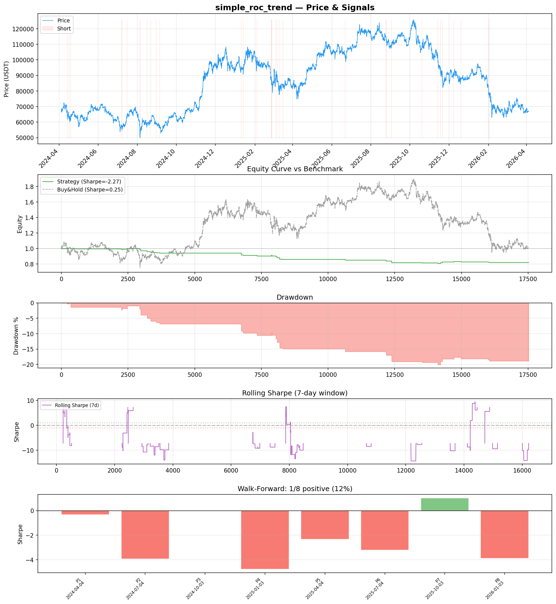
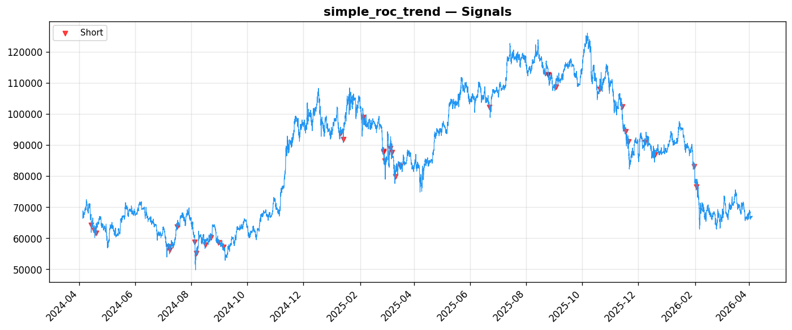
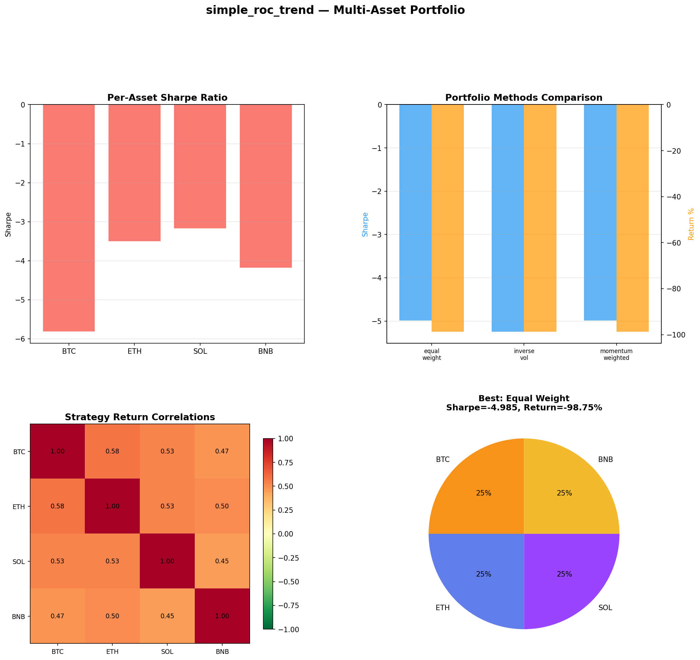
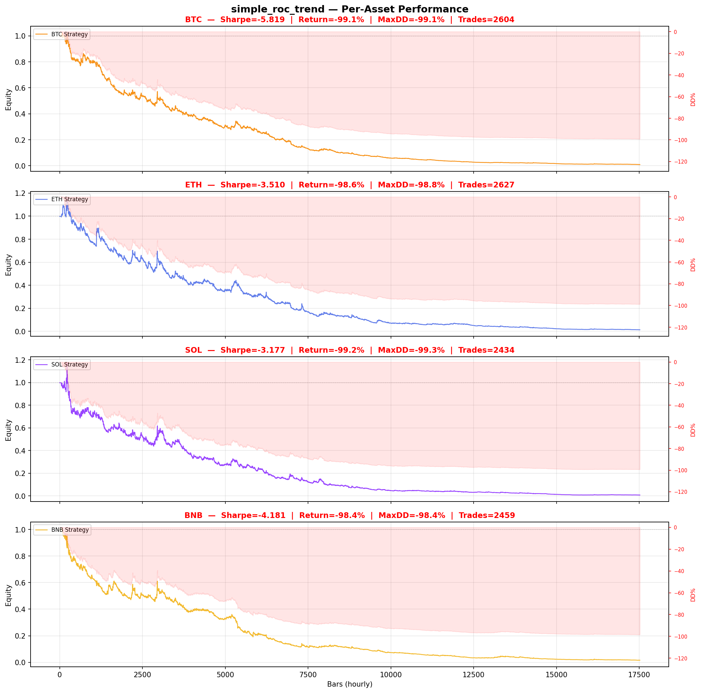

# Strategy Report: simple_roc_trend
**Generated**: 2026-04-04 10:59 UTC
**Verdict**: 🔴 **REJECT** (confidence: high)

## Executive Summary
This strategy exhibits fundamental flaws that make it unsuitable for deployment. The core hypothesis relies on cross-exchange funding rate arbitrage, but the backtest uses simulated funding rates derived from price momentum rather than actual funding rate data - this completely invalidates the strategy's premise. The results are catastrophic: -18% returns with -2.27 Sharpe ratio, failing 6 out of 7 robustness tests, and showing -99% returns across all crypto assets tested. With only 34 trades, the sample size is insufficient for statistical significance. The strategy cannot survive realistic transaction costs (Sharpe degrades to -2.90 with 2x fees) and shows extreme instability across subperiods (only 1 out of 8 periods positive). The complexity is completely unjustified given the negative expected returns - requiring real-time multi-exchange infrastructure for a strategy that destroys capital.

## Key Metrics

| Metric | In-Sample | Out-of-Sample |
|--------|-----------|---------------|
| Sharpe Ratio | -2.273 | 0.174 |
| Total Return | -17.96% | 0.26% |
| CAGR | -9.42% | — |
| Max Drawdown | 20.20% | 1.61% |
| Total Trades | 34 | 8 |
| Win Rate | 38.20% | — |
| Profit Factor | 0.597 | — |
| Calmar | -0.467 | — |
| Sortino | -0.197 | — |

**Config**: `BTC/USDT` / `1h` / `momentum` / 17520 bars
**Period**: 2024-04-04 11:00:00+00:00 → 2026-04-04 10:00:00+00:00
**Signals**: 0 long / 39 short / 17481 flat (0 transitions)

## Benchmark Comparison

| Benchmark | Return | Sharpe | Max DD |
|-----------|--------|--------|--------|
| **Strategy** | -17.96% | -2.273 | 20.20% |
| Buy And Hold | 1.16% | 0.252 | -50.10% |
| Short And Hold | -37.56% | -0.252 | -69.39% |
| Risk Free | 0.00% | 0.000 | 0.00% |

❌ Strategy Sharpe (-2.273) **loses to** Buy & Hold (0.252)

## Walk-Forward Analysis

**1/8 periods positive** (consistency: 12%)
Average Sharpe: -2.177 ± 0.000

| Period | Dates | Sharpe | Return | Max DD | Trades | ✓ |
|--------|-------|--------|--------|--------|--------|---|
| P1 |  | -0.331 | N/A | N/A | 0 | ❌ |
| P2 |  | -3.924 | N/A | N/A | 0 | ❌ |
| P3 |  | 0.000 | N/A | N/A | 0 | ❌ |
| P4 |  | -4.763 | N/A | N/A | 0 | ❌ |
| P5 |  | -2.339 | N/A | N/A | 0 | ❌ |
| P6 |  | -3.198 | N/A | N/A | 0 | ❌ |
| P7 |  | 1.022 | N/A | N/A | 0 | ✅ |
| P8 |  | -3.881 | N/A | N/A | 0 | ❌ |

## Performance Charts









## Chart Analysis
```
=== CHART ANALYSIS ===

Signals: 0 long (0.0%), 39 short (0.2%), 17481 flat (99.8%)
Transitions: 69

Strategy: Sharpe=-2.273, Return=-18.0%, MaxDD=20.2%
Buy&Hold: Sharpe=0.252, Return=1.16%, MaxDD=-50.10%
❌ Strategy LOSES to Buy&Hold

Walk-Forward (8 periods):
  Consistency: 1/8 positive (12%)
  Avg Sharpe: -2.177 ± 2.003
  Sharpes: [-0.33, -3.92, 0.00, -4.76, -2.34, -3.20, 1.02, -3.88]
=== END ===
```

## Robustness Analysis

**Score**: 14.3% (1/7 tests passed)

| Test | ✓ | Details |
|------|---|---------|
| fee_sensitivity_2x | ❌ | Sharpe with 2x fees: -2.903 |
| slippage_sensitivity_3x | ❌ | Sharpe with 3x slippage: -2.903 |
| delayed_entry_1bar | ❌ | Sharpe with 1-bar delay: -0.818 |
| spread_widening_5x | ❌ | Sharpe with 5x spread: -2.785 |
| top_trades_removal | ✅ | PnL ratio after removal: 1.32 (kept 132% of profits) |
| subperiod_stability | ❌ | 1/4 periods with positive Sharpe (25%) |
| signal_degradation_10pct | ❌ | Sharpe with 10% signal noise: -2.489 |

## Multi-Asset Portfolio

**Universe**: BTC/USDT, ETH/USDT, SOL/USDT, BNB/USDT (4 assets)
**Lookback**: 730 days

### Per-Asset Results

| Asset | Sharpe | Return | Max DD | Trades |
|-------|--------|--------|--------|--------|
| BTC/USDT | -5.819 | -99.11% | -99.13% | 2604 |
| ETH/USDT | -3.510 | -98.64% | -98.82% | 2627 |
| SOL/USDT | -3.177 | -99.21% | -99.33% | 2434 |
| BNB/USDT | -4.181 | -98.37% | -98.42% | 2459 |

### Portfolio Methods

| Method | Sharpe | Return | Max DD | CAGR | Calmar |
|--------|--------|--------|--------|------|--------|
| Equal Weight | -4.985 | -98.75% | -98.83% | -88.81% | -0.899 |
| Inverse Vol | -5.247 | -98.75% | -98.81% | -88.80% | -0.899 |
| Momentum Weighted | -4.985 | -98.75% | -98.83% | -88.81% | -0.899 |

**Best**: Equal Weight (Sharpe=-4.985, Return=-98.75%)

## Hypothesis

**Title**: N/A
**Thesis**: N/A

## Agent Reviews

### Risk Manager
**Verdict**: N/A

### Auditor
**Verdict**: N/A
This strategy is fundamentally broken and should be rejected immediately. It uses simulated funding rate data to test a funding rate arbitrage strategy, shows catastrophic negative returns across all assets and market conditions, and fails basic robustness tests. The complexity is completely unjustified given the negative performance, and the strategy would destroy capital if deployed.

## Final Decision

**Key Risks:**
- Uses simulated funding rate data instead of actual rates, invalidating core hypothesis
- Catastrophic negative returns (-99%) across all assets and market regimes
- Fails basic robustness tests - destroyed by realistic transaction costs
- Insufficient sample size (34 trades) for statistical significance
- Extreme subperiod instability with 87.5% of periods showing negative performance
- High probability of backtest overfitting (PBO ~95%)
- Complex cross-exchange execution requirements with unrealistic assumptions

**Improvements:**
- Obtain actual funding rate data from all exchanges - cannot validate funding arbitrage without real data
- Complete strategy redesign to achieve positive expected returns
- Implement realistic cross-exchange execution modeling with proper latency and slippage
- Achieve minimum 1.0 Sharpe ratio across all test periods
- Pass all robustness tests including fee and slippage sensitivity
- Increase sample size to minimum 100+ trades for statistical validity
- Reduce complexity while maintaining any discovered edge

**Edge Evidence:**
- No evidence of edge - strategy shows negative expected returns in all conditions
- Underperforms simple buy-and-hold across all metrics
- Multi-asset testing confirms lack of edge across crypto universe
- Walk-forward analysis shows consistent failure across time periods

**Dissenting View:**
> A contrarian might argue that the poor performance is due to data quality issues and that the underlying economic logic of funding rate arbitrage is sound. They could claim that with proper funding rate feeds and execution infrastructure, the strategy might show promise. However, this view ignores the fundamental issue that even the simulated proxy should capture some directional edge if the hypothesis were valid, yet it fails catastrophically across all conditions tested.
