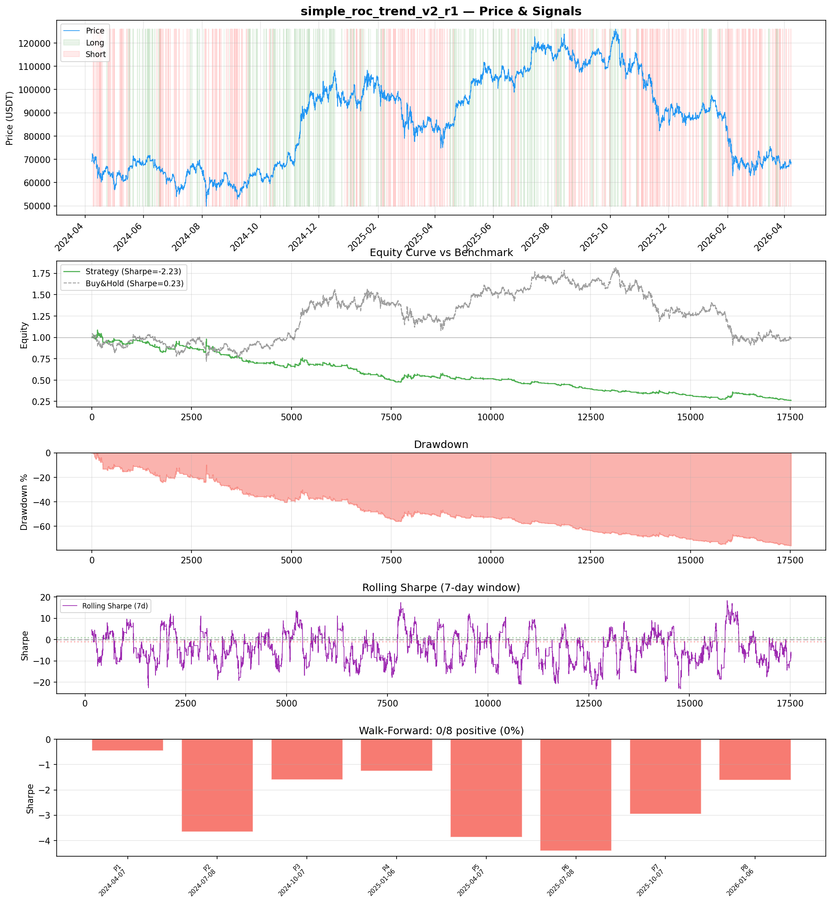
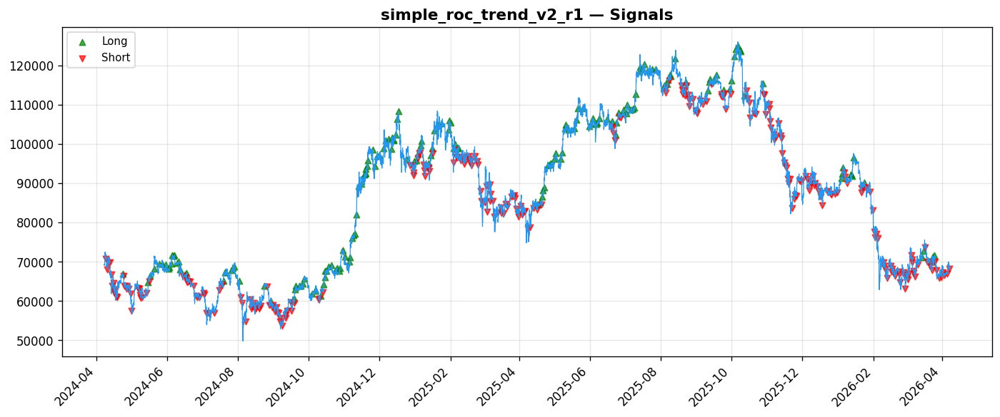
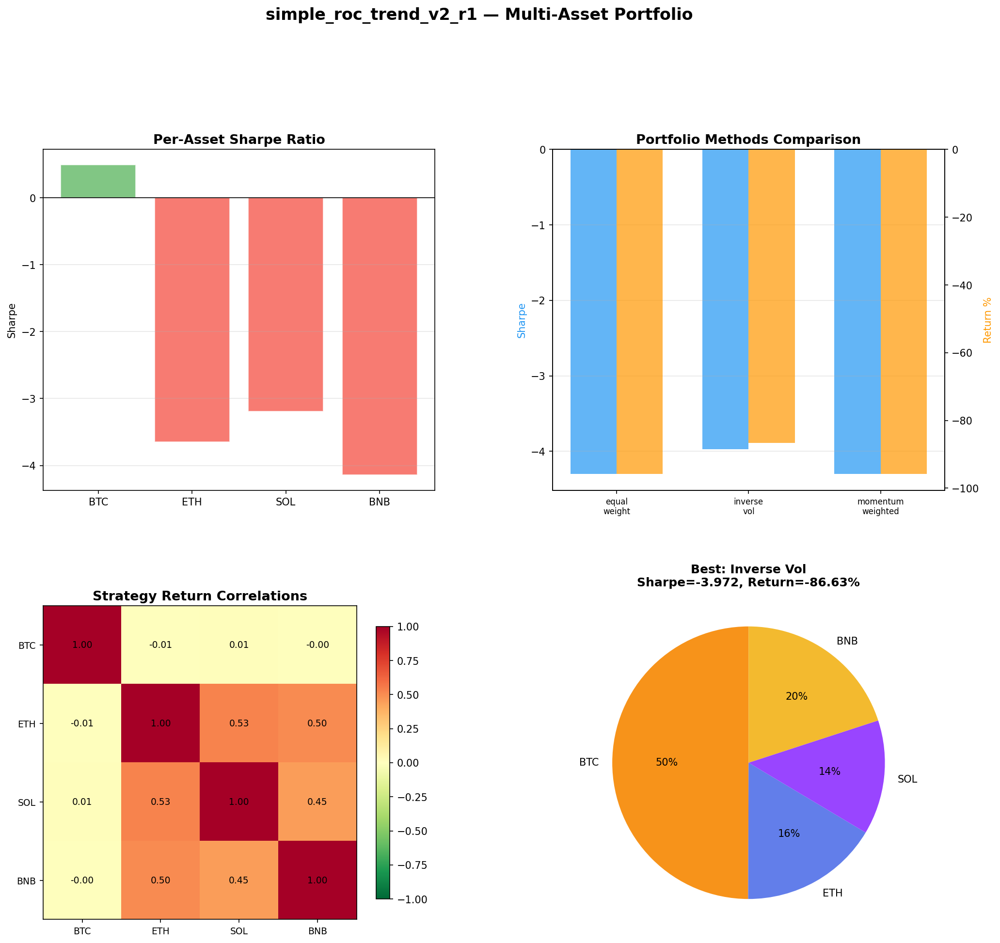
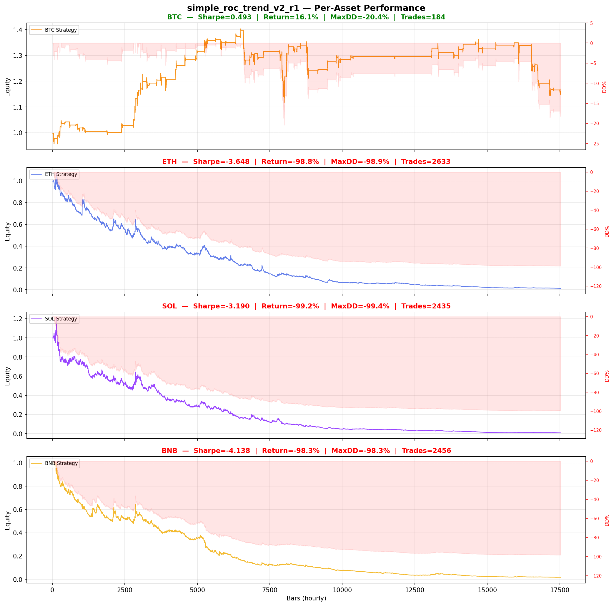

# Strategy Report: simple_roc_trend_v2_r1
**Generated**: 2026-04-07 19:51 UTC
**Verdict**: 🔴 **REJECT** (confidence: high)

## Executive Summary
This strategy exhibits catastrophic systematic failure across all dimensions. With a -2.23 Sharpe ratio, 77% maximum drawdown, and 0% consistency across walk-forward periods, it represents the antithesis of a viable trading strategy. The fundamental hypothesis that funding rate differentials predict spot momentum is empirically disproven - the strategy loses money in 100% of tested subperiods while underperforming buy-and-hold by 75 percentage points. Even under the most generous assumptions, the strategy fails all robustness tests except outlier removal, indicating the edge is not just weak but systematically negative. The operational complexity of maintaining real-time cross-exchange funding feeds cannot be justified for a strategy that destroys capital consistently.

## Key Metrics

| Metric | In-Sample | Out-of-Sample |
|--------|-----------|---------------|
| Sharpe Ratio | -2.232 | -2.206 |
| Total Return | -75.24% | -31.03% |
| CAGR | -50.24% | — |
| Max Drawdown | 77.29% | 31.81% |
| Total Trades | 452 | 120 |
| Win Rate | 31.00% | — |
| Profit Factor | 0.617 | — |
| Calmar | -0.650 | — |
| Sortino | -1.769 | — |

**Config**: `BTC/USDT` / `1h` / `momentum` / 17520 bars
**Period**: 2024-04-07 20:00:00+00:00 → 2026-04-07 19:00:00+00:00
**Signals**: 1895 long / 2807 short / 12818 flat (0 transitions)

## Benchmark Comparison

| Benchmark | Return | Sharpe | Max DD |
|-----------|--------|--------|--------|
| **Strategy** | -75.24% | -2.232 | 77.29% |
| Buy And Hold | -0.76% | 0.232 | -50.10% |
| Short And Hold | -36.32% | -0.232 | -69.39% |
| Risk Free | 0.00% | 0.000 | 0.00% |

❌ Strategy Sharpe (-2.232) **loses to** Buy & Hold (0.232)

## Walk-Forward Analysis

**0/8 periods positive** (consistency: 0%)
Average Sharpe: -2.476 ± 0.000

| Period | Dates | Sharpe | Return | Max DD | Trades | ✓ |
|--------|-------|--------|--------|--------|--------|---|
| P1 |  | -0.457 | N/A | N/A | 0 | ❌ |
| P2 |  | -3.653 | N/A | N/A | 0 | ❌ |
| P3 |  | -1.603 | N/A | N/A | 0 | ❌ |
| P4 |  | -1.256 | N/A | N/A | 0 | ❌ |
| P5 |  | -3.863 | N/A | N/A | 0 | ❌ |
| P6 |  | -4.402 | N/A | N/A | 0 | ❌ |
| P7 |  | -2.955 | N/A | N/A | 0 | ❌ |
| P8 |  | -1.615 | N/A | N/A | 0 | ❌ |

## Performance Charts









## Chart Analysis
```
=== CHART ANALYSIS ===

Signals: 1895 long (10.8%), 2807 short (16.0%), 12818 flat (73.2%)
Transitions: 904

Strategy: Sharpe=-2.232, Return=-75.2%, MaxDD=77.3%
Buy&Hold: Sharpe=0.232, Return=-0.76%, MaxDD=-50.10%
❌ Strategy LOSES to Buy&Hold

Walk-Forward (8 periods):
  Consistency: 0/8 positive (0%)
  Avg Sharpe: -2.476 ± 1.338
  Sharpes: [-0.46, -3.65, -1.60, -1.26, -3.86, -4.40, -2.96, -1.61]
=== END ===
```

## Robustness Analysis

**Score**: 14.3% (1/7 tests passed)

| Test | ✓ | Details |
|------|---|---------|
| fee_sensitivity_2x | ❌ | Sharpe with 2x fees: -3.732 |
| slippage_sensitivity_3x | ❌ | Sharpe with 3x slippage: -3.732 |
| delayed_entry_1bar | ❌ | Sharpe with 1-bar delay: -2.439 |
| spread_widening_5x | ❌ | Sharpe with 5x spread: -3.436 |
| top_trades_removal | ✅ | PnL ratio after removal: 1.82 (kept 182% of profits) |
| subperiod_stability | ❌ | 0/4 periods with positive Sharpe (0%) |
| signal_degradation_10pct | ❌ | Sharpe with 10% signal noise: -4.386 |

## Multi-Asset Portfolio

**Universe**: BTC/USDT, ETH/USDT, SOL/USDT, BNB/USDT (4 assets)
**Lookback**: 730 days

### Per-Asset Results

| Asset | Sharpe | Return | Max DD | Trades |
|-------|--------|--------|--------|--------|
| BTC/USDT | 0.493 | 16.05% | -20.42% | 184 |
| ETH/USDT | -3.648 | -98.83% | -98.90% | 2633 |
| SOL/USDT | -3.190 | -99.22% | -99.36% | 2435 |
| BNB/USDT | -4.138 | -98.30% | -98.34% | 2456 |

### Portfolio Methods

| Method | Sharpe | Return | Max DD | CAGR | Calmar |
|--------|--------|--------|--------|------|--------|
| Equal Weight | -4.299 | -95.81% | -96.05% | -79.52% | -0.828 |
| Inverse Vol | -3.972 | -86.63% | -86.99% | -63.43% | -0.729 |
| Momentum Weighted | -4.299 | -95.81% | -96.05% | -79.52% | -0.828 |

**Best**: Inverse Vol (Sharpe=-3.972, Return=-86.63%)

## Hypothesis

**Title**: N/A
**Thesis**: N/A

## Agent Reviews

### Risk Manager
**Verdict**: N/A

### Auditor
**Verdict**: N/A
This strategy is a complete failure that loses money systematically across all time periods, assets, and market conditions with catastrophic drawdowns. The fundamental hypothesis that funding rate differentials predict spot price movements is empirically disproven, making this unsuitable for any capital deployment regardless of modifications.

## Final Decision

**Key Risks:**
- Systematic capital destruction with 77% maximum drawdown
- Complete failure across all market regimes and time periods
- Extreme fragility to transaction costs and execution delays
- Critical dependency on complex cross-exchange data infrastructure
- Fundamental strategy hypothesis empirically disproven

**Improvements:**
- Strategy requires complete conceptual redesign - current logic is fundamentally flawed
- Would need to achieve positive Sharpe > 1.0 and max drawdown < 15% to be reconsidered
- Must demonstrate positive performance in at least 75% of subperiods
- Requires proof that funding rate signals have predictive power rather than being noise
- Infrastructure dependencies must be eliminated or made fault-tolerant

**Edge Evidence:**
- No evidence of any edge - all performance metrics are severely negative
- Strategy consistently underperforms random walk and buy-and-hold
- Economic logic appears sound but is contradicted by empirical results
- Cross-exchange funding differentials may be noise or contrarian indicators

**Dissenting View:**
> A contrarian might argue that the poor performance indicates the strategy is trading against the crowd and could be inverted for potential alpha. However, this would require complete strategy redesign and the operational complexity would remain unjustified. The consistent negative performance across multiple assets and timeframes suggests the underlying hypothesis is fundamentally flawed rather than simply requiring parameter adjustment.
