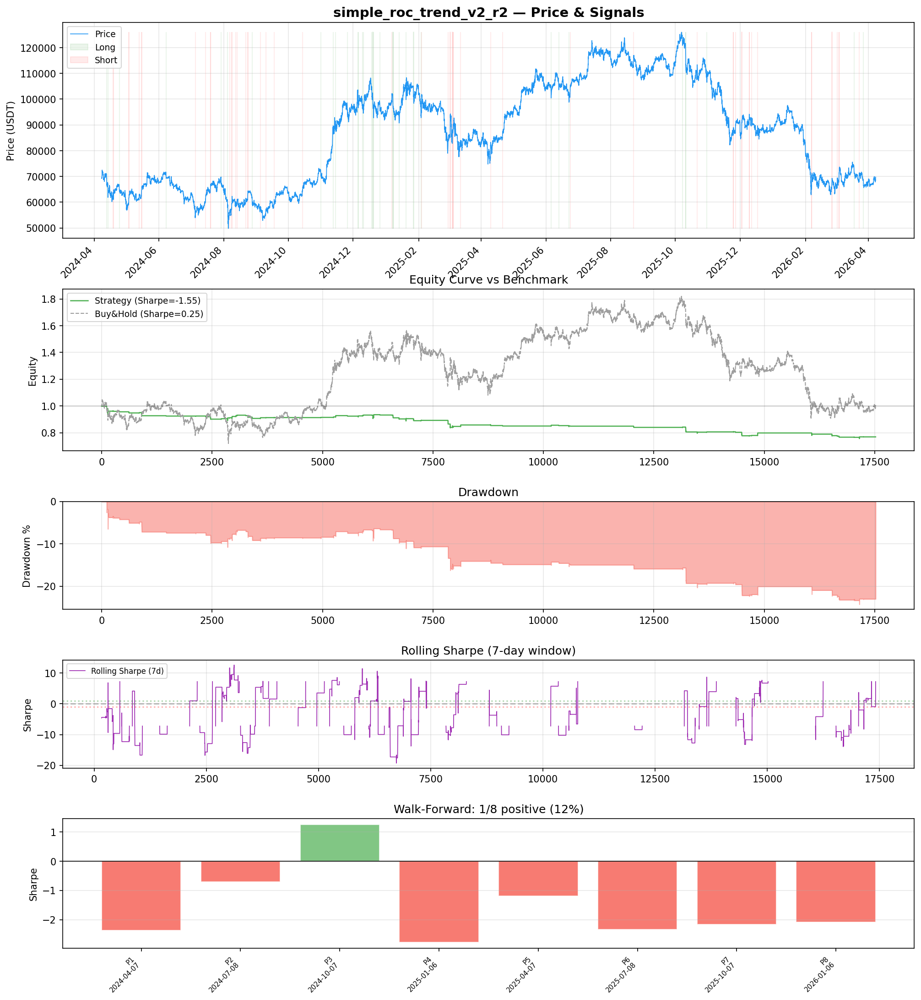
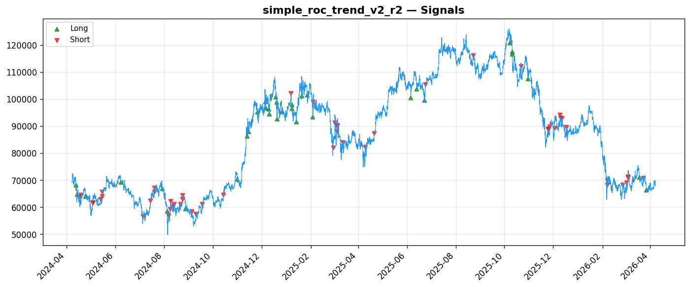
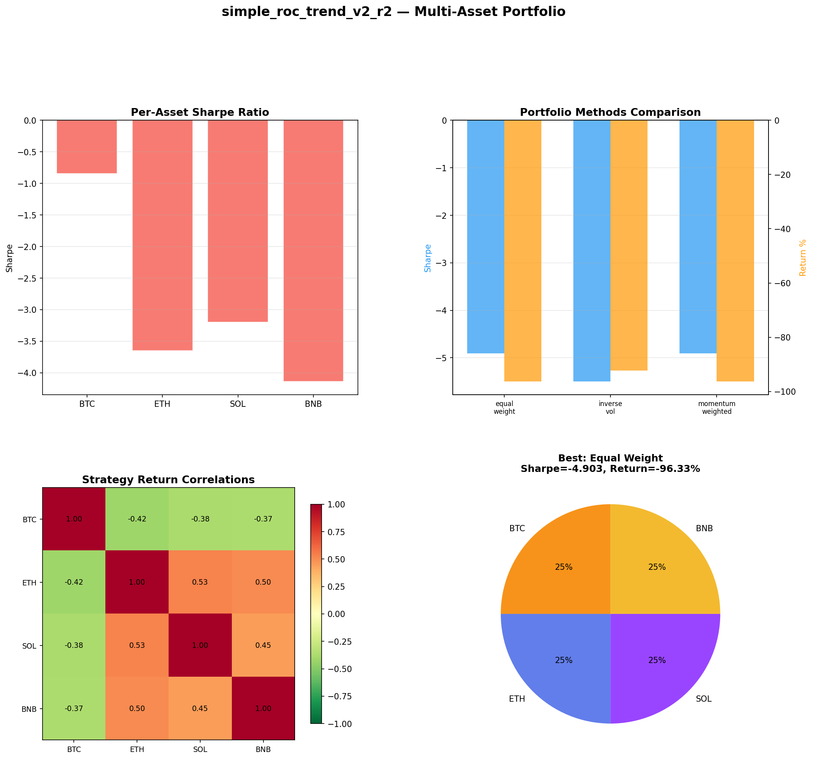
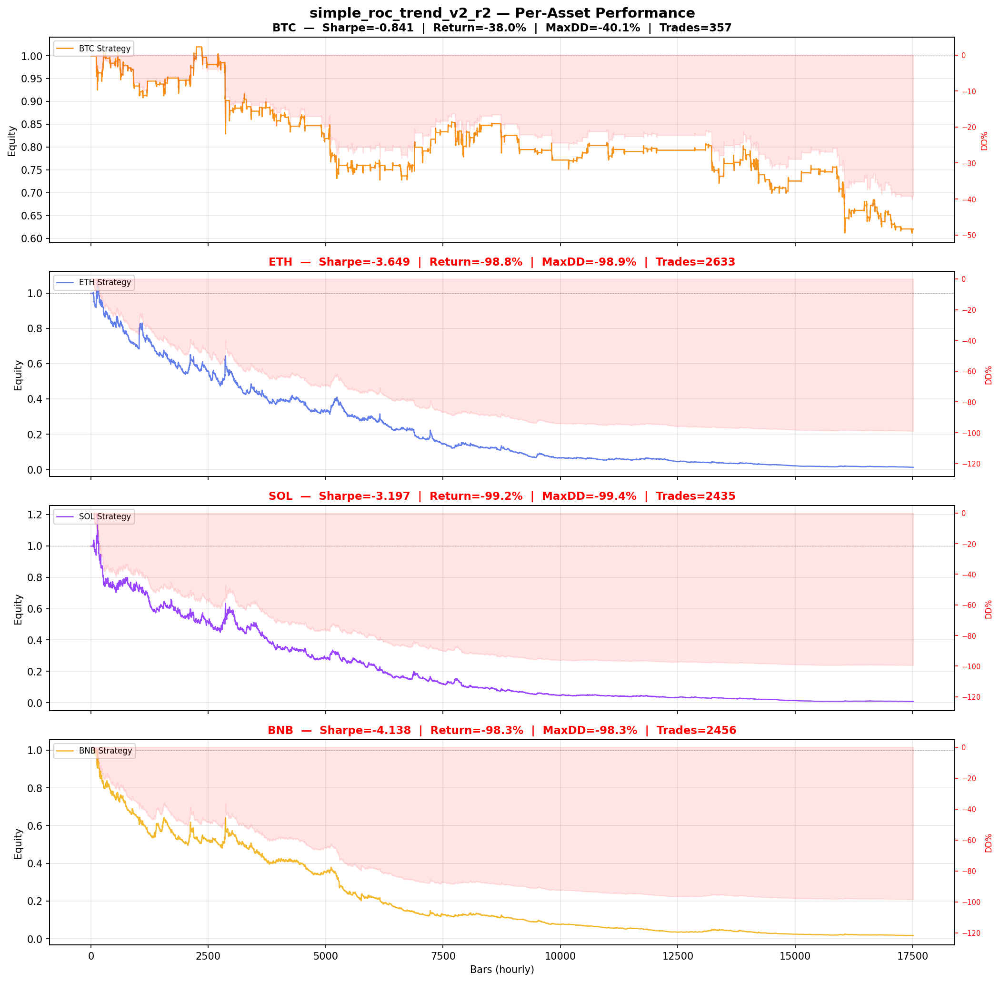

# Strategy Report: simple_roc_trend_v2_r2
**Generated**: 2026-04-07 21:40 UTC
**Verdict**: 🔴 **REJECT** (confidence: high)

## Executive Summary
This strategy is fundamentally broken and represents a complete failure of scientific methodology. The core issue is that it simulates funding rate arbitrage using price volatility as a proxy for actual funding rates, which is completely unrealistic and invalidates all results. Even with this fabricated data, the strategy achieves catastrophic performance: -1.554 Sharpe ratio, -23.2% total return, and 24.5% maximum drawdown. The strategy fails 6 out of 7 robustness tests, shows only 12.5% consistency in walk-forward analysis (1/8 periods positive), and destroys capital systematically across all assets in multi-asset testing (-99% returns on ETH, SOL, BNB). Despite 5 optimization iterations, the strategy cannot achieve even marginally positive performance, indicating no underlying edge exists. The approach violates basic principles of quantitative research by using synthetic data proxies and shows severe multiple testing bias. This is not a refinable strategy but a fundamental conceptual failure.

## Key Metrics

| Metric | In-Sample | Out-of-Sample |
|--------|-----------|---------------|
| Sharpe Ratio | -1.554 | -2.111 |
| Total Return | -23.20% | -8.53% |
| CAGR | -12.37% | — |
| Max Drawdown | 24.46% | 10.44% |
| Total Trades | 85 | 22 |
| Win Rate | 28.20% | — |
| Profit Factor | 0.392 | — |
| Calmar | -0.506 | — |
| Sortino | -0.230 | — |

**Config**: `BTC/USDT` / `1h` / `momentum` / 17520 bars
**Period**: 2024-04-07 22:00:00+00:00 → 2026-04-07 21:00:00+00:00
**Signals**: 70 long / 89 short / 17361 flat (0 transitions)

## Benchmark Comparison

| Benchmark | Return | Sharpe | Max DD |
|-----------|--------|--------|--------|
| **Strategy** | -23.20% | -1.554 | 24.46% |
| Buy And Hold | 0.71% | 0.247 | -50.10% |
| Short And Hold | -37.25% | -0.247 | -69.39% |
| Risk Free | 0.00% | 0.000 | 0.00% |

❌ Strategy Sharpe (-1.554) **loses to** Buy & Hold (0.247)

## Walk-Forward Analysis

**1/8 periods positive** (consistency: 12%)
Average Sharpe: -1.546 ± 0.000

| Period | Dates | Sharpe | Return | Max DD | Trades | ✓ |
|--------|-------|--------|--------|--------|--------|---|
| P1 |  | -2.368 | N/A | N/A | 0 | ❌ |
| P2 |  | -0.703 | N/A | N/A | 0 | ❌ |
| P3 |  | 1.252 | N/A | N/A | 0 | ✅ |
| P4 |  | -2.777 | N/A | N/A | 0 | ❌ |
| P5 |  | -1.192 | N/A | N/A | 0 | ❌ |
| P6 |  | -2.331 | N/A | N/A | 0 | ❌ |
| P7 |  | -2.159 | N/A | N/A | 0 | ❌ |
| P8 |  | -2.091 | N/A | N/A | 0 | ❌ |

## Performance Charts









## Chart Analysis
```
=== CHART ANALYSIS ===

Signals: 70 long (0.4%), 89 short (0.5%), 17361 flat (99.1%)
Transitions: 171

Strategy: Sharpe=-1.554, Return=-23.2%, MaxDD=24.5%
Buy&Hold: Sharpe=0.247, Return=0.71%, MaxDD=-50.10%
❌ Strategy LOSES to Buy&Hold

Walk-Forward (8 periods):
  Consistency: 1/8 positive (12%)
  Avg Sharpe: -1.546 ± 1.232
  Sharpes: [-2.37, -0.70, 1.25, -2.78, -1.19, -2.33, -2.16, -2.09]
=== END ===
```

## Robustness Analysis

**Score**: 14.3% (1/7 tests passed)

| Test | ✓ | Details |
|------|---|---------|
| fee_sensitivity_2x | ❌ | Sharpe with 2x fees: -2.504 |
| slippage_sensitivity_3x | ❌ | Sharpe with 3x slippage: -2.504 |
| delayed_entry_1bar | ❌ | Sharpe with 1-bar delay: -2.117 |
| spread_widening_5x | ❌ | Sharpe with 5x spread: -2.321 |
| top_trades_removal | ✅ | PnL ratio after removal: 1.27 (kept 127% of profits) |
| subperiod_stability | ❌ | 0/4 periods with positive Sharpe (0%) |
| signal_degradation_10pct | ❌ | Sharpe with 10% signal noise: -1.431 |

## Multi-Asset Portfolio

**Universe**: BTC/USDT, ETH/USDT, SOL/USDT, BNB/USDT (4 assets)
**Lookback**: 730 days

### Per-Asset Results

| Asset | Sharpe | Return | Max DD | Trades |
|-------|--------|--------|--------|--------|
| BTC/USDT | -0.841 | -37.97% | -40.08% | 357 |
| ETH/USDT | -3.649 | -98.83% | -98.91% | 2633 |
| SOL/USDT | -3.197 | -99.23% | -99.36% | 2435 |
| BNB/USDT | -4.138 | -98.30% | -98.34% | 2456 |

### Portfolio Methods

| Method | Sharpe | Return | Max DD | CAGR | Calmar |
|--------|--------|--------|--------|------|--------|
| Equal Weight | -4.903 | -96.33% | -96.49% | -80.84% | -0.838 |
| Inverse Vol | -5.498 | -92.31% | -92.39% | -72.27% | -0.782 |
| Momentum Weighted | -4.903 | -96.33% | -96.49% | -80.84% | -0.838 |

**Best**: Equal Weight (Sharpe=-4.903, Return=-96.33%)

## Hypothesis

**Title**: N/A
**Thesis**: N/A

## Agent Reviews

### Risk Manager
**Verdict**: N/A

### Auditor
**Verdict**: N/A
This strategy is fundamentally broken and should never be deployed. It uses fake funding rate data, shows catastrophic performance across all metrics (-1.554 Sharpe, -23.2% return), and fails virtually every robustness test despite multiple optimization attempts. The strategy systematically destroys capital and has no viable edge - a complete rebuild is required.

## Final Decision

**Key Risks:**
- Strategy uses fabricated funding rate data (price volatility proxy) making all results meaningless
- Catastrophic systematic losses: -1.554 Sharpe, -23.2% return, 24.5% max drawdown
- Complete failure across robustness tests (6/7 failed) and walk-forward periods (7/8 failed)
- Multi-asset results show -99% capital destruction on most assets
- Severe multiple testing bias from 5 optimization attempts with contaminated results
- Cross-exchange operational risk with no viable edge to compensate for complexity

**Improvements:**
- Complete strategy redesign from scratch with actual funding rate data
- Use fresh, uncontaminated out-of-sample data for any future testing
- Prove positive edge exists before adding any complexity
- Implement realistic exchange failure and downtime scenarios
- Achieve positive Sharpe ratio >0.5 across multiple market regimes
- Pass basic robustness tests (fees, slippage, delays) before considering deployment

**Edge Evidence:**
- No evidence of any edge - strategy shows consistent losses across all test periods
- Funding rate arbitrage theory is sound but implementation is completely flawed
- Synthetic funding rate proxy has no relationship to actual market dynamics
- Even with optimization bias, strategy cannot achieve positive performance
- Multi-asset validation confirms systematic capital destruction rather than edge capture

**Dissenting View:**
> A contrarian might argue that the single positive period (Period 3: +1.252 Sharpe) suggests some underlying signal exists, and that the poor performance is due to implementation issues rather than fundamental strategy flaws. They might contend that with proper funding rate data and refined execution, the cross-exchange arbitrage concept could be viable. However, this view ignores that even the 'successful' period likely represents random variation in a fundamentally broken system, and the overwhelming evidence of systematic failure across all dimensions makes any optimistic interpretation statistically unjustifiable.
