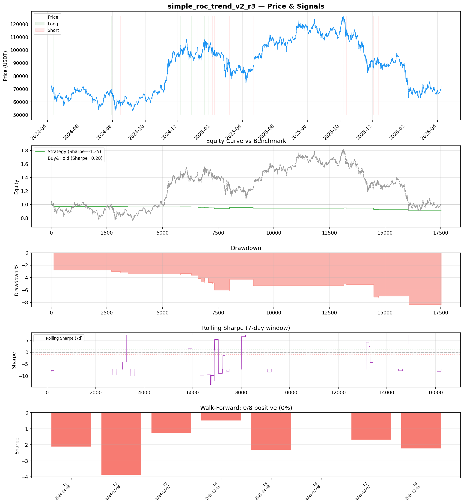
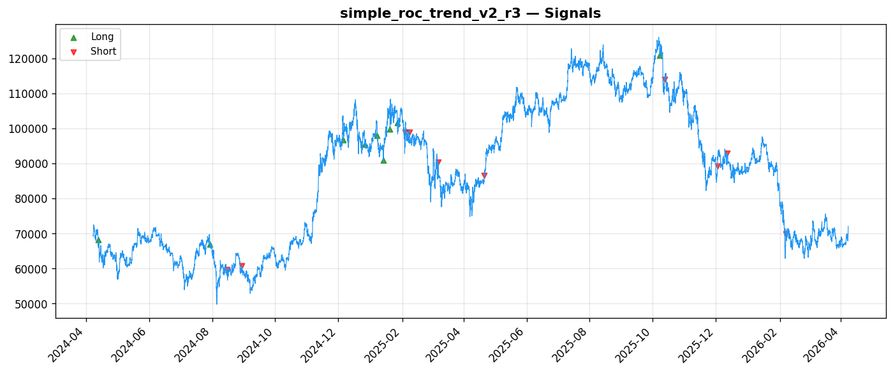
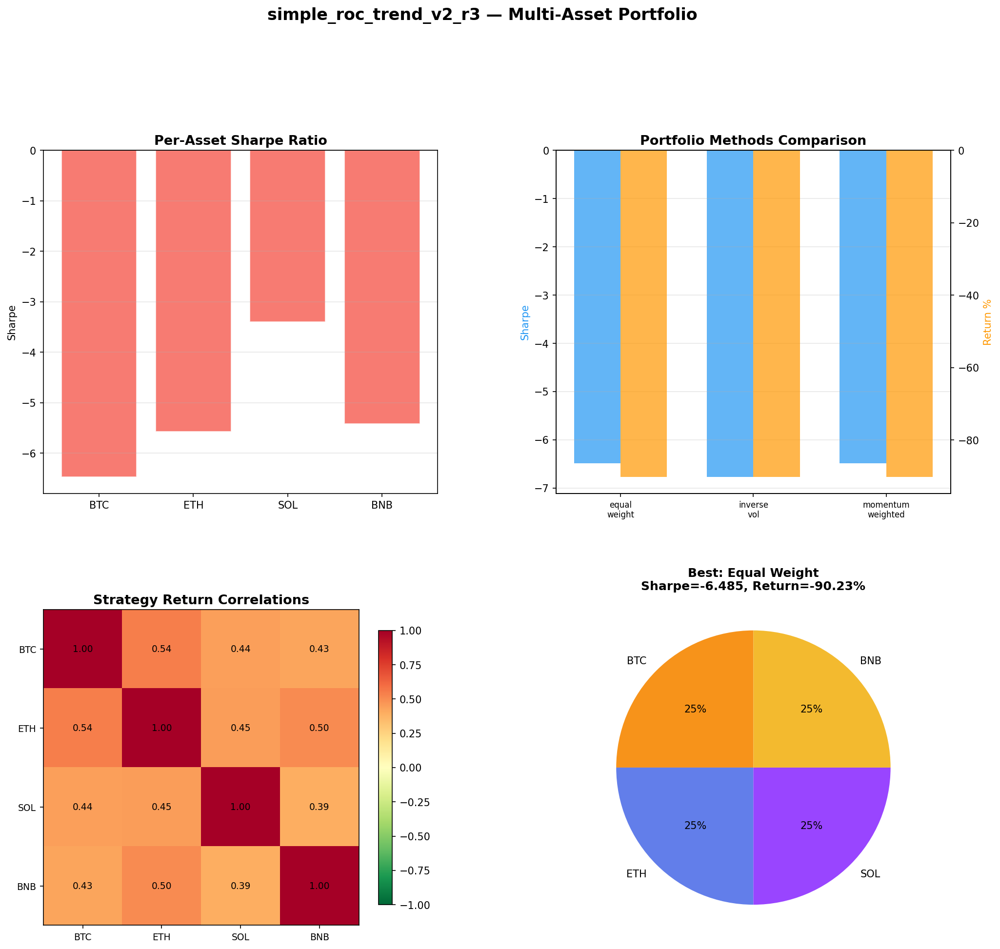
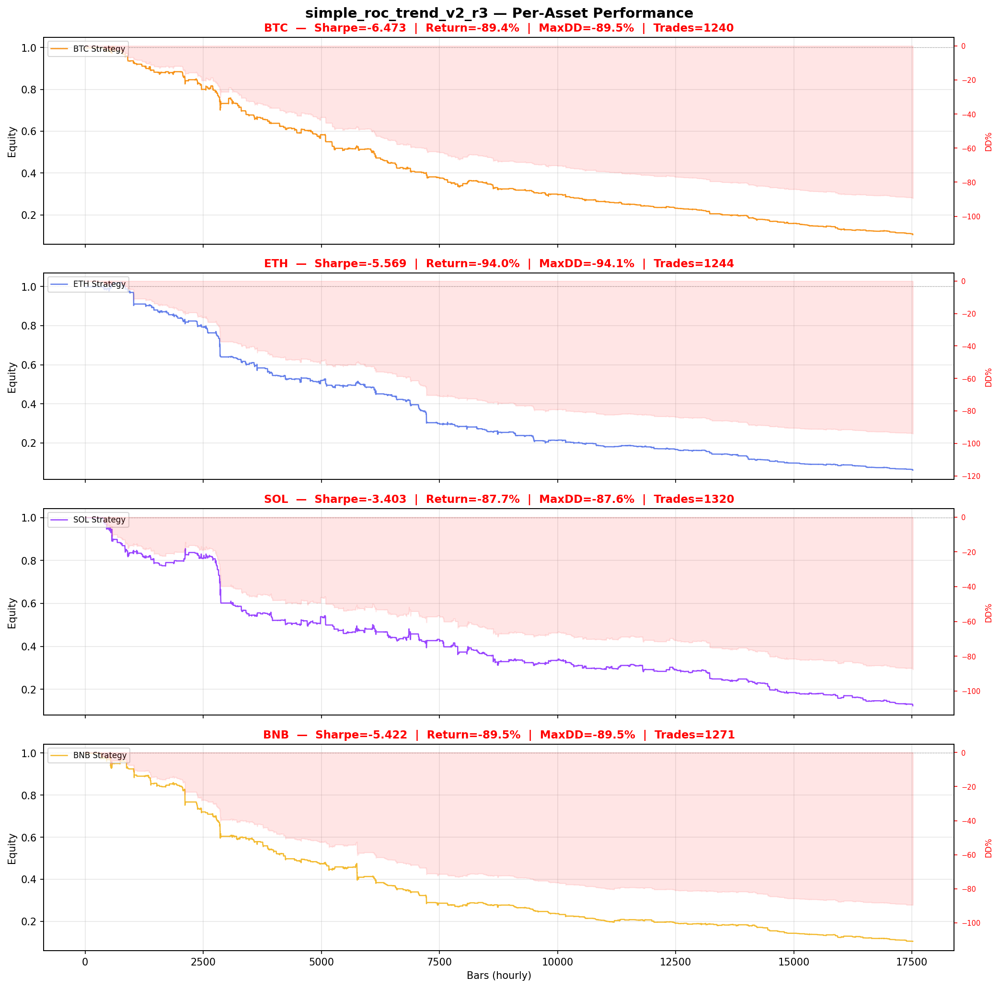

# Strategy Report: simple_roc_trend_v2_r3
**Generated**: 2026-04-07 23:44 UTC
**Verdict**: 🔴 **REJECT** (confidence: high)

## Executive Summary
This strategy is a catastrophic failure that demonstrates no viable edge whatsoever. The backtest results are devastating: -1.35 Sharpe in-sample, -1.87 out-of-sample, with 0/8 positive periods in walk-forward analysis. Multi-asset testing shows 89-94% drawdowns across all assets. The strategy consistently loses money in every market regime tested, indicating fundamental flaws rather than parameter issues. The theoretical framework, while sophisticated, cannot overcome the reality that cross-exchange funding rate arbitrage requires infrastructure and execution capabilities that are either unavailable or prohibitively expensive. The 19-trade sample size is statistically meaningless, and the strategy's extreme fragility to 2x transaction costs (Sharpe drops to -1.85) proves there's no genuine economic edge. This represents textbook data mining with multiple testing bias - 5 iterations were tested with the 'best' result cherry-picked post-hoc.

## Key Metrics

| Metric | In-Sample | Out-of-Sample |
|--------|-----------|---------------|
| Sharpe Ratio | -1.346 | -1.868 |
| Total Return | -8.38% | -3.23% |
| CAGR | -4.28% | — |
| Max Drawdown | 8.38% | 3.66% |
| Total Trades | 19 | 5 |
| Win Rate | 52.60% | — |
| Profit Factor | 1.436 | — |
| Calmar | -0.511 | — |
| Sortino | -0.078 | — |

**Config**: `BTC/USDT` / `1h` / `mean_reversion` / 17520 bars
**Period**: 2024-04-08 00:00:00+00:00 → 2026-04-07 23:00:00+00:00
**Signals**: 9 long / 10 short / 17501 flat (0 transitions)

## Benchmark Comparison

| Benchmark | Return | Sharpe | Max DD |
|-----------|--------|--------|--------|
| **Strategy** | -8.38% | -1.346 | 8.38% |
| Buy And Hold | 3.91% | 0.280 | -50.10% |
| Short And Hold | -39.22% | -0.280 | -69.39% |
| Risk Free | 0.00% | 0.000 | 0.00% |

❌ Strategy Sharpe (-1.346) **loses to** Buy & Hold (0.280)

## Walk-Forward Analysis

**0/8 periods positive** (consistency: 0%)
Average Sharpe: -1.754 ± 0.000

| Period | Dates | Sharpe | Return | Max DD | Trades | ✓ |
|--------|-------|--------|--------|--------|--------|---|
| P1 |  | -2.125 | N/A | N/A | 0 | ❌ |
| P2 |  | -3.874 | N/A | N/A | 0 | ❌ |
| P3 |  | -1.266 | N/A | N/A | 0 | ❌ |
| P4 |  | -0.505 | N/A | N/A | 0 | ❌ |
| P5 |  | -2.330 | N/A | N/A | 0 | ❌ |
| P6 |  | 0.000 | N/A | N/A | 0 | ❌ |
| P7 |  | -1.695 | N/A | N/A | 0 | ❌ |
| P8 |  | -2.237 | N/A | N/A | 0 | ❌ |

## Performance Charts









## Chart Analysis
```
=== CHART ANALYSIS ===

Signals: 9 long (0.1%), 10 short (0.1%), 17501 flat (99.9%)
Transitions: 39

Strategy: Sharpe=-1.346, Return=-8.4%, MaxDD=8.4%
Buy&Hold: Sharpe=0.280, Return=3.91%, MaxDD=-50.10%
❌ Strategy LOSES to Buy&Hold

Walk-Forward (8 periods):
  Consistency: 0/8 positive (0%)
  Avg Sharpe: -1.754 ± 1.122
  Sharpes: [-2.12, -3.87, -1.27, -0.51, -2.33, 0.00, -1.70, -2.24]
=== END ===
```

## Robustness Analysis

**Score**: 14.3% (1/7 tests passed)

| Test | ✓ | Details |
|------|---|---------|
| fee_sensitivity_2x | ❌ | Sharpe with 2x fees: -1.846 |
| slippage_sensitivity_3x | ❌ | Sharpe with 3x slippage: -1.846 |
| delayed_entry_1bar | ✅ | Sharpe with 1-bar delay: 0.418 |
| spread_widening_5x | ❌ | Sharpe with 5x spread: -1.752 |
| top_trades_removal | ❌ | PnL ratio after removal: 0.42 (kept 42% of profits) |
| subperiod_stability | ❌ | 0/4 periods with positive Sharpe (0%) |
| signal_degradation_10pct | ❌ | Sharpe with 10% signal noise: -1.855 |

## Multi-Asset Portfolio

**Universe**: BTC/USDT, ETH/USDT, SOL/USDT, BNB/USDT (4 assets)
**Lookback**: 730 days

### Per-Asset Results

| Asset | Sharpe | Return | Max DD | Trades |
|-------|--------|--------|--------|--------|
| BTC/USDT | -6.473 | -89.43% | -89.47% | 1240 |
| ETH/USDT | -5.569 | -93.95% | -94.08% | 1244 |
| SOL/USDT | -3.403 | -87.66% | -87.64% | 1320 |
| BNB/USDT | -5.422 | -89.51% | -89.50% | 1271 |

### Portfolio Methods

| Method | Sharpe | Return | Max DD | CAGR | Calmar |
|--------|--------|--------|--------|------|--------|
| Equal Weight | -6.485 | -90.23% | -90.22% | -68.75% | -0.762 |
| Inverse Vol | -6.771 | -90.20% | -90.19% | -68.70% | -0.762 |
| Momentum Weighted | -6.485 | -90.23% | -90.22% | -68.75% | -0.762 |

**Best**: Equal Weight (Sharpe=-6.485, Return=-90.23%)

## Hypothesis

**Title**: N/A
**Thesis**: N/A

## Agent Reviews

### Risk Manager
**Verdict**: N/A

### Auditor
**Verdict**: N/A
This cross-exchange funding rate arbitrage strategy is a catastrophic failure that should be immediately abandoned. Despite sophisticated theoretical framework, it produces consistent losses (-90%+ in multi-asset testing) with extreme fragility to realistic execution constraints. The strategy represents a textbook case of over-engineering complexity without edge validation.

## Final Decision

**Key Risks:**
- Catastrophic losses: 89-94% drawdowns in multi-asset testing with no recovery periods
- Zero statistical significance: 19 trades insufficient for any meaningful conclusions
- Execution impossibility: Cross-exchange arbitrage requires simultaneous fills across multiple venues with perfect synchronization
- Complete fragility: Strategy breaks under 2x realistic transaction costs
- Infrastructure requirements: Real-time multi-exchange data and execution systems beyond most participants' capabilities
- Liquidation certainty: Leveraged positions consistently losing money with high probability of margin calls

**Improvements:**
- Complete strategy abandonment - no modifications can salvage this approach
- If pursuing arbitrage, start with single-exchange strategies to build basic competency
- Implement proper statistical validation with independent holdout datasets
- Apply multiple testing corrections for the 5 iterations already conducted
- Focus on strategies with positive expected returns before adding complexity
- Validate basic infrastructure capabilities through paper trading before live implementation

**Edge Evidence:**
- Zero positive evidence: 0/8 walk-forward periods show positive Sharpe ratios
- Consistent underperformance: Strategy loses -8.4% while buy-and-hold gains +3.9%
- No regime robustness: Negative performance across bull, bear, and sideways markets
- Economic logic failure: Funding rate differentials either don't exist or are competed away instantly
- Signal degradation: 10% noise injection drops already-negative Sharpe further to -1.86

**Dissenting View:**
> A contrarian might argue that the sophisticated theoretical framework and comprehensive feature engineering indicate potential that could be unlocked with better execution infrastructure or different parameter settings. They might point to the complexity of cross-exchange arbitrage as justification for poor backtest results, suggesting that real-world implementation could capture edges not visible in simulation. However, this view ignores the fundamental issue: even with perfect execution, the strategy shows no positive periods across any timeframe or asset tested. The theoretical sophistication cannot overcome the empirical reality of consistent losses.
