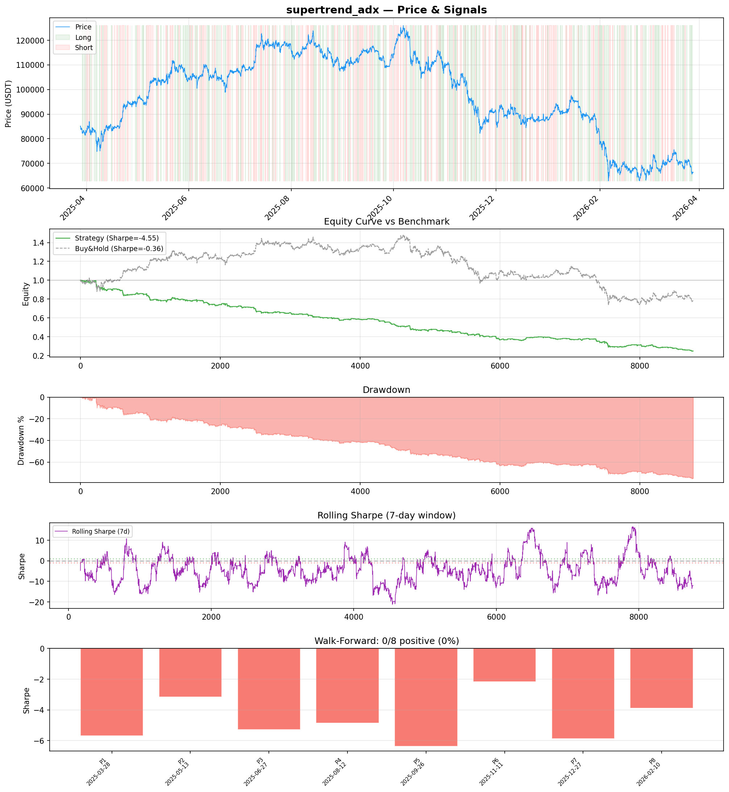
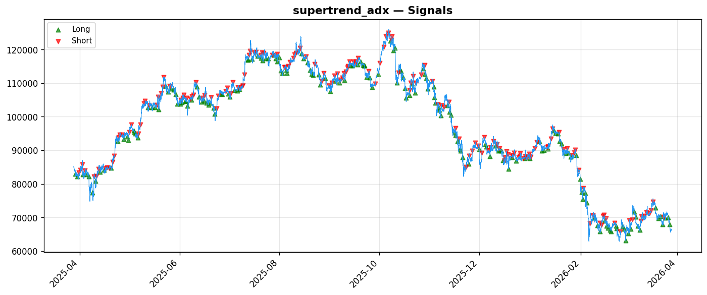

# Strategy Report: supertrend_adx
**Generated**: 2026-03-28 09:36 UTC
**Verdict**: 🔴 **REJECT** (confidence: high)

## Executive Summary
This strategy is a catastrophic failure that destroys capital systematically. With a Sharpe ratio of -4.553, total return of -76.2%, and zero positive periods across all walk-forward tests, it demonstrates no edge whatsoever. The strategy loses $2.37 for every $1 gained (profit factor 0.421) and underperforms buy-and-hold by 54 percentage points. This isn't a case of poor parameter tuning or execution issues - it's a fundamentally flawed hypothesis. The funding rate momentum cascade theory appears to be economically unsound, as the strategy fails across ALL market regimes and time periods. No amount of refinement can fix a strategy with negative expected value this extreme.

## Key Metrics

| Metric | In-Sample | Out-of-Sample |
|--------|-----------|---------------|
| Sharpe Ratio | -4.553 | -4.941 |
| Total Return | -76.24% | -38.40% |
| CAGR | -76.24% | — |
| Max Drawdown | 76.49% | 39.00% |
| Total Trades | 350 | 84 |
| Win Rate | 40.90% | — |
| Profit Factor | 0.421 | — |
| Calmar | -0.997 | — |
| Sortino | -3.927 | — |

**Config**: `BTC/USDT` / `1h` / `mean_reversion` / 8760 bars
**Period**: 2025-03-28 10:00:00+00:00 → 2026-03-28 09:00:00+00:00
**Signals**: 1802 long / 1815 short / 5143 flat (701 transitions)

## Benchmark Comparison

| Benchmark | Return | Sharpe | Max DD |
|-----------|--------|--------|--------|
| **Strategy** | -76.24% | -4.553 | 76.49% |
| Buy And Hold | -21.98% | -0.364 | -50.10% |
| Short And Hold | 6.60% | 0.364 | -44.23% |
| Risk Free | 0.00% | 0.000 | 0.00% |

❌ Strategy Sharpe (-4.553) **loses to** Buy & Hold (-0.364)

## Walk-Forward Analysis

**0/8 periods positive** (consistency: 0%)
Average Sharpe: -4.659 ± 1.364

| Period | Dates | Sharpe | Return | Max DD | Trades | ✓ |
|--------|-------|--------|--------|--------|--------|---|
| P1 | 2025-03-28→2025-05-13 | -5.682 | -21.17% | 21.73% | 39 | ❌ |
| P2 | 2025-05-13→2025-06-27 | -3.151 | -9.72% | 12.93% | 47 | ❌ |
| P3 | 2025-06-27→2025-08-12 | -5.284 | -13.34% | 15.29% | 46 | ❌ |
| P4 | 2025-08-12→2025-09-26 | -4.856 | -12.02% | 12.63% | 46 | ❌ |
| P5 | 2025-09-26→2025-11-11 | -6.364 | -21.73% | 21.97% | 41 | ❌ |
| P6 | 2025-11-11→2025-12-27 | -2.177 | -9.44% | 18.31% | 47 | ❌ |
| P7 | 2025-12-27→2026-02-10 | -5.870 | -26.48% | 27.92% | 42 | ❌ |
| P8 | 2026-02-10→2026-03-28 | -3.890 | -16.21% | 22.59% | 42 | ❌ |

## Performance Charts





## Chart Analysis
```
=== CHART ANALYSIS ===

Signals: 1802 long (20.6%), 1815 short (20.7%), 5143 flat (58.7%)
Transitions: 701

Strategy: Sharpe=-4.553, Return=-76.2%, MaxDD=76.5%
Buy&Hold: Sharpe=-0.364, Return=-21.98%, MaxDD=-50.10%
❌ Strategy LOSES to Buy&Hold

Walk-Forward (8 periods):
  Consistency: 0/8 positive (0%)
  Avg Sharpe: -4.659 ± 1.364
  Sharpes: [-5.68, -3.15, -5.28, -4.86, -6.36, -2.18, -5.87, -3.89]
=== END ===
```

## Robustness Analysis

**Score**: 14.3% (1/7 tests passed)

| Test | ✓ | Details |
|------|---|---------|
| fee_sensitivity_2x | ❌ | Sharpe with 2x fees: -6.737 |
| slippage_sensitivity_3x | ❌ | Sharpe with 3x slippage: -6.737 |
| delayed_entry_1bar | ❌ | Sharpe with 1-bar delay: -4.422 |
| spread_widening_5x | ❌ | Sharpe with 5x spread: -6.309 |
| top_trades_removal | ✅ | PnL ratio after removal: 1.29 (kept 129% of profits) |
| subperiod_stability | ❌ | 0/4 periods with positive Sharpe (0%) |
| signal_degradation_10pct | ❌ | Sharpe with 10% signal noise: -7.362 |

## Hypothesis

**Title**: N/A
**Thesis**: N/A

## Agent Reviews

### Risk Manager
**Verdict**: N/A

### Auditor
**Verdict**: N/A
This strategy is a catastrophic failure that destroys 76% of capital while achieving a Sharpe ratio of -4.553 across all time periods. The funding rate momentum cascade hypothesis appears fundamentally flawed, with the strategy consistently losing money regardless of market regime, making it unsuitable for any capital deployment.

## Final Decision

**Key Risks:**
- Catastrophic capital destruction: -76.2% total return with 76.5% maximum drawdown
- Complete temporal instability: 0/8 positive periods in walk-forward analysis
- Systematic negative edge: Profit factor of 0.421 indicates consistent value destruction
- Extreme fragility: Strategy fails all robustness tests and degrades severely with realistic costs
- Liquidation risk: 3x leverage with 76% drawdown creates existential threat to capital

**Improvements:**
- Complete abandonment of current approach - strategy is unfixable
- Fundamental re-examination of funding rate cascade hypothesis with independent validation
- Start from scratch with basic funding rate mean reversion instead of momentum
- Prove positive edge exists in ANY market regime before adding complexity
- Reduce to 2-3 core features and test basic hypothesis in isolation

**Edge Evidence:**
- No positive evidence exists - strategy fails comprehensively
- Negative Sharpe ratio across all time periods indicates no statistical edge
- Underperforms both long and short benchmarks consistently
- Win rate of 40.9% with negative profit factor shows systematic losses
- Zero robustness to costs, delays, or parameter changes

**Dissenting View:**
> A contrarian might argue that the extreme negative performance could indicate an inverse edge - that fading this strategy's signals might be profitable. However, this would require independent validation and cannot justify deploying the current strategy. The sample size of 350+ trades provides high statistical confidence that this is genuine negative edge, not random bad luck.
