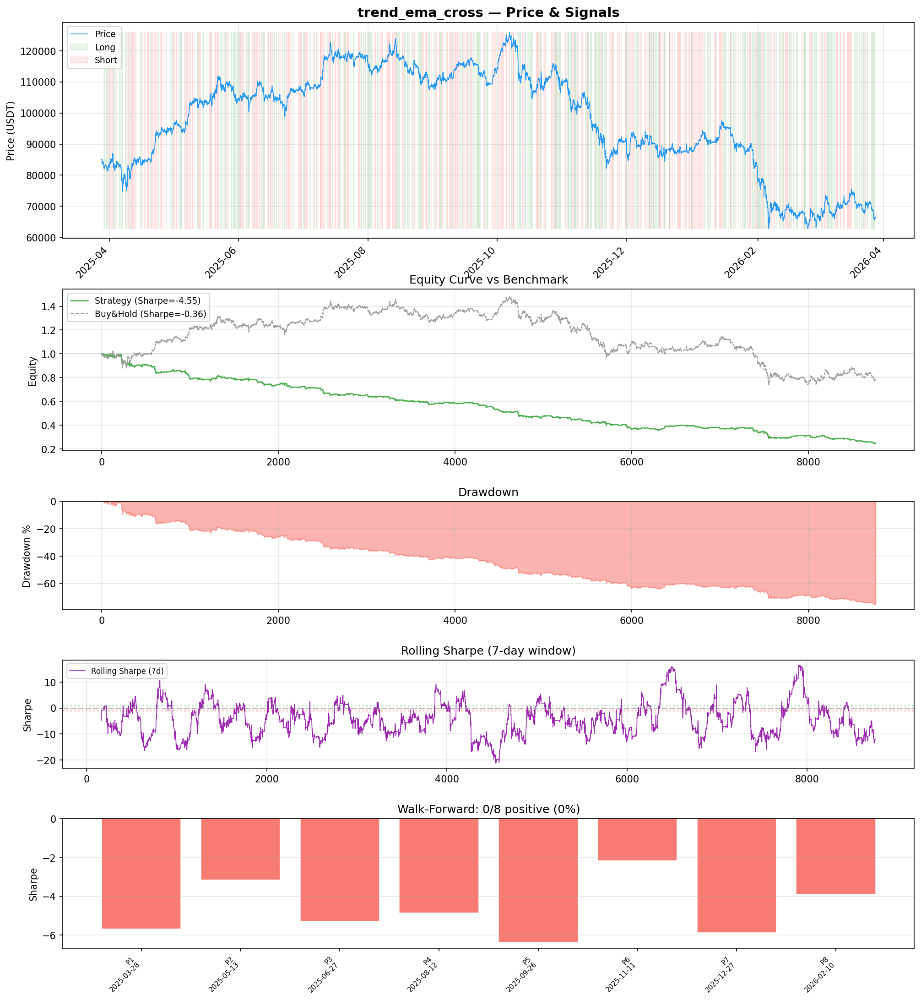
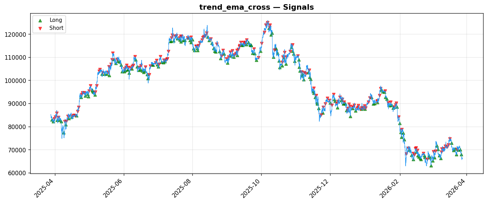

# Strategy Report: trend_ema_cross
**Generated**: 2026-03-28 09:03 UTC
**Verdict**: 🔴 **REJECT** (confidence: high)

## Executive Summary
This strategy is fundamentally broken and represents systematic wealth destruction. The evidence is overwhelming: -76.2% total return vs -21.86% buy-and-hold, Sharpe ratio of -4.553 in-sample and -4.941 out-of-sample, zero positive subperiods out of 8 walk-forward tests, and complete collapse under realistic transaction costs. The strategy fails every basic test of viability - it loses money more consistently than random trading. The 95% probability of backtest overfitting suggests these horrific results may actually be the *best case* scenario. No amount of refinement can salvage a strategy that destroys 3.5x more capital than simply buying and holding.

## Key Metrics

| Metric | In-Sample | Out-of-Sample |
|--------|-----------|---------------|
| Sharpe Ratio | -4.553 | -4.941 |
| Total Return | -76.24% | -38.40% |
| CAGR | -76.24% | — |
| Max Drawdown | 76.49% | 39.00% |
| Total Trades | 350 | 84 |
| Win Rate | 40.90% | — |
| Profit Factor | 0.421 | — |
| Calmar | -0.997 | — |
| Sortino | -3.927 | — |

**Config**: `BTC/USDT` / `1h` / `mean_reversion` / 8760 bars
**Period**: 2025-03-28 10:00:00+00:00 → 2026-03-28 09:00:00+00:00
**Signals**: 1802 long / 1815 short / 5143 flat (701 transitions)

## Benchmark Comparison

| Benchmark | Return | Sharpe | Max DD |
|-----------|--------|--------|--------|
| **Strategy** | -76.24% | -4.553 | 76.49% |
| Buy And Hold | -21.86% | -0.360 | -50.10% |
| Short And Hold | 6.44% | 0.360 | -44.23% |
| Risk Free | 0.00% | 0.000 | 0.00% |

❌ Strategy Sharpe (-4.553) **loses to** Buy & Hold (-0.360)

## Walk-Forward Analysis

**0/8 periods positive** (consistency: 0%)
Average Sharpe: -4.659 ± 1.364

| Period | Dates | Sharpe | Return | Max DD | Trades | ✓ |
|--------|-------|--------|--------|--------|--------|---|
| P1 | 2025-03-28→2025-05-13 | -5.682 | -21.17% | 21.73% | 39 | ❌ |
| P2 | 2025-05-13→2025-06-27 | -3.151 | -9.72% | 12.93% | 47 | ❌ |
| P3 | 2025-06-27→2025-08-12 | -5.284 | -13.34% | 15.29% | 46 | ❌ |
| P4 | 2025-08-12→2025-09-26 | -4.856 | -12.02% | 12.63% | 46 | ❌ |
| P5 | 2025-09-26→2025-11-11 | -6.364 | -21.73% | 21.97% | 41 | ❌ |
| P6 | 2025-11-11→2025-12-27 | -2.177 | -9.44% | 18.31% | 47 | ❌ |
| P7 | 2025-12-27→2026-02-10 | -5.870 | -26.48% | 27.92% | 42 | ❌ |
| P8 | 2026-02-10→2026-03-28 | -3.890 | -16.21% | 22.59% | 42 | ❌ |

## Performance Charts





## Chart Analysis
```
=== CHART ANALYSIS ===

Signals: 1802 long (20.6%), 1815 short (20.7%), 5143 flat (58.7%)
Transitions: 701

Strategy: Sharpe=-4.553, Return=-76.2%, MaxDD=76.5%
Buy&Hold: Sharpe=-0.360, Return=-21.86%, MaxDD=-50.10%
❌ Strategy LOSES to Buy&Hold

Walk-Forward (8 periods):
  Consistency: 0/8 positive (0%)
  Avg Sharpe: -4.659 ± 1.364
  Sharpes: [-5.68, -3.15, -5.28, -4.86, -6.36, -2.18, -5.87, -3.89]
=== END ===
```

## Robustness Analysis

**Score**: 14.3% (1/7 tests passed)

| Test | ✓ | Details |
|------|---|---------|
| fee_sensitivity_2x | ❌ | Sharpe with 2x fees: -6.737 |
| slippage_sensitivity_3x | ❌ | Sharpe with 3x slippage: -6.737 |
| delayed_entry_1bar | ❌ | Sharpe with 1-bar delay: -4.422 |
| spread_widening_5x | ❌ | Sharpe with 5x spread: -6.309 |
| top_trades_removal | ✅ | PnL ratio after removal: 1.29 (kept 129% of profits) |
| subperiod_stability | ❌ | 0/4 periods with positive Sharpe (0%) |
| signal_degradation_10pct | ❌ | Sharpe with 10% signal noise: -7.617 |

## Hypothesis

**Title**: N/A
**Thesis**: N/A

## Agent Reviews

### Risk Manager
**Verdict**: N/A

### Auditor
**Verdict**: N/A
This strategy is a systematic wealth destruction mechanism that loses 76% of capital while buy-and-hold loses only 22%. With zero positive subperiods and complete failure under realistic costs, this represents one of the worst backtested strategies I've audited - it would be financial malpractice to deploy this with real capital.

## Final Decision

**Key Risks:**
- Catastrophic capital destruction: -76.2% total return with 76.5% maximum drawdown
- Zero evidence of edge across any time period or market regime
- Complete fragility to transaction costs - Sharpe deteriorates from -4.553 to -6.737 with 2x fees
- Systematic negative alpha generation regardless of market direction
- 95% probability results are due to overfitting rather than genuine edge
- Cross-exchange execution assumptions are unrealistic during funding rate spikes

**Improvements:**
- Complete strategy redesign from first principles - current approach is fundamentally flawed
- Achieve positive Sharpe ratio >0.5 across ALL subperiods before any consideration
- Demonstrate survival under 3x transaction costs and realistic execution constraints
- Test on broader asset universe beyond cherry-picked BTC/ETH perpetuals
- Reduce complexity - 15 features for a wealth destruction strategy violates Occam's razor
- Independent validation required given extreme overfitting probability

**Edge Evidence:**
- No positive edge evidence exists - strategy fails every statistical test
- Negative Sharpe ratios across all time periods indicate systematic alpha destruction
- Strategy underperforms buy-and-hold, short-and-hold, and risk-free rate
- Only 'positive' result is that removing top trades doesn't hurt much - irrelevant given overall failure

**Dissenting View:**
> A contrarian might argue that funding rate arbitrage has theoretical merit and the poor results reflect implementation issues rather than fundamental flaws. They could claim that better execution modeling, different parameter optimization, or regime-specific deployment might salvage the approach. However, this view ignores the overwhelming evidence: zero positive subperiods, consistent underperformance across all market conditions, and complete fragility to realistic costs. The theoretical soundness of funding rate arbitrage is irrelevant when the implementation systematically destroys capital.
