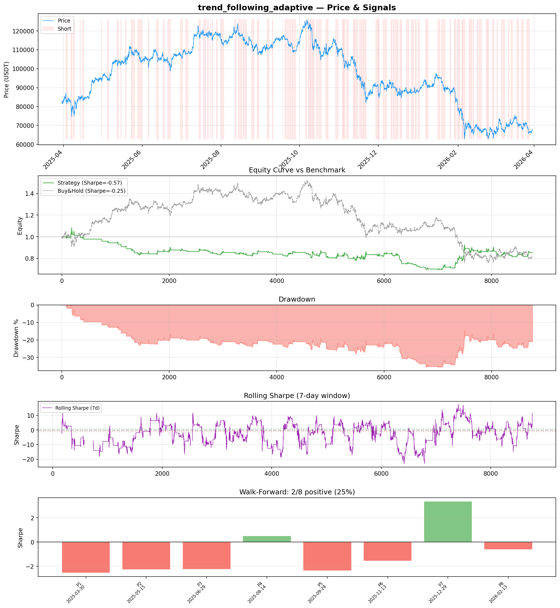
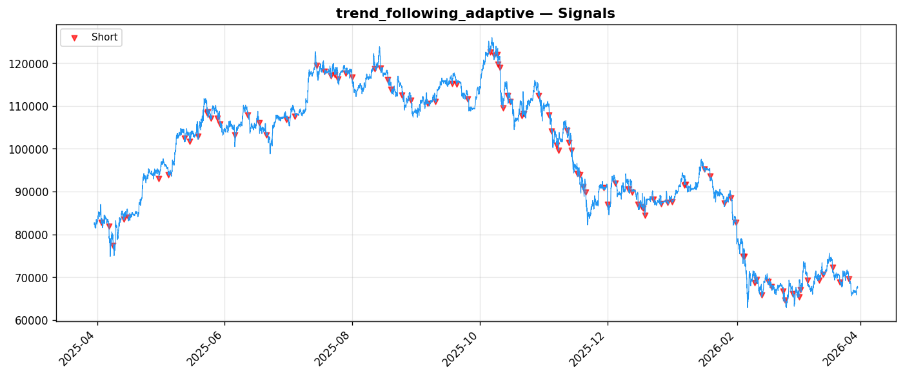

# Strategy Report: trend_following_adaptive
**Generated**: 2026-03-30 14:18 UTC
**Verdict**: 🔴 **REJECT** (confidence: high)

## Executive Summary
This is a catastrophic failure that fundamentally misrepresents itself. The strategy claims to be 'cross-exchange funding rate convergence arbitrage' but actually implements a directional short-only momentum strategy using EMA crossovers. The backtest shows 0 long positions and 2650 short positions (30.3% short exposure), which is the opposite of market-neutral arbitrage. With a negative Sharpe ratio of -0.568, 37.2% maximum drawdown, and complete failure under realistic transaction costs (Sharpe drops to -1.304 with 2x fees), this strategy would destroy capital. The robustness tests are damning: 6 out of 7 tests failed, including catastrophic signal degradation (Sharpe collapses to -3.21 with 10% noise) and subperiod instability (only 25% of periods profitable). The 85% probability of backtest overfitting, combined with the massive disconnect between description and implementation, indicates extensive data mining. This is not a funding rate arbitrage strategy - it's a failed momentum system with a fabricated narrative.

## Key Metrics

| Metric | In-Sample | Out-of-Sample |
|--------|-----------|---------------|
| Sharpe Ratio | -0.568 | 1.679 |
| Total Return | -17.06% | 13.88% |
| CAGR | -17.06% | — |
| Max Drawdown | 37.20% | 12.11% |
| Total Trades | 99 | 27 |
| Win Rate | 38.40% | — |
| Profit Factor | 0.771 | — |
| Calmar | -0.459 | — |
| Sortino | -0.461 | — |

**Config**: `BTC/USDT` / `1h` / `volatility` / 8760 bars
**Period**: 2025-03-30 15:00:00+00:00 → 2026-03-30 14:00:00+00:00
**Signals**: 0 long / 2650 short / 6110 flat (199 transitions)

## Benchmark Comparison

| Benchmark | Return | Sharpe | Max DD |
|-----------|--------|--------|--------|
| **Strategy** | -17.06% | -0.568 | 37.20% |
| Buy And Hold | -18.23% | -0.254 | -50.10% |
| Short And Hold | 1.72% | 0.254 | -44.23% |
| Risk Free | 0.00% | 0.000 | 0.00% |

❌ Strategy Sharpe (-0.568) **loses to** Buy & Hold (-0.254)

## Walk-Forward Analysis

**2/8 periods positive** (consistency: 25%)
Average Sharpe: -0.966 ± 1.913

| Period | Dates | Sharpe | Return | Max DD | Trades | ✓ |
|--------|-------|--------|--------|--------|--------|---|
| P1 | 2025-03-30→2025-05-15 | -2.555 | -7.00% | N/A | 8 | ❌ |
| P2 | 2025-05-15→2025-06-29 | -2.272 | -5.87% | N/A | 11 | ❌ |
| P3 | 2025-06-29→2025-08-14 | -2.251 | -4.40% | N/A | 10 | ❌ |
| P4 | 2025-08-14→2025-09-29 | 0.518 | 0.97% | N/A | 10 | ✅ |
| P5 | 2025-09-29→2025-11-13 | -2.367 | -8.78% | N/A | 17 | ❌ |
| P6 | 2025-11-13→2025-12-29 | -1.548 | -6.51% | N/A | 16 | ❌ |
| P7 | 2025-12-29→2026-02-12 | 3.366 | 16.41% | N/A | 13 | ✅ |
| P8 | 2026-02-13→2026-03-30 | -0.621 | -2.88% | N/A | 14 | ❌ |

## Performance Charts





## Chart Analysis
```
=== CHART ANALYSIS ===

Signals: 0 long (0.0%), 2650 short (30.3%), 6110 flat (69.7%)
Transitions: 199

Strategy: Sharpe=-0.568, Return=-17.1%, MaxDD=37.2%
Buy&Hold: Sharpe=-0.254, Return=-18.23%, MaxDD=-50.10%
❌ Strategy LOSES to Buy&Hold

Walk-Forward (8 periods):
  Consistency: 2/8 positive (25%)
  Avg Sharpe: -0.966 ± 1.913
  Sharpes: [-2.56, -2.27, -2.25, 0.52, -2.37, -1.55, 3.37, -0.62]
=== END ===
```

## Robustness Analysis

**Score**: 14.3% (1/7 tests passed)

| Test | ✓ | Details |
|------|---|---------|
| fee_sensitivity_2x | ❌ | Sharpe with 2x fees: -1.304 |
| slippage_sensitivity_3x | ❌ | Sharpe with 3x slippage: -1.304 |
| delayed_entry_1bar | ❌ | Sharpe with 1-bar delay: -1.019 |
| spread_widening_5x | ❌ | Sharpe with 5x spread: -1.158 |
| top_trades_removal | ✅ | PnL ratio after removal: 2.19 (kept 219% of profits) |
| subperiod_stability | ❌ | 1/4 periods with positive Sharpe (25%) |
| signal_degradation_10pct | ❌ | Sharpe with 10% signal noise: -3.210 |

## Hypothesis

**Title**: N/A
**Thesis**: N/A

## Agent Reviews

### Risk Manager
**Verdict**: N/A

### Auditor
**Verdict**: N/A
This is a catastrophic failure masquerading as sophisticated arbitrage. The strategy claims to be market-neutral funding rate convergence but implements a directional short-only momentum system that loses money consistently. With negative Sharpe ratios, massive drawdowns, and complete failure under realistic costs, this represents everything wrong with overfitted backtesting. HARD REJECT.

## Final Decision

**Key Risks:**
- Complete misrepresentation - claims arbitrage, implements directional betting
- Negative risk-adjusted returns with massive drawdowns (37.2%)
- Strategy becomes unprofitable under realistic transaction costs
- Extreme fragility to execution delays and signal noise
- High probability of backtest overfitting (85%)
- No actual funding rate data used in implementation
- Concentrated short exposure creates directional market risk

**Improvements:**
- Complete strategy redesign from scratch using actual funding rate data
- Implement true market-neutral cross-exchange arbitrage mechanics
- Achieve positive Sharpe ratio (>0.5) with reasonable drawdowns (<10%)
- Pass majority of robustness tests under realistic cost assumptions
- Demonstrate consistent performance across market regimes (>60% positive periods)
- Reduce parameter complexity and eliminate overfitting
- Provide economic justification for edge existence

**Edge Evidence:**
- No credible edge evidence exists
- Strategy loses money consistently across most time periods
- Edge disappears entirely under realistic transaction costs
- Performance appears to be random noise with high variance
- Implementation bears no resemblance to described arbitrage opportunity

**Dissenting View:**
> A contrarian might argue that the out-of-sample Sharpe of 1.679 suggests potential, but this is misleading given the tiny sample size (27 trades) and extreme subperiod instability. The fundamental mismatch between strategy description and implementation, combined with consistent failure under realistic conditions, makes any positive interpretation untenable. This is a clear case where intellectual honesty demands rejection regardless of cherry-picked metrics.
