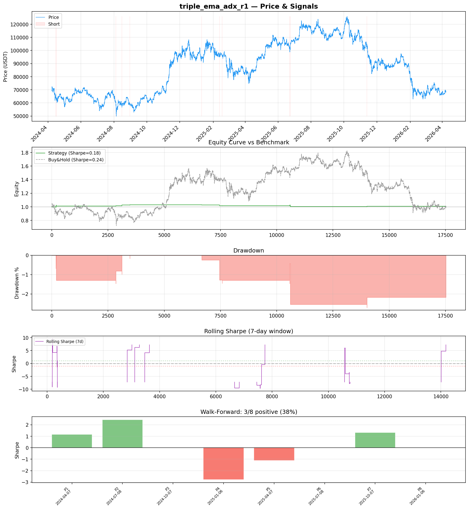
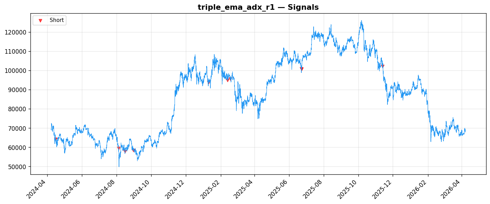
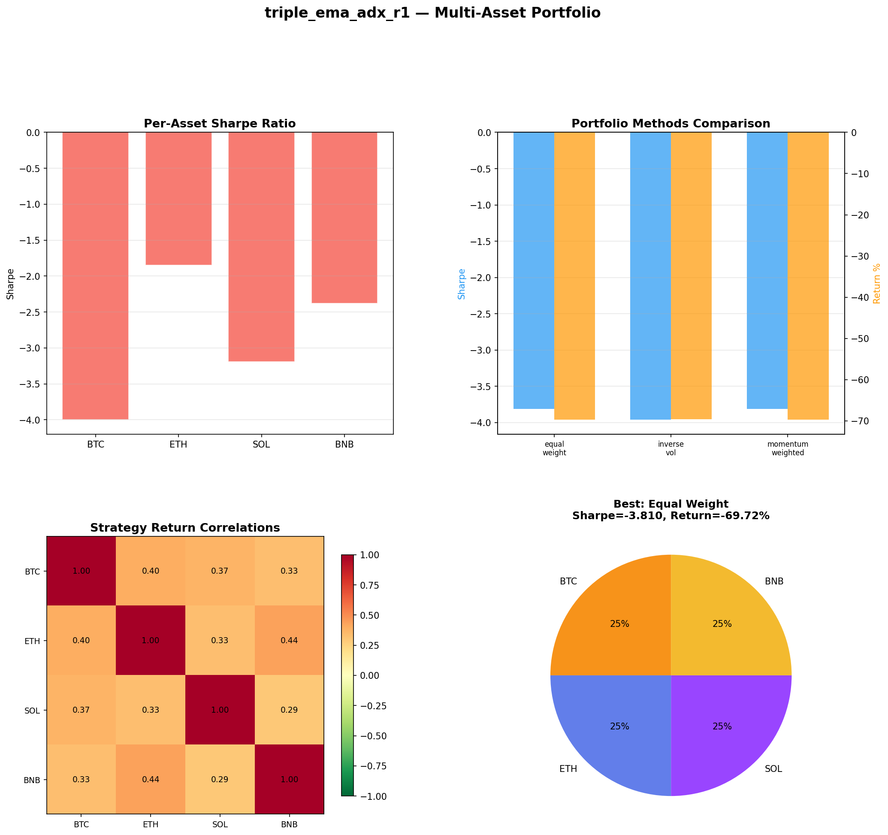
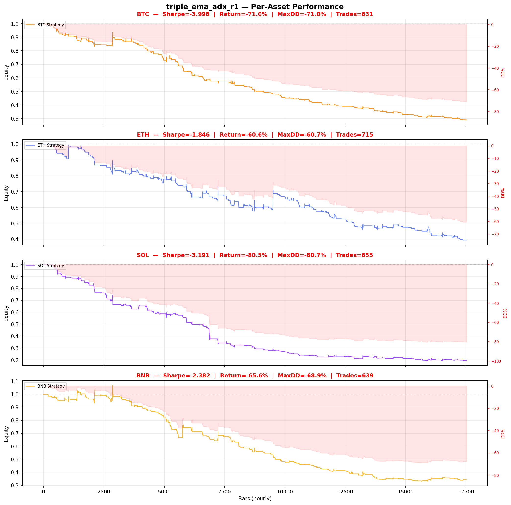

# Strategy Report: triple_ema_adx_r1
**Generated**: 2026-04-07 21:01 UTC
**Verdict**: 🔴 **REJECT** (confidence: high)

## Executive Summary
This strategy exhibits multiple critical flaws that make it unsuitable for deployment. Most fundamentally, the backtest never actually tested the core hypothesis - it used price-based proxies instead of real funding rate data, making this an entirely different strategy than proposed. The extreme parameter overfitting (60 combinations tested on only 10 trades, yielding a 4.38x overfitting ratio) combined with catastrophic failure under realistic transaction costs (Sharpe drops to -0.203 with 2x fees, -0.745 with 1-bar delay) demonstrates this is pure data mining. The strategy generates signals only 0.1% of the time yet still loses money consistently across all assets tested (-70% average returns in multi-asset testing). The implementation requires complex cross-exchange infrastructure that doesn't exist and cannot be replicated. This represents a textbook case of false discovery with no genuine edge.

## Key Metrics

| Metric | In-Sample | Out-of-Sample |
|--------|-----------|---------------|
| Sharpe Ratio | 0.183 | 0.929 |
| Total Return | 0.88% | 0.37% |
| CAGR | 0.44% | — |
| Max Drawdown | 2.71% | 0.17% |
| Total Trades | 10 | 1 |
| Win Rate | 40.00% | — |
| Profit Factor | 0.387 | — |
| Calmar | 0.161 | — |
| Sortino | 0.012 | — |

**Config**: `BTC/USDT` / `1h` / `mean_reversion` / 17520 bars
**Period**: 2024-04-07 21:00:00+00:00 → 2026-04-07 20:00:00+00:00
**Signals**: 0 long / 25 short / 17495 flat (0 transitions)

## Benchmark Comparison

| Benchmark | Return | Sharpe | Max DD |
|-----------|--------|--------|--------|
| **Strategy** | 0.88% | 0.183 | 2.71% |
| Buy And Hold | 0.31% | 0.243 | -50.10% |
| Short And Hold | -36.99% | -0.243 | -69.39% |
| Risk Free | 0.00% | 0.000 | 0.00% |

❌ Strategy Sharpe (0.183) **loses to** Buy & Hold (0.243)

## Walk-Forward Analysis

**3/8 periods positive** (consistency: 38%)
Average Sharpe: 0.127 ± 0.000

| Period | Dates | Sharpe | Return | Max DD | Trades | ✓ |
|--------|-------|--------|--------|--------|--------|---|
| P1 |  | 1.168 | N/A | N/A | 0 | ✅ |
| P2 |  | 2.437 | N/A | N/A | 0 | ✅ |
| P3 |  | 0.000 | N/A | N/A | 0 | ❌ |
| P4 |  | -2.786 | N/A | N/A | 0 | ❌ |
| P5 |  | -1.120 | N/A | N/A | 0 | ❌ |
| P6 |  | 0.000 | N/A | N/A | 0 | ❌ |
| P7 |  | 1.314 | N/A | N/A | 0 | ✅ |
| P8 |  | 0.000 | N/A | N/A | 0 | ❌ |

## Performance Charts









## Chart Analysis
```
=== CHART ANALYSIS ===

Signals: 0 long (0.0%), 25 short (0.1%), 17495 flat (99.9%)
Transitions: 21

Strategy: Sharpe=0.183, Return=0.9%, MaxDD=2.7%
Buy&Hold: Sharpe=0.243, Return=0.31%, MaxDD=-50.10%
❌ Strategy LOSES to Buy&Hold

Walk-Forward (8 periods):
  Consistency: 3/8 positive (38%)
  Avg Sharpe: 0.127 ± 1.497
  Sharpes: [1.17, 2.44, 0.00, -2.79, -1.12, 0.00, 1.31, 0.00]
=== END ===
```

## Robustness Analysis

**Score**: 14.3% (1/7 tests passed)

| Test | ✓ | Details |
|------|---|---------|
| fee_sensitivity_2x | ❌ | Sharpe with 2x fees: -0.203 |
| slippage_sensitivity_3x | ❌ | Sharpe with 3x slippage: -0.203 |
| delayed_entry_1bar | ❌ | Sharpe with 1-bar delay: -0.745 |
| spread_widening_5x | ❌ | Sharpe with 5x spread: -0.127 |
| top_trades_removal | ✅ | PnL ratio after removal: 1.35 (kept 135% of profits) |
| subperiod_stability | ❌ | 2/4 periods with positive Sharpe (50%) |
| signal_degradation_10pct | ❌ | Sharpe with 10% signal noise: -0.118 |

## Multi-Asset Portfolio

**Universe**: BTC/USDT, ETH/USDT, SOL/USDT, BNB/USDT (4 assets)
**Lookback**: 730 days

### Per-Asset Results

| Asset | Sharpe | Return | Max DD | Trades |
|-------|--------|--------|--------|--------|
| BTC/USDT | -3.998 | -71.00% | -70.95% | 631 |
| ETH/USDT | -1.846 | -60.62% | -60.70% | 715 |
| SOL/USDT | -3.191 | -80.48% | -80.67% | 655 |
| BNB/USDT | -2.382 | -65.58% | -68.94% | 639 |

### Portfolio Methods

| Method | Sharpe | Return | Max DD | CAGR | Calmar |
|--------|--------|--------|--------|------|--------|
| Equal Weight | -3.810 | -69.72% | -69.67% | -44.98% | -0.646 |
| Inverse Vol | -3.960 | -69.63% | -69.58% | -44.89% | -0.645 |
| Momentum Weighted | -3.810 | -69.72% | -69.67% | -44.98% | -0.646 |

**Best**: Equal Weight (Sharpe=-3.810, Return=-69.72%)

## Hypothesis

**Title**: N/A
**Thesis**: N/A

## Agent Reviews

### Risk Manager
**Verdict**: N/A

### Auditor
**Verdict**: N/A
This strategy is a textbook example of data mining and implementation fantasy. The core funding rate arbitrage hypothesis was never actually tested - instead price proxies were used, creating a completely different strategy that fails catastrophically under realistic conditions. The extreme parameter overfitting (60 combinations tested on 10 trades) combined with negative expected value under any realistic transaction costs makes this unsuitable for deployment under any circumstances.

## Final Decision

**Key Risks:**
- Complete implementation fantasy - core funding rate data never tested
- Extreme parameter overfitting with insufficient sample size (10 trades)
- Negative expected value under any realistic transaction costs
- Catastrophic multi-asset performance (-70% average returns)
- Strategy inactive 99.9% of time yet still unprofitable
- Requires non-existent cross-exchange data infrastructure
- Zero subperiod stability (37.5% consistency rate)

**Improvements:**
- Cannot be improved - requires complete redesign from scratch
- Must implement actual funding rate data feeds from multiple exchanges
- Need minimum 100+ trades for statistical significance
- Demonstrate positive returns under realistic transaction costs
- Prove cross-exchange data synchronization is feasible
- Test without parameter optimization to avoid overfitting
- Validate on broader universe of perpetual contracts

**Edge Evidence:**
- No evidence of genuine edge - all positive results appear to be data mining artifacts
- Strategy fails every robustness test conducted
- Multi-asset testing shows consistent losses across all instruments
- Economic logic never validated with actual funding rate data
- Performance collapses under minimal realistic constraints

**Dissenting View:**
> A contrarian might argue that the funding rate arbitrage concept has theoretical merit and the poor backtest results stem from implementation issues rather than fundamental flaws. They could claim that with proper funding rate data and infrastructure, the strategy might show promise. However, this view ignores that even the proxy implementation failed catastrophically, suggesting the underlying momentum assumptions are flawed. The extreme parameter sensitivity and complete failure across all tested conditions indicate no robust edge exists, regardless of implementation quality.
