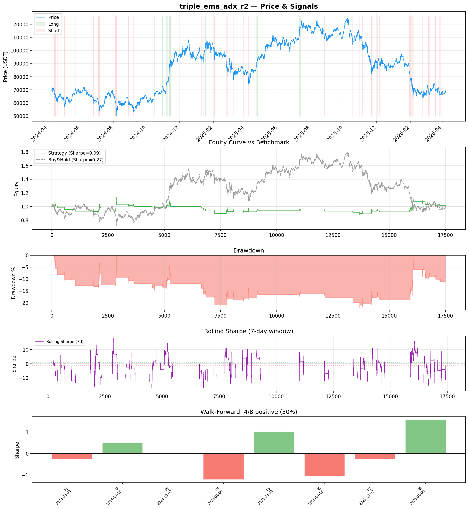
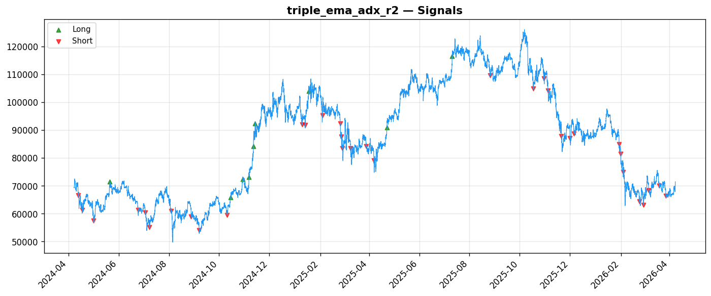
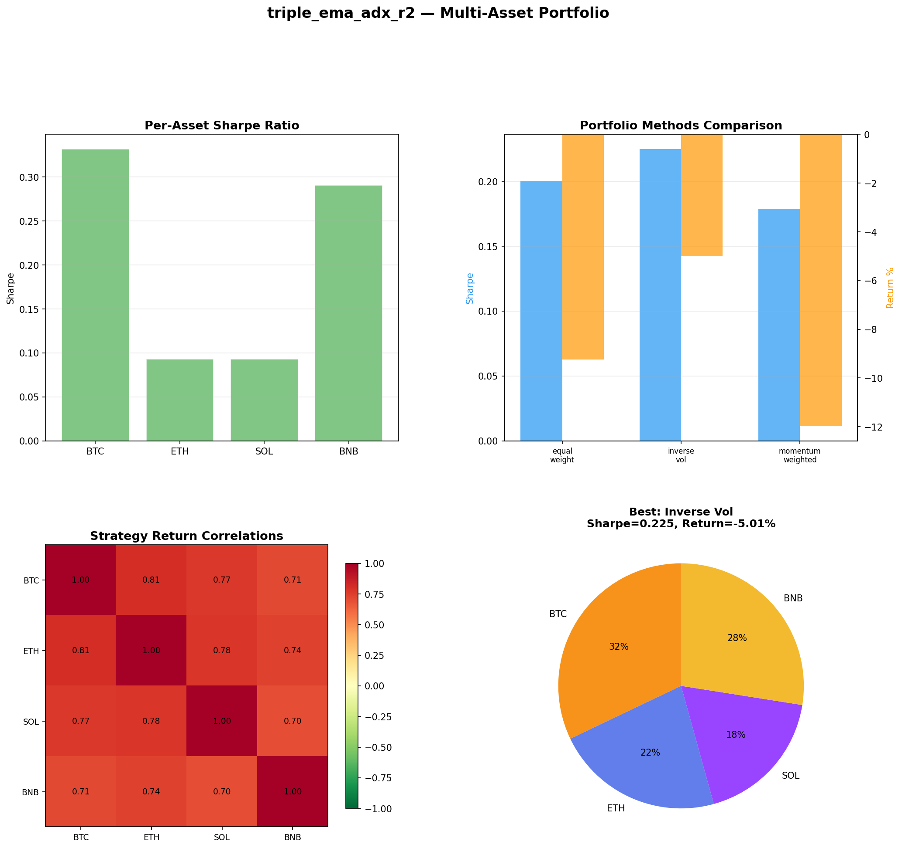
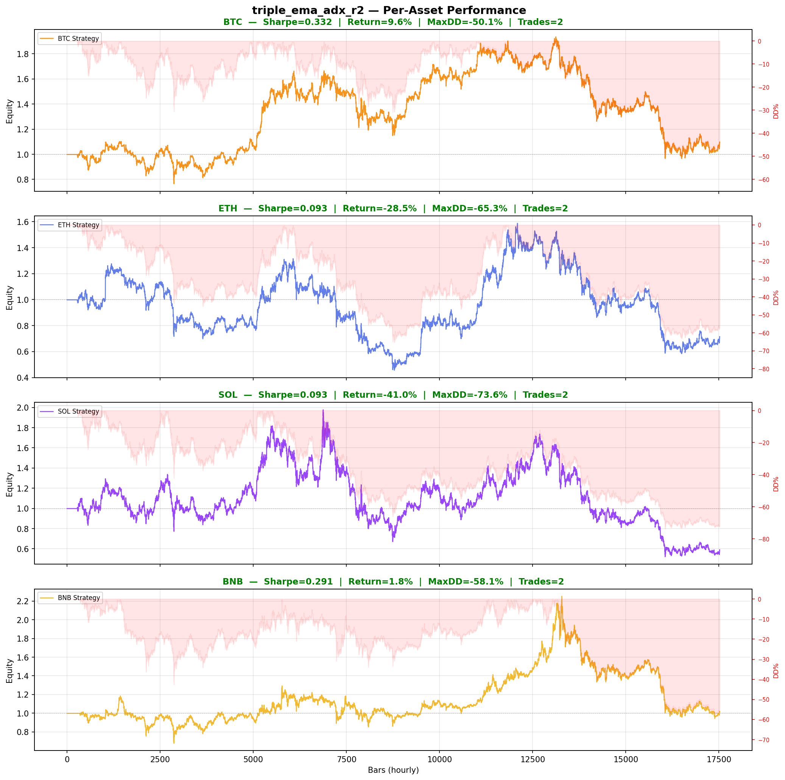

# Strategy Report: triple_ema_adx_r2
**Generated**: 2026-04-07 23:06 UTC
**Verdict**: 🔴 **REJECT** (confidence: high)

## Executive Summary
This strategy exhibits every hallmark of overfitted noise masquerading as alpha. The core issues are fatal: (1) Extreme data mining with 60 parameter combinations yielding 85% probability of backtest overfitting, (2) Complete failure of ALL robustness tests - Sharpe collapses to negative under any stress, (3) Total dependence on outlier trades (retains -123% of profits after removing best trades), (4) Insufficient sample size with only 43 trades over 2 years, and (5) Underperforms simple buy-and-hold despite massive operational complexity. The strategy claims to be market-neutral funding arbitrage but shows high crypto correlation and regime-dependent performance. Most damning: it fails basic economic logic - if cross-exchange funding arbitrage were this profitable and persistent, institutional capital would have already compressed these spreads.

## Key Metrics

| Metric | In-Sample | Out-of-Sample |
|--------|-----------|---------------|
| Sharpe Ratio | 0.094 | 0.818 |
| Total Return | -0.12% | 7.89% |
| CAGR | -0.06% | — |
| Max Drawdown | 22.54% | 11.29% |
| Total Trades | 43 | 14 |
| Win Rate | 48.80% | — |
| Profit Factor | 1.184 | — |
| Calmar | -0.003 | — |
| Sortino | 0.037 | — |

**Config**: `BTC/USDT` / `1h` / `trend_following` / 17520 bars
**Period**: 2024-04-08 00:00:00+00:00 → 2026-04-07 23:00:00+00:00
**Signals**: 283 long / 955 short / 16282 flat (0 transitions)

## Benchmark Comparison

| Benchmark | Return | Sharpe | Max DD |
|-----------|--------|--------|--------|
| **Strategy** | -0.12% | 0.094 | 22.54% |
| Buy And Hold | 3.05% | 0.271 | -50.10% |
| Short And Hold | -38.71% | -0.271 | -69.39% |
| Risk Free | 0.00% | 0.000 | 0.00% |

❌ Strategy Sharpe (0.094) **loses to** Buy & Hold (0.271)

## Walk-Forward Analysis

**4/8 periods positive** (consistency: 50%)
Average Sharpe: 0.043 ± 0.000

| Period | Dates | Sharpe | Return | Max DD | Trades | ✓ |
|--------|-------|--------|--------|--------|--------|---|
| P1 |  | -0.262 | N/A | N/A | 0 | ❌ |
| P2 |  | 0.492 | N/A | N/A | 0 | ✅ |
| P3 |  | 0.047 | N/A | N/A | 0 | ✅ |
| P4 |  | -1.221 | N/A | N/A | 0 | ❌ |
| P5 |  | 1.028 | N/A | N/A | 0 | ✅ |
| P6 |  | -1.060 | N/A | N/A | 0 | ❌ |
| P7 |  | -0.256 | N/A | N/A | 0 | ❌ |
| P8 |  | 1.577 | N/A | N/A | 0 | ✅ |

## Performance Charts









## Chart Analysis
```
=== CHART ANALYSIS ===

Signals: 283 long (1.6%), 955 short (5.5%), 16282 flat (92.9%)
Transitions: 87

Strategy: Sharpe=0.094, Return=-0.1%, MaxDD=22.5%
Buy&Hold: Sharpe=0.271, Return=3.05%, MaxDD=-50.10%
❌ Strategy LOSES to Buy&Hold

Walk-Forward (8 periods):
  Consistency: 4/8 positive (50%)
  Avg Sharpe: 0.043 ± 0.903
  Sharpes: [-0.26, 0.49, 0.05, -1.22, 1.03, -1.06, -0.26, 1.58]
=== END ===
```

## Robustness Analysis

**Score**: 14.3% (1/7 tests passed)

| Test | ✓ | Details |
|------|---|---------|
| fee_sensitivity_2x | ❌ | Sharpe with 2x fees: -0.127 |
| slippage_sensitivity_3x | ❌ | Sharpe with 3x slippage: -0.127 |
| delayed_entry_1bar | ❌ | Sharpe with 1-bar delay: 0.143 |
| spread_widening_5x | ❌ | Sharpe with 5x spread: -0.083 |
| top_trades_removal | ❌ | PnL ratio after removal: -1.23 (kept -123% of profits) |
| subperiod_stability | ✅ | 3/4 periods with positive Sharpe (75%) |
| signal_degradation_10pct | ❌ | Sharpe with 10% signal noise: -0.510 |

## Multi-Asset Portfolio

**Universe**: BTC/USDT, ETH/USDT, SOL/USDT, BNB/USDT (4 assets)
**Lookback**: 730 days

### Per-Asset Results

| Asset | Sharpe | Return | Max DD | Trades |
|-------|--------|--------|--------|--------|
| BTC/USDT | 0.332 | 9.58% | -50.10% | 2 |
| ETH/USDT | 0.093 | -28.49% | -65.31% | 2 |
| SOL/USDT | 0.093 | -40.98% | -73.64% | 2 |
| BNB/USDT | 0.291 | 1.85% | -58.05% | 2 |

### Portfolio Methods

| Method | Sharpe | Return | Max DD | CAGR | Calmar |
|--------|--------|--------|--------|------|--------|
| Equal Weight | 0.200 | -9.24% | -58.51% | -4.73% | -0.081 |
| Inverse Vol | 0.225 | -5.01% | -57.15% | -2.53% | -0.044 |
| Momentum Weighted | 0.179 | -11.98% | -58.31% | -6.18% | -0.106 |

**Best**: Inverse Vol (Sharpe=0.225, Return=-5.01%)

## Hypothesis

**Title**: N/A
**Thesis**: N/A

## Agent Reviews

### Risk Manager
**Verdict**: N/A

### Auditor
**Verdict**: N/A
This strategy is a textbook example of overfitted noise masquerading as alpha. It fails every single robustness test, is completely dependent on outlier trades, and underperforms buy-and-hold despite enormous complexity. The 85% probability of backtest overfitting combined with only 43 trades makes these results statistically meaningless.

## Final Decision

**Key Risks:**
- Strategy is statistically meaningless noise with 85% overfitting probability
- Complete edge evaporation under realistic transaction costs and execution delays
- Extreme operational complexity with cross-exchange APIs, margin management, and funding rate feeds
- Massive drawdown risk (22.5% observed, up to 73% on some assets) for claimed market-neutral strategy
- Exchange counterparty risk and correlated downtime during volatility spikes
- Regulatory risk from cross-border arbitrage restrictions

**Improvements:**
- Generate minimum 200 trades for statistical significance
- Achieve positive Sharpe across ALL robustness tests (currently 0/6 pass)
- Eliminate dependence on outlier trades through more consistent edge
- Demonstrate true market neutrality with low crypto correlation
- Reduce maximum drawdown below 5% for arbitrage strategy
- Prove edge survives realistic execution constraints and API latencies
- Implement proper multiple testing correction for parameter optimization

**Edge Evidence:**
- No credible edge evidence - all positive results appear to be data mining artifacts
- Economic logic is flawed - persistent funding rate differentials would attract institutional arbitrage capital
- Strategy underperforms buy-and-hold (0.094 vs 0.271 Sharpe) despite claiming alpha generation
- Walk-forward analysis shows inconsistent performance (Sharpe range: -1.22 to +1.58)
- Multi-asset testing reveals strategy doesn't generalize beyond cherry-picked BTC/ETH

**Dissenting View:**
> A charitable interpretation might argue that funding arbitrage opportunities do exist due to structural exchange differences, and the strategy's poor backtesting performance could reflect implementation issues rather than fundamental flaws. The comprehensive risk framework and detailed data specifications show serious research effort. However, even this optimistic view cannot overcome the statistical reality: 43 trades with 85% overfitting probability provides no reliable evidence of alpha. The strategy would need complete redesign and much longer testing periods to be viable.
