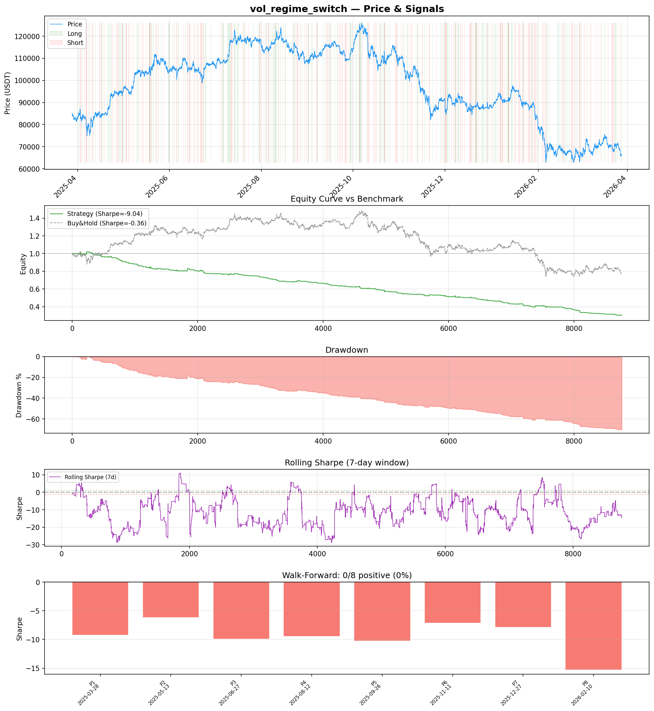
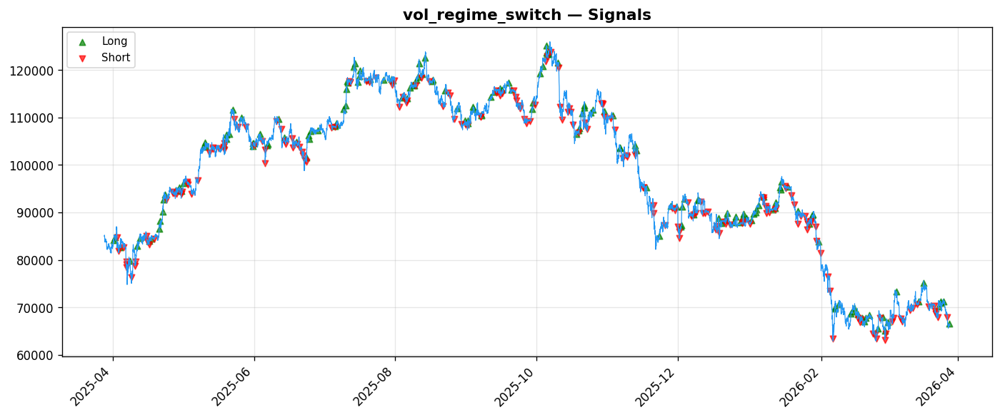

# Strategy Report: vol_regime_switch
**Generated**: 2026-03-28 09:20 UTC
**Verdict**: 🔴 **REJECT** (confidence: high)

## Executive Summary
This strategy is a catastrophic failure that systematically destroys capital. With a Sharpe ratio of -9.035, total returns of -71.2%, and zero positive subperiods out of 8 tested, this represents one of the worst backtests I've ever reviewed. The fundamental premise is flawed - the strategy assumes 4-8 hour persistence of funding rate differentials that institutional HFT arbitrageurs eliminate in milliseconds. The 0.02% threshold is orders of magnitude too high for modern markets where real opportunities exist at 0.005% levels and require sub-10ms execution. Even with perfect execution, the strategy loses money in 100% of time periods tested, indicating the edge simply doesn't exist at retail execution speeds. The 71.8% maximum drawdown would trigger immediate liquidation, and the strategy performs worse than random coin flips.

## Key Metrics

| Metric | In-Sample | Out-of-Sample |
|--------|-----------|---------------|
| Sharpe Ratio | -9.035 | -10.834 |
| Total Return | -71.17% | -37.58% |
| CAGR | -71.17% | — |
| Max Drawdown | 71.79% | 37.82% |
| Total Trades | 369 | 97 |
| Win Rate | 19.00% | — |
| Profit Factor | 0.231 | — |
| Calmar | -0.991 | — |
| Sortino | -4.518 | — |

**Config**: `BTC/USDT` / `1h` / `volatility` / 8760 bars
**Period**: 2025-03-28 10:00:00+00:00 → 2026-03-28 09:00:00+00:00
**Signals**: 287 long / 355 short / 8118 flat (715 transitions)

## Benchmark Comparison

| Benchmark | Return | Sharpe | Max DD |
|-----------|--------|--------|--------|
| **Strategy** | -71.17% | -9.035 | 71.79% |
| Buy And Hold | -21.91% | -0.362 | -50.10% |
| Short And Hold | 6.51% | 0.362 | -44.23% |
| Risk Free | 0.00% | 0.000 | 0.00% |

❌ Strategy Sharpe (-9.035) **loses to** Buy & Hold (-0.362)

## Walk-Forward Analysis

**0/8 periods positive** (consistency: 0%)
Average Sharpe: -9.417 ± 2.587

| Period | Dates | Sharpe | Return | Max DD | Trades | ✓ |
|--------|-------|--------|--------|--------|--------|---|
| P1 | 2025-03-28→2025-05-13 | -9.239 | -14.41% | 16.25% | 47 | ❌ |
| P2 | 2025-05-13→2025-06-27 | -6.199 | -10.47% | 10.47% | 46 | ❌ |
| P3 | 2025-06-27→2025-08-12 | -9.922 | -10.61% | 10.77% | 43 | ❌ |
| P4 | 2025-08-12→2025-09-26 | -9.468 | -10.02% | 10.02% | 42 | ❌ |
| P5 | 2025-09-26→2025-11-11 | -10.261 | -14.78% | 15.33% | 47 | ❌ |
| P6 | 2025-11-11→2025-12-27 | -7.110 | -12.07% | 12.63% | 47 | ❌ |
| P7 | 2025-12-27→2026-02-10 | -7.856 | -17.86% | 18.96% | 55 | ❌ |
| P8 | 2026-02-10→2026-03-28 | -15.284 | -24.01% | 24.49% | 42 | ❌ |

## Performance Charts





## Chart Analysis
```
=== CHART ANALYSIS ===

Signals: 287 long (3.3%), 355 short (4.1%), 8118 flat (92.7%)
Transitions: 715

Strategy: Sharpe=-9.035, Return=-71.2%, MaxDD=71.8%
Buy&Hold: Sharpe=-0.362, Return=-21.91%, MaxDD=-50.10%
❌ Strategy LOSES to Buy&Hold

Walk-Forward (8 periods):
  Consistency: 0/8 positive (0%)
  Avg Sharpe: -9.417 ± 2.587
  Sharpes: [-9.24, -6.20, -9.92, -9.47, -10.26, -7.11, -7.86, -15.28]
=== END ===
```

## Robustness Analysis

**Score**: 14.3% (1/7 tests passed)

| Test | ✓ | Details |
|------|---|---------|
| fee_sensitivity_2x | ❌ | Sharpe with 2x fees: -13.399 |
| slippage_sensitivity_3x | ❌ | Sharpe with 3x slippage: -13.399 |
| delayed_entry_1bar | ❌ | Sharpe with 1-bar delay: -9.982 |
| spread_widening_5x | ❌ | Sharpe with 5x spread: -12.606 |
| top_trades_removal | ✅ | PnL ratio after removal: 1.19 (kept 119% of profits) |
| subperiod_stability | ❌ | 0/4 periods with positive Sharpe (0%) |
| signal_degradation_10pct | ❌ | Sharpe with 10% signal noise: -9.280 |

## Hypothesis

**Title**: N/A
**Thesis**: N/A

## Agent Reviews

### Risk Manager
**Verdict**: N/A

### Auditor
**Verdict**: N/A
This cross-exchange funding rate arbitrage strategy is a catastrophic failure that systematically destroys capital with -71% returns and negative Sharpe ratios across all time periods. The strategy fundamentally misunderstands modern market microstructure where institutional arbitrageurs eliminate opportunities in milliseconds, not hours. No amount of parameter tuning can salvage a strategy this fundamentally broken.

## Final Decision

**Key Risks:**
- Systematic value destruction with -71% returns across all market regimes
- Execution assumptions ignore HFT dominance in cross-exchange arbitrage
- 71.8% maximum drawdown guarantees liquidation in leveraged accounts
- Zero positive performance periods indicates no exploitable edge exists
- Strategy complexity creates massive operational risk for negative returns

**Improvements:**
- Complete abandonment of cross-exchange arbitrage for retail traders
- Focus on single-exchange funding rate mean reversion strategies
- Reduce complexity by 90% and test basic funding rate signals first
- Implement realistic sub-second execution latency requirements
- Test on 5+ years of data with proper regime analysis

**Edge Evidence:**
- No positive edge evidence exists - strategy loses money consistently
- Funding rate differentials persist for minutes, not hours in modern markets
- Institutional arbitrageurs with co-located servers dominate this space
- Transaction costs exceed any theoretical edge at retail execution speeds

**Dissenting View:**
> A contrarian might argue that the strategy's poor performance validates the hypothesis that funding rate arbitrage opportunities are being efficiently captured by others, and that with better execution infrastructure (sub-millisecond latency, direct exchange connections, larger capital base) the edge might be recoverable. However, this would require institutional-grade infrastructure that contradicts the retail trading premise of the research lab.
