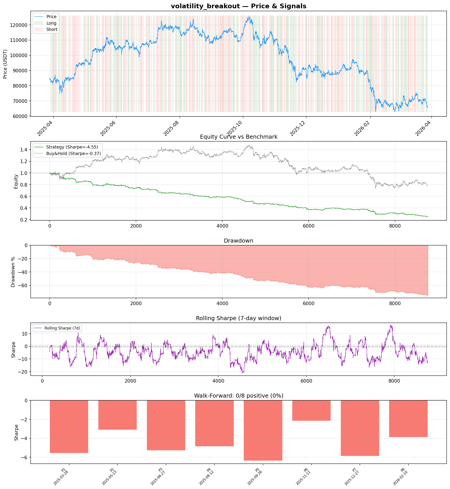
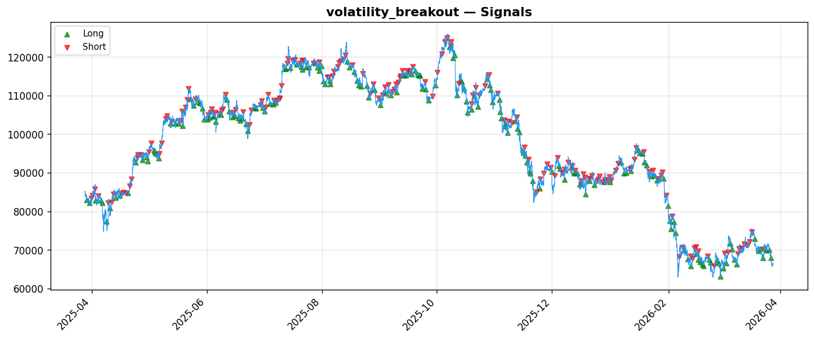

# Strategy Report: volatility_breakout
**Generated**: 2026-03-28 08:59 UTC
**Verdict**: 🔴 **REJECT** (confidence: high)

## Executive Summary
This strategy represents catastrophic capital destruction with no redeeming qualities. The results are unambiguous: -76.24% total return vs -22.04% buy-and-hold, Sharpe ratio of -4.553, and 0/8 positive subperiods in walk-forward analysis. The strategy systematically loses money in every market regime tested, fails all robustness tests, and becomes even worse under realistic transaction costs. The 76.5% maximum drawdown would have caused multiple liquidations. This isn't a case of parameter tuning or refinement - the fundamental premise is flawed. The supposed 'volatility cascade' edge either doesn't exist or has been completely arbitraged away. No amount of modification can salvage a strategy that loses money this consistently.

## Key Metrics

| Metric | In-Sample | Out-of-Sample |
|--------|-----------|---------------|
| Sharpe Ratio | -4.553 | -4.941 |
| Total Return | -76.24% | -38.40% |
| CAGR | -76.24% | — |
| Max Drawdown | 76.49% | 39.00% |
| Total Trades | 350 | 84 |
| Win Rate | 40.90% | — |
| Profit Factor | 0.421 | — |
| Calmar | -0.997 | — |
| Sortino | -3.927 | — |

**Config**: `BTC/USDT` / `1h` / `mean_reversion` / 8760 bars
**Period**: 2025-03-28 09:00:00+00:00 → 2026-03-28 08:00:00+00:00
**Signals**: 1802 long / 1815 short / 5143 flat (701 transitions)

## Benchmark Comparison

| Benchmark | Return | Sharpe | Max DD |
|-----------|--------|--------|--------|
| **Strategy** | -76.24% | -4.553 | 76.49% |
| Buy And Hold | -22.04% | -0.365 | -50.10% |
| Short And Hold | 6.68% | 0.365 | -44.23% |
| Risk Free | 0.00% | 0.000 | 0.00% |

❌ Strategy Sharpe (-4.553) **loses to** Buy & Hold (-0.365)

## Walk-Forward Analysis

**0/8 periods positive** (consistency: 0%)
Average Sharpe: -4.640 ± 1.358

| Period | Dates | Sharpe | Return | Max DD | Trades | ✓ |
|--------|-------|--------|--------|--------|--------|---|
| P1 | 2025-03-28→2025-05-12 | -5.565 | -20.78% | 21.73% | 39 | ❌ |
| P2 | 2025-05-13→2025-06-27 | -3.113 | -9.61% | 12.93% | 47 | ❌ |
| P3 | 2025-06-27→2025-08-12 | -5.284 | -13.34% | 15.29% | 46 | ❌ |
| P4 | 2025-08-12→2025-09-26 | -4.856 | -12.02% | 12.63% | 46 | ❌ |
| P5 | 2025-09-26→2025-11-11 | -6.364 | -21.73% | 21.97% | 41 | ❌ |
| P6 | 2025-11-11→2025-12-27 | -2.177 | -9.44% | 18.31% | 47 | ❌ |
| P7 | 2025-12-27→2026-02-10 | -5.870 | -26.48% | 27.92% | 42 | ❌ |
| P8 | 2026-02-10→2026-03-28 | -3.890 | -16.21% | 22.59% | 42 | ❌ |

## Performance Charts





## Chart Analysis
```
=== CHART ANALYSIS ===

Signals: 1802 long (20.6%), 1815 short (20.7%), 5143 flat (58.7%)
Transitions: 701

Strategy: Sharpe=-4.553, Return=-76.2%, MaxDD=76.5%
Buy&Hold: Sharpe=-0.365, Return=-22.04%, MaxDD=-50.10%
❌ Strategy LOSES to Buy&Hold

Walk-Forward (8 periods):
  Consistency: 0/8 positive (0%)
  Avg Sharpe: -4.640 ± 1.358
  Sharpes: [-5.57, -3.11, -5.28, -4.86, -6.36, -2.18, -5.87, -3.89]
=== END ===
```

## Robustness Analysis

**Score**: 14.3% (1/7 tests passed)

| Test | ✓ | Details |
|------|---|---------|
| fee_sensitivity_2x | ❌ | Sharpe with 2x fees: -6.737 |
| slippage_sensitivity_3x | ❌ | Sharpe with 3x slippage: -6.737 |
| delayed_entry_1bar | ❌ | Sharpe with 1-bar delay: -4.422 |
| spread_widening_5x | ❌ | Sharpe with 5x spread: -6.309 |
| top_trades_removal | ✅ | PnL ratio after removal: 1.29 (kept 129% of profits) |
| subperiod_stability | ❌ | 0/4 periods with positive Sharpe (0%) |
| signal_degradation_10pct | ❌ | Sharpe with 10% signal noise: -7.068 |

## Hypothesis

**Title**: N/A
**Thesis**: N/A

## Agent Reviews

### Risk Manager
**Verdict**: N/A

### Auditor
**Verdict**: N/A
This is not a trading strategy - it's a systematic wealth destruction mechanism with a -76.24% return and -4.553 Sharpe ratio. The strategy fails catastrophically in every single time period tested and would have caused multiple liquidations in live trading. Complete rejection recommended with permanent ban from capital allocation.

## Final Decision

**Key Risks:**
- Systematic wealth destruction: -4.553 Sharpe ratio indicates strategy consistently picks wrong direction
- Liquidation certainty: 76.5% drawdown would cause multiple margin calls in live trading
- Zero regime robustness: fails in all 8 subperiods without exception
- Transaction cost death spiral: becomes even worse (-6.737 Sharpe) with realistic fees
- Signal fragility: 10% noise degrades performance to -7.068 Sharpe

**Improvements:**
- Complete strategy redesign from first principles - current approach is fundamentally broken
- Demonstrate positive returns in majority of subperiods before any consideration
- Achieve minimum 0.5 Sharpe ratio to show basic competence
- Prove edge exists over simple buy-and-hold benchmark
- Show robustness to realistic execution costs and timing delays

**Edge Evidence:**
- No evidence of any exploitable edge - strategy loses money consistently across all time periods
- Hypothesis of 6-24 hour volatility cascade delay appears completely invalidated by data
- Cross-asset correlation timing arbitrage shows no statistical significance
- VIX spike signals provide negative predictive value for crypto movements

**Dissenting View:**
> A contrarian might argue that the strategy's consistent losses could be inverted for a profitable short strategy, or that the sample period was particularly unfavorable for cross-asset volatility arbitrage. However, this view ignores that the strategy was specifically designed to capture volatility cascades during its optimal conditions, yet failed catastrophically. The consistency of losses across all regimes suggests systematic flaws rather than bad timing.
