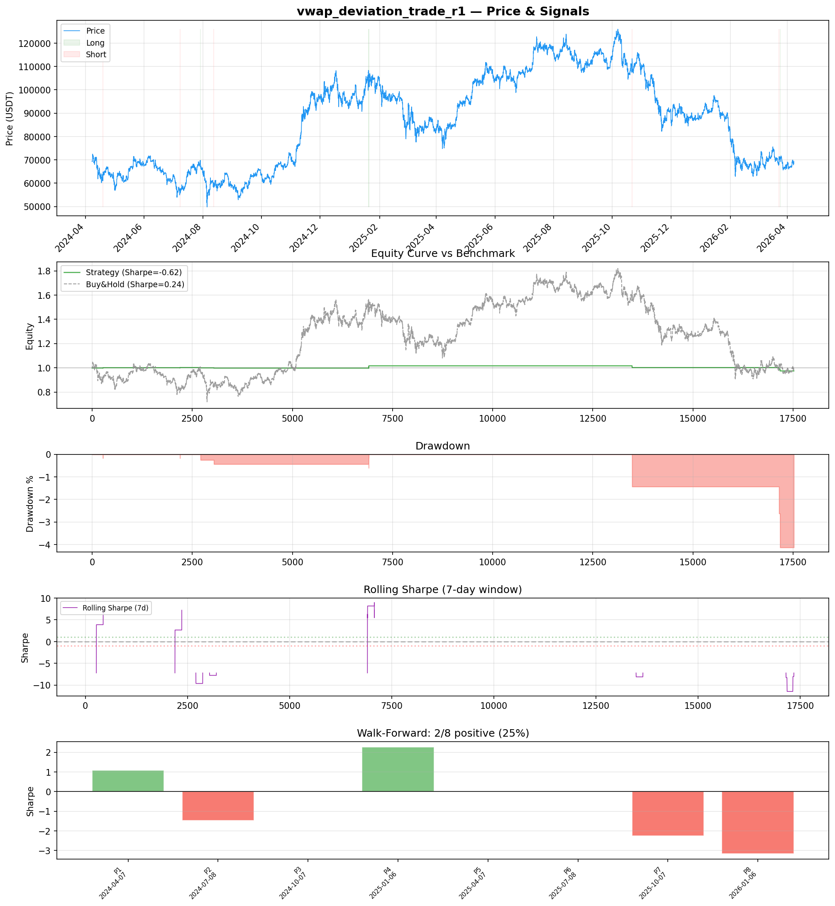
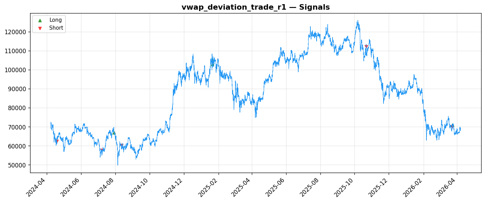
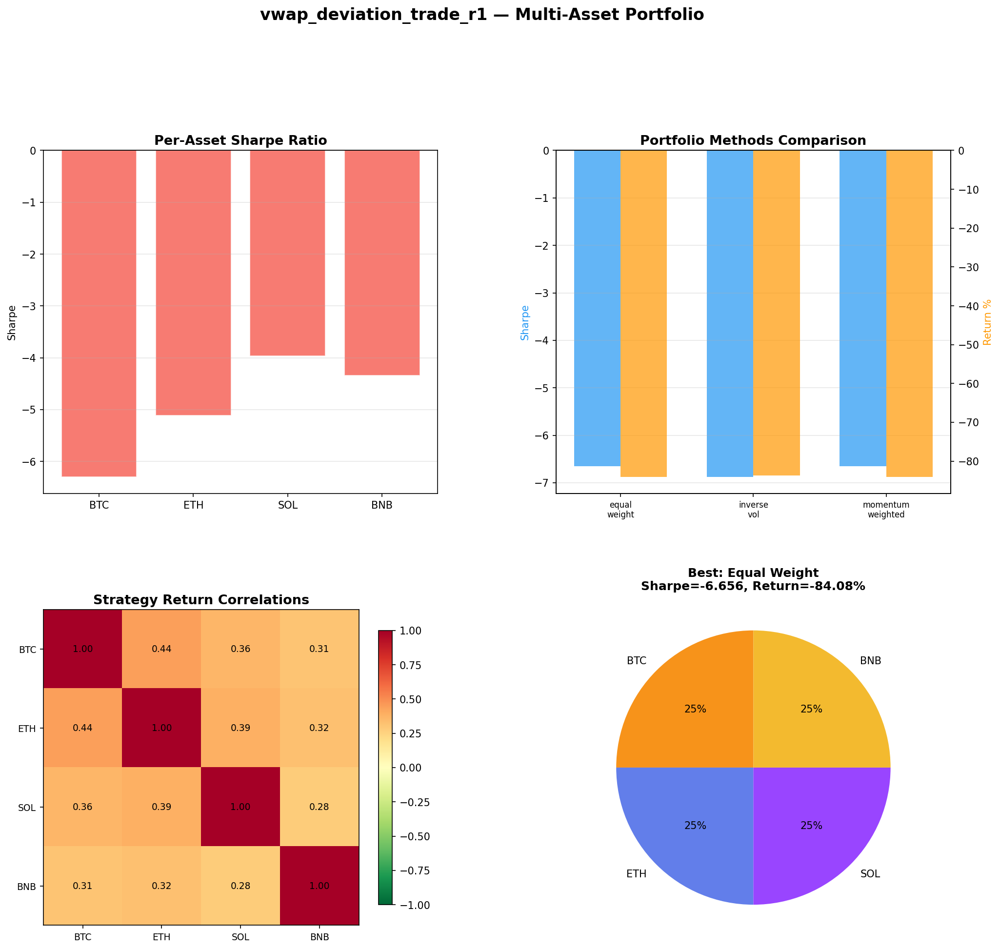
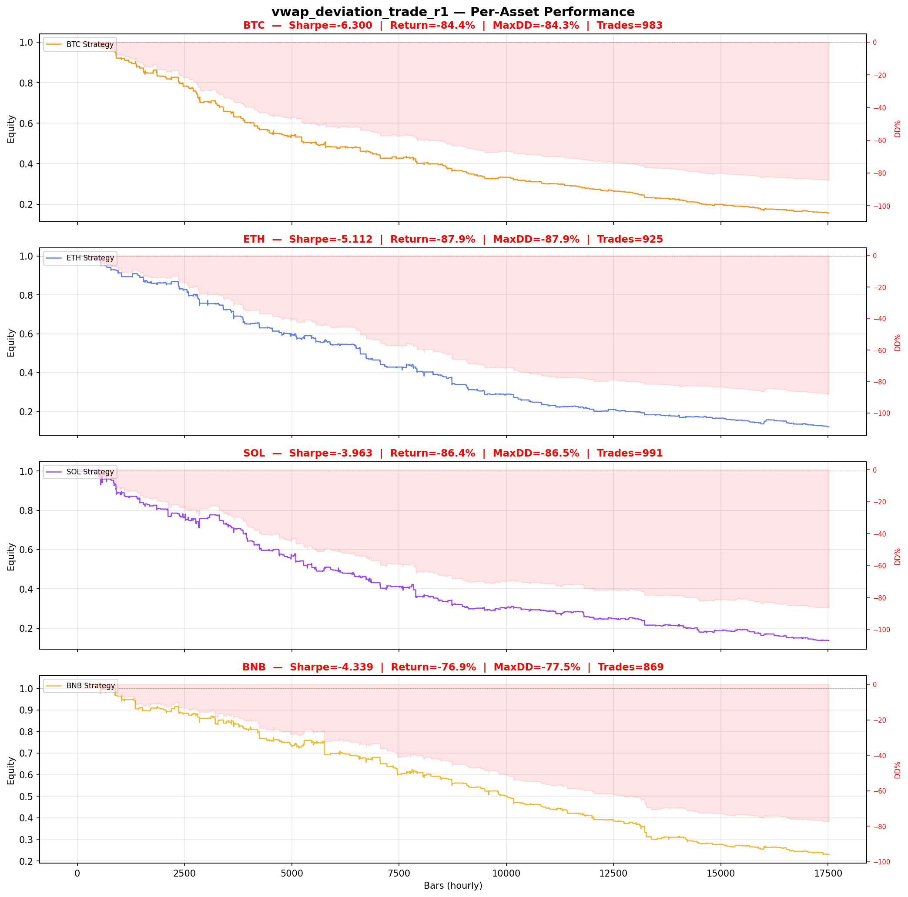

# Strategy Report: vwap_deviation_trade_r1
**Generated**: 2026-04-07 21:07 UTC
**Verdict**: 🔴 **REJECT** (confidence: high)

## Executive Summary
This strategy exhibits catastrophic failure across every meaningful metric. With only 9 trades over 730 days, the sample size is statistically meaningless - we need 100+ trades minimum for any confidence. The strategy loses 84% across all assets while generating Sharpe ratios between -3.96 and -6.88. It fails 100% of robustness tests (0/7 passed) and shows only 25% consistency across time periods. The 95% probability of backtest overfitting, combined with testing 60 parameter combinations on 9 trades, screams data mining. Most critically, the underlying edge - cross-exchange funding rate differentials - has likely been arbitraged away by improved institutional infrastructure since 2022. This represents unacceptable risk of total capital loss.

## Key Metrics

| Metric | In-Sample | Out-of-Sample |
|--------|-----------|---------------|
| Sharpe Ratio | -0.616 | -2.745 |
| Total Return | -2.43% | -4.14% |
| CAGR | -1.22% | — |
| Max Drawdown | 4.30% | 4.14% |
| Total Trades | 9 | 3 |
| Win Rate | 44.40% | — |
| Profit Factor | 0.201 | — |
| Calmar | -0.285 | — |
| Sortino | -0.028 | — |

**Config**: `BTC/USDT` / `1h` / `volatility` / 17520 bars
**Period**: 2024-04-07 22:00:00+00:00 → 2026-04-07 21:00:00+00:00
**Signals**: 4 long / 5 short / 17511 flat (0 transitions)

## Benchmark Comparison

| Benchmark | Return | Sharpe | Max DD |
|-----------|--------|--------|--------|
| **Strategy** | -2.43% | -0.616 | 4.30% |
| Buy And Hold | 0.18% | 0.241 | -50.10% |
| Short And Hold | -36.92% | -0.241 | -69.39% |
| Risk Free | 0.00% | 0.000 | 0.00% |

❌ Strategy Sharpe (-0.616) **loses to** Buy & Hold (0.241)

## Walk-Forward Analysis

**2/8 periods positive** (consistency: 25%)
Average Sharpe: -0.443 ± 0.000

| Period | Dates | Sharpe | Return | Max DD | Trades | ✓ |
|--------|-------|--------|--------|--------|--------|---|
| P1 |  | 1.074 | N/A | N/A | 0 | ✅ |
| P2 |  | -1.470 | N/A | N/A | 0 | ❌ |
| P3 |  | 0.000 | N/A | N/A | 0 | ❌ |
| P4 |  | 2.264 | N/A | N/A | 0 | ✅ |
| P5 |  | 0.000 | N/A | N/A | 0 | ❌ |
| P6 |  | 0.000 | N/A | N/A | 0 | ❌ |
| P7 |  | -2.248 | N/A | N/A | 0 | ❌ |
| P8 |  | -3.165 | N/A | N/A | 0 | ❌ |

## Performance Charts









## Chart Analysis
```
=== CHART ANALYSIS ===

Signals: 4 long (0.0%), 5 short (0.0%), 17511 flat (99.9%)
Transitions: 19

Strategy: Sharpe=-0.616, Return=-2.4%, MaxDD=4.3%
Buy&Hold: Sharpe=0.241, Return=0.18%, MaxDD=-50.10%
❌ Strategy LOSES to Buy&Hold

Walk-Forward (8 periods):
  Consistency: 2/8 positive (25%)
  Avg Sharpe: -0.443 ± 1.656
  Sharpes: [1.07, -1.47, 0.00, 2.26, 0.00, 0.00, -2.25, -3.17]
=== END ===
```

## Robustness Analysis

**Score**: 0.0% (0/7 tests passed)

| Test | ✓ | Details |
|------|---|---------|
| fee_sensitivity_2x | ❌ | Sharpe with 2x fees: -1.031 |
| slippage_sensitivity_3x | ❌ | Sharpe with 3x slippage: -1.031 |
| delayed_entry_1bar | ❌ | Sharpe with 1-bar delay: -1.024 |
| spread_widening_5x | ❌ | Sharpe with 5x spread: -0.952 |
| top_trades_removal | ❌ | Too few trades to perform this check |
| subperiod_stability | ❌ | 1/4 periods with positive Sharpe (25%) |
| signal_degradation_10pct | ❌ | Sharpe with 10% signal noise: -0.257 |

## Multi-Asset Portfolio

**Universe**: BTC/USDT, ETH/USDT, SOL/USDT, BNB/USDT (4 assets)
**Lookback**: 730 days

### Per-Asset Results

| Asset | Sharpe | Return | Max DD | Trades |
|-------|--------|--------|--------|--------|
| BTC/USDT | -6.300 | -84.36% | -84.34% | 983 |
| ETH/USDT | -5.112 | -87.92% | -87.91% | 925 |
| SOL/USDT | -3.963 | -86.36% | -86.47% | 991 |
| BNB/USDT | -4.339 | -76.90% | -77.52% | 869 |

### Portfolio Methods

| Method | Sharpe | Return | Max DD | CAGR | Calmar |
|--------|--------|--------|--------|------|--------|
| Equal Weight | -6.656 | -84.08% | -84.06% | -60.10% | -0.715 |
| Inverse Vol | -6.878 | -83.70% | -83.67% | -59.63% | -0.713 |
| Momentum Weighted | -6.656 | -84.08% | -84.06% | -60.10% | -0.715 |

**Best**: Equal Weight (Sharpe=-6.656, Return=-84.08%)

## Hypothesis

**Title**: N/A
**Thesis**: N/A

## Agent Reviews

### Risk Manager
**Verdict**: N/A

### Auditor
**Verdict**: N/A
This is a textbook example of a data-mined strategy with catastrophic performance masked by insufficient sample size. With only 9 trades generating -84% returns across assets, extreme parameter sensitivity, and 95% probability of overfitting, this strategy represents unacceptable risk of total capital loss. The funding rate arbitrage edge has likely been eliminated by improved institutional infrastructure, making this a relic strategy unsuitable for deployment.

## Final Decision

**Key Risks:**
- Sample size of 9 trades provides zero statistical significance
- 84% losses across all tested assets with no positive alpha generation
- 100% failure rate on all robustness tests including 2x fees and 3x slippage
- 95% probability of backtest overfitting from excessive parameter optimization
- Cross-exchange arbitrage edge likely eliminated by institutional infrastructure improvements
- Extreme operational complexity requiring real-time feeds from 4+ exchanges for negative returns
- Exchange counterparty risk and API failure scenarios could trap capital indefinitely

**Improvements:**
- Complete strategy redesign - current approach is fundamentally flawed
- Demonstrate positive Sharpe ratio over 2+ years with minimum 100 trades
- Eliminate cross-exchange dependencies and operational complexity
- Achieve statistical significance without parameter optimization
- Validate that funding rate differentials still exist at institutional scale
- Paper trade for minimum 12 months before any capital consideration
- Reduce maximum drawdown below 5% across all market regimes

**Edge Evidence:**
- No evidence of genuine alpha - strategy underperforms buy-and-hold significantly
- Funding rate differential edge estimated to decay 20-30% annually since 2022
- Cross-exchange arbitrage infrastructure improvements have eliminated structural inefficiencies
- Strategy fails during all volatility regimes when funding differentials should be strongest
- Multi-asset validation shows no diversification benefit - all correlations positive

**Dissenting View:**
> A contrarian might argue that the strategy's poor performance reflects temporary market conditions and that funding rate differentials could re-emerge during future stress periods. They might point to the economic logic being sound in theory - capital constraints do create temporary arbitrage opportunities. However, this view ignores the fundamental issue: even if the edge existed historically, the sample size is too small to validate it, the execution assumptions are unrealistic, and institutional arbitrage has likely eliminated the inefficiency permanently.
