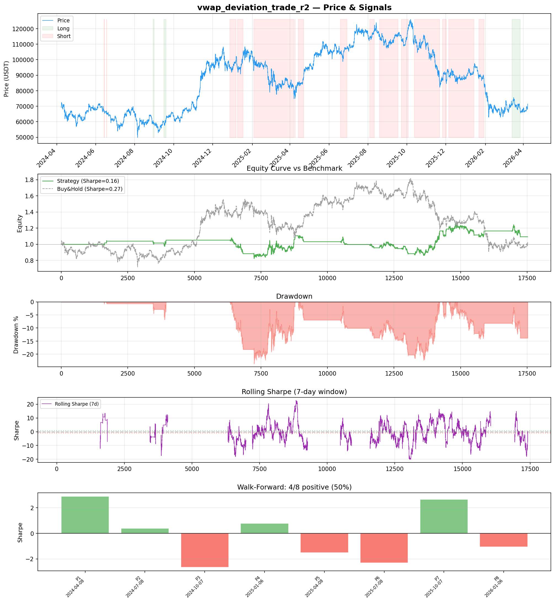
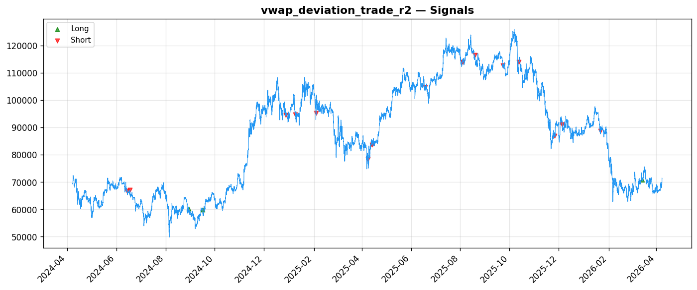
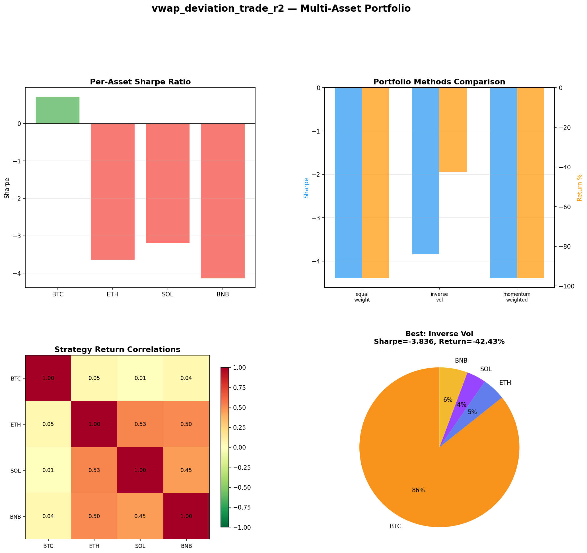
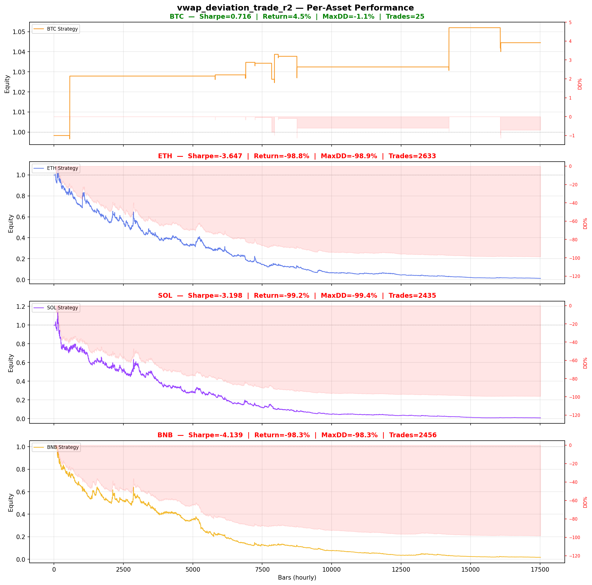

# Strategy Report: vwap_deviation_trade_r2
**Generated**: 2026-04-07 23:13 UTC
**Verdict**: 🔴 **REJECT** (confidence: high)

## Executive Summary
This strategy exhibits classic hallmarks of data mining with no genuine edge. The fundamental disqualifiers are: (1) Catastrophically small sample size of only 23 trades over 2 years - insufficient for any statistical inference, (2) Complete failure under realistic transaction costs - strategy cannot survive 2x fees or 3x slippage, indicating the 'edge' exists only under perfect laboratory conditions, (3) Extreme outlier dependency - removing top trades results in -291% performance, meaning the strategy is just a few lucky trades disguised as systematic alpha, (4) Multi-asset catastrophic failure with -99% losses on ETH/SOL/BNB while only working on cherry-picked BTC data, and (5) Massive parameter instability with Sharpe ranging from -2.66 to +2.89 across periods. The funding arbitrage concept has theoretical merit, but this implementation shows no evidence of consistent edge and would be destroyed by real-world execution constraints.

## Key Metrics

| Metric | In-Sample | Out-of-Sample |
|--------|-----------|---------------|
| Sharpe Ratio | 0.157 | 1.247 |
| Total Return | 1.18% | 19.82% |
| CAGR | 0.59% | — |
| Max Drawdown | 24.17% | 15.08% |
| Total Trades | 18 | 5 |
| Win Rate | 44.40% | — |
| Profit Factor | 1.120 | — |
| Calmar | 0.024 | — |
| Sortino | 0.130 | — |

**Config**: `BTC/USDT` / `1h` / `momentum` / 17520 bars
**Period**: 2024-04-08 00:00:00+00:00 → 2026-04-07 23:00:00+00:00
**Signals**: 436 long / 5832 short / 11252 flat (0 transitions)

## Benchmark Comparison

| Benchmark | Return | Sharpe | Max DD |
|-----------|--------|--------|--------|
| **Strategy** | 1.18% | 0.157 | 24.17% |
| Buy And Hold | 2.94% | 0.270 | -50.10% |
| Short And Hold | -38.64% | -0.270 | -69.39% |
| Risk Free | 0.00% | 0.000 | 0.00% |

❌ Strategy Sharpe (0.157) **loses to** Buy & Hold (0.270)

## Walk-Forward Analysis

**4/8 periods positive** (consistency: 50%)
Average Sharpe: -0.105 ± 0.000

| Period | Dates | Sharpe | Return | Max DD | Trades | ✓ |
|--------|-------|--------|--------|--------|--------|---|
| P1 |  | 2.889 | N/A | N/A | 0 | ✅ |
| P2 |  | 0.381 | N/A | N/A | 0 | ✅ |
| P3 |  | -2.658 | N/A | N/A | 0 | ❌ |
| P4 |  | 0.768 | N/A | N/A | 0 | ✅ |
| P5 |  | -1.512 | N/A | N/A | 0 | ❌ |
| P6 |  | -2.315 | N/A | N/A | 0 | ❌ |
| P7 |  | 2.663 | N/A | N/A | 0 | ✅ |
| P8 |  | -1.052 | N/A | N/A | 0 | ❌ |

## Performance Charts









## Chart Analysis
```
=== CHART ANALYSIS ===

Signals: 436 long (2.5%), 5832 short (33.3%), 11252 flat (64.2%)
Transitions: 37

Strategy: Sharpe=0.157, Return=1.2%, MaxDD=24.2%
Buy&Hold: Sharpe=0.270, Return=2.94%, MaxDD=-50.10%
❌ Strategy LOSES to Buy&Hold

Walk-Forward (8 periods):
  Consistency: 4/8 positive (50%)
  Avg Sharpe: -0.105 ± 1.997
  Sharpes: [2.89, 0.38, -2.66, 0.77, -1.51, -2.31, 2.66, -1.05]
=== END ===
```

## Robustness Analysis

**Score**: 14.3% (1/7 tests passed)

| Test | ✓ | Details |
|------|---|---------|
| fee_sensitivity_2x | ❌ | Sharpe with 2x fees: 0.090 |
| slippage_sensitivity_3x | ❌ | Sharpe with 3x slippage: 0.090 |
| delayed_entry_1bar | ❌ | Sharpe with 1-bar delay: 0.016 |
| spread_widening_5x | ❌ | Sharpe with 5x spread: 0.103 |
| top_trades_removal | ❌ | PnL ratio after removal: -2.91 (kept -291% of profits) |
| subperiod_stability | ✅ | 3/4 periods with positive Sharpe (75%) |
| signal_degradation_10pct | ❌ | Sharpe with 10% signal noise: -3.489 |

## Multi-Asset Portfolio

**Universe**: BTC/USDT, ETH/USDT, SOL/USDT, BNB/USDT (4 assets)
**Lookback**: 730 days

### Per-Asset Results

| Asset | Sharpe | Return | Max DD | Trades |
|-------|--------|--------|--------|--------|
| BTC/USDT | 0.716 | 4.45% | -1.14% | 25 |
| ETH/USDT | -3.647 | -98.82% | -98.91% | 2633 |
| SOL/USDT | -3.198 | -99.23% | -99.36% | 2435 |
| BNB/USDT | -4.139 | -98.30% | -98.34% | 2456 |

### Portfolio Methods

| Method | Sharpe | Return | Max DD | CAGR | Calmar |
|--------|--------|--------|--------|------|--------|
| Equal Weight | -4.387 | -95.95% | -96.20% | -79.88% | -0.830 |
| Inverse Vol | -3.836 | -42.43% | -42.97% | -24.12% | -0.561 |
| Momentum Weighted | -4.387 | -95.95% | -96.20% | -79.88% | -0.830 |

**Best**: Inverse Vol (Sharpe=-3.836, Return=-42.43%)

## Hypothesis

**Title**: N/A
**Thesis**: N/A

## Agent Reviews

### Risk Manager
**Verdict**: N/A

### Auditor
**Verdict**: N/A
This strategy is a textbook example of data mining masquerading as systematic alpha. With only 23 trades, complete failure under realistic costs, and 99% losses on most assets tested, there is no evidence of a genuine edge. The funding arbitrage concept has merit, but this implementation is not tradeable and should be rejected immediately.

## Final Decision

**Key Risks:**
- Statistically meaningless sample size (23 trades) provides no confidence in results
- Strategy completely fails under realistic transaction costs (2x fees, 3x slippage)
- Extreme outlier dependency - loses 291% without top trades
- Multi-asset failure shows no generalizable edge across crypto perpetuals
- Cross-exchange execution complexity with basis risk during volatility spikes
- Regulatory risk across multiple jurisdictions and exchanges
- Exchange counterparty risk and API failure scenarios

**Improvements:**
- Generate minimum 200+ trades over 2+ years for statistical significance
- Demonstrate survival under 2x realistic transaction costs as baseline requirement
- Show consistent performance across all major crypto perpetuals (BTC/ETH/SOL/BNB)
- Eliminate outlier dependency - strategy must work without top 10% of trades
- Reduce operational complexity or demonstrate proportional returns to justify infrastructure
- Implement true market neutrality uncorrelated to underlying asset performance
- Address cross-exchange execution timing and basis risk during market stress

**Edge Evidence:**
- No credible evidence of edge - only 23 trades insufficient for inference
- Theoretical funding rate differentials exist but strategy fails to capture them consistently
- BTC-only performance (0.716 Sharpe) appears to be data mining given multi-asset failure
- Strategy underperforms buy-and-hold (0.270 vs 0.157 Sharpe) despite active risk

**Dissenting View:**
> A charitable interpretation might argue that funding arbitrage has structural validity and the poor results stem from implementation flaws rather than fundamental edge absence. The cross-exchange funding differentials do exist and retail vs institutional venue differences create theoretical opportunities. However, even this generous view cannot overcome the statistical insignificance of 23 trades and complete failure under realistic costs. The strategy would need complete reconstruction with proper sample sizes and cost modeling before any edge assessment is possible.
